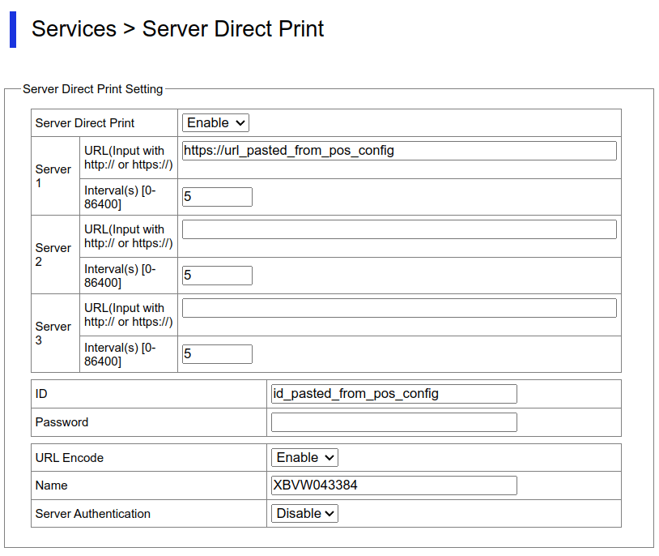

===========================
Epson server direct printer
===========================

The Epson Server Direct Print functionality allows for receipt printing from Point of Sale systems.
Once enabled, the POS register sends tickets directly to any Epson printer model supporting Server
Direct Print.

.. note::
   We recommended using the Epson **TM-m30III** model for receipt printing. However, all the
   following models are compatible:

   - TM-H6000V
   - TM-T88VI
   - TM-T88VI-iHUB
   - TM-T88VII
   - TM-m30II-NT
   - TM-m30II-S
   - TM-m30II-SL
   - TM-m30II-H
   - TM-m30III
   - TM-m30III-H
   - TM-m50
   - TM-m50II

   These printers don't require connecting to an :doc:`IoT system
   </applications/general/iot/connect>` or configuring an SSL certificate.

.. _epson-direct/pos-configuration:

Point of Sale configuration
===========================

To configure the printer in Point of Sale, follow these steps:

#. :ref:`Access the POS settings <configuration/settings>`.
#. Scroll down to the :guilabel:`Point of Sale` section and enable the :guilabel:`Epson Server
   Direct Printer` setting.
#. Optionally, select :guilabel:`Cashdrawer` if using a cash drawer connected to the printer.
#. Click the :icon:`fa-clipboard` :guilabel:`Copy URL` and :icon:`fa-clipboard` :guilabel:`Copy ID`
   clipboard buttons to copy the URL and ID for the :ref:`printer configuration
   <epson-direct/printer-configuration>`.

.. note::
   When the printer connects to a network, it automatically prints a receipt with an IP address.

.. _epson-direct/printer-configuration:

Printer configuration
=====================

To configure the printer, follow the next steps:

#. Connect the printer to the Internet and find the IP address on the automatically-printed receipt.
#. Open an Internet browser, enter the printer's IP address in the search bar, and press `Enter`.
#. On the printer homepage, click :guilabel:`Advanced Settings`, then :guilabel:`Administrator
   Login`.
#. Enter the printer's password.
#. Go to :menuselection:`TM-i Settings --> Services --> Server Direct Print`.
#. Set the :guilabel:`Server Direct Print` field to :guilabel:`Enable`.
#. In the :guilabel:`URL` field, paste the printer setup URL from the :ref:`POS configuration
   <epson-direct/pos-configuration>`.
#. In the :guilabel:`Interval` section, set the value to :guilabel:`5`.
#. In the :guilabel:`ID` field, paste the printer setup ID from the :ref:`POS configuration
   <epson-direct/pos-configuration>`.
#. Click :guilabel:`Apply & Restart`.

.. tip::
   - The same printer can be used for multiple POS configurations.
   - Setting the :guilabel:`Interval` field to :guilabel:`5` ensures a balance between printing
     speed and server load; the printer processes all queued receipts at each interval.
   - Ensure the printer's :guilabel:`Device ID` is set to `local_printer` in the :guilabel:`Device
     Admin` section.
   - Update the printer firmware before enabling the print confirmations.
   - Find the printer's password on the back of the device next to the :icon:`fa-lock`
     (:guilabel:`lock`) icon.

.. seealso::
   :doc:`epos_printers`
