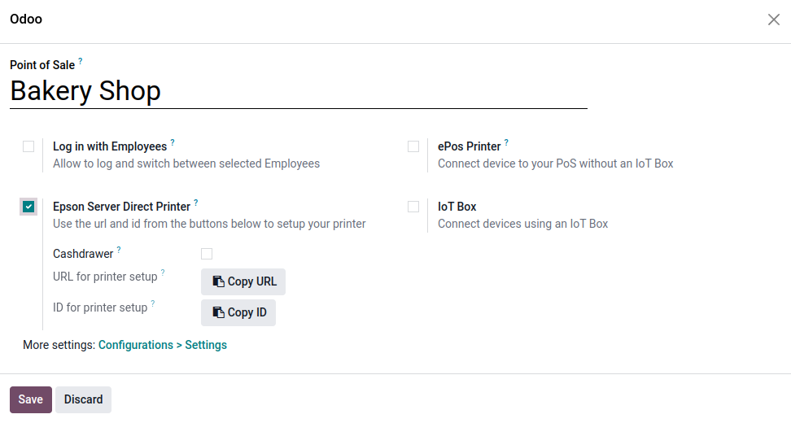
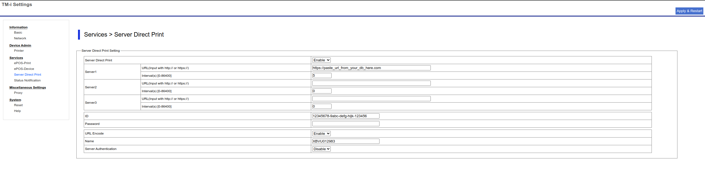

=========================
Epson Server Direct Print
=========================

Epson Server Direct receipt printing is designed to work seamlessly with Point of Sale systems. Once connected, these
devices automatically share information, allowing for direct printing of tickets from the POS system
to the Epson Server Direct printer. No SSL certificate configuration is needed.

Point Of Sale Configuration
===========================

To use an Epson Server Direct printer in Point of Sale:

#. :ref:`Access the POS settings <configuration/settings>`.
#. Activate the :guilabel:`Epson Server Direct Printer` feature.
#. If using a cashdrawer connected to the printer tick the "Cashdrawer" option
#. Use the two clipboard buttons to copy the URL and ID for the printer configuration.

.. note::
   When the printer connects to a network, it automatically prints a ticket with its IP address.

Printer Configuration
=====================
#. Connect the printer to internet and find its ip address on a printed receipt.
#. Enter the printer's ip address in a browser
#. On the printer homepage click on `Advanced Settings`
#. Click on `Administrator Login`
#. Enter the printer's password found on its back near :guilabel:`🔒` symbol
#. Click on `TM-i Settings`
#. Click on `Server Direct Print` under `Services` section
#. Set `Server Direct Print` to `Enable`
#. In the `URL field` paste the URL for printer setup from your PoS configuration
#. In the `Interval` section set the value to `5`
#. In the `ID` field paste the ID for printer setup from your PoS configuration
#. Click on `Apply & Restart`

.. note::
  Same printer can be used for multiple Point Of Sale configurations

.. note::
  The printer will print all queued receipts every `Inteval` seconds

.. note::
  Make sure that the printer `Device ID` is set to `local_printer` in `Device Admin` section

Directly supported Epson printers
=================================

The following Epson printers are directly compatible with Odoo without needing an :doc:`IoT system
</applications/general/iot/devices/printer>`.

- TM-Intelligent printers (Recommended model: `Epson TM-M30 iii`)

.. note::
  Make sure to update printer firmware before using it to receive the print confirmations.

.. seealso::
   - :doc:`epos_printers`
