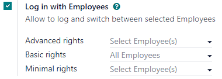
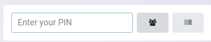

=========================
Multi-employee management
=========================

Odoo Point of Sale (POS) offers a **Multi Employees per Session** feature, allowing multiple users
to :ref:`log into a POS session <pos/employee_login/use>`. Activating this feature enables the
following actions:

- Select specific users who can :ref:`log into the POS <pos/employee_login/use>`.
- :ref:`Assign basic or advanced permissions <pos/employee_login/configuration>` to these users.
- :ref:`Track the employees involved in each order for enhanced analytics <pos/analytics>`.

.. _pos/employee_login/configuration:

Configuration
=============

Access the multi-employee setting from the :guilabel:`PoS Interface` section of the :ref:`POS
settings <configuration/settings>`. Then,

#. Activate the :guilabel:`Multi Employees per Session` feature.
#. Add the employees with **basic POS functionality** access in the :guilabel:`Basic rights` field.
#. Add the employees with **extended POS functionalities** in the :guilabel:`Advanced rights` field.

.. note::
   - Leaving the :guilabel:`Basic rights` field empty allows all employees to log in.
   - Leaving the :guilabel:`Advanced rights` field empty grants extended rights to Odoo users only.

.. tip::
   Click the :icon:`fa-ellipsis-v` (:guilabel:`vertical ellipsis`) button on the top right corner of
   a POS card and :guilabel:`Edit` to access the setting from the main POS dashboard.

.. seealso::
   :doc:`../../general/users/access_rights`

.. tabs::
   .. tab:: Basic rights

      Employees with basic rights can perform the following actions within the POS:

      **Session management:**

      - :ref:`Open a POS session <pos/session-start>`.
      - Lock the current POS session.
      - Toggle the visibility of product and category images.

      **Sales transactions:**

      - :ref:`Process standard sales transactions <pos/sell>`.
      - :ref:`Process refunds <pos/refund>`.
      - :doc:`Access and handle sales orders <shop/sales_order>`.
      - :ref:`Set customers <pos/customers>`.
      - Access past and current order history.

      **Pricing and discounts:**

      - Manually select another :doc:`pricelist <pricing/pricelists>`.
      - Enter promotional codes.
      - :doc:`Manually apply discounts <pricing/discounts>`.
      - Manually :ref:`change a product's price <pos/sell>`.

   .. tab:: Advanced rights

      In addition to the basic rights, employees with advanced rights can also:

      - :ref:`Perform cash-in and cash-out operations <pos/cash-register>`.
      - Access the Odoo backend interface.
      - :ref:`Close the current POS session <pos/session-close>`.

.. _pos/employee_login/use:

Usage guidelines
================

Logging in
----------

Once the **Multi Employees per Session** feature is enabled, employees must log in to :ref:`open a
POS session <pos/session-start>` and access the POS interface. They can :ref:`scan their employee
badge <pos/employee_login/badge>` or click :guilabel:`Select Cashier` to select their name from the
list of authorized users.

To switch between users during an :ref:`active session <pos/session-start>`, click on the currently
logged-in employee's name at the top right of the POS screen and select the user to switch to.

.. _pos/employee_login/badge:

Logging in with badges
----------------------

Employees can log in using their badge. To configure badge-based login, assign a unique badge ID to
the employee's profile in the **Employees** module:

#. Navigate to the **Employees** module.
#. Open the form view of the specific employee.
#. Go to the :guilabel:`HR Settings` tab.
#. The :guilabel:`Attendance/Point of Sale` category offers two options:

   - Manually enter any badge ID in the :guilabel:`Badge ID` field.
   - Click :guilabel:`Generate` to create a unique badge ID automatically.
#. Click :guilabel:`Print Badge` to generate a barcode representation of the assigned badge ID.

To switch users within an open POS session using a badge, you must first lock the session. To do so,
click the :icon:`fa-bars` icon (:guilabel:`hamburger menu`) and :guilabel:`Lock` to return to the
login screen. Then, the new employee can scan their badge to log in.

Adding a PIN Code
-----------------

For enhanced security, employees may be forced to enter a PIN code each time they log into a POS
session. To set up a PIN code for an employee:

#. Navigate to the **Employees** module.
#. Open the form view of the relevant employee.
#. Go to the :guilabel:`HR Settings` tab.
#. Enter a desired numerical code in the :guilabel:`PIN Code` field of the
   :guilabel:`Attendance/Point of Sale` category.

.. note::
   The PIN code must consist of a sequence of digits only.
