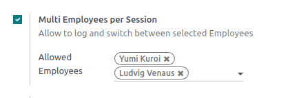
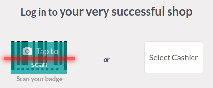
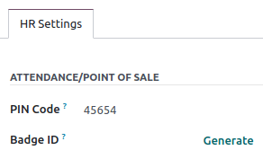

=========================
Multi-employee management
=========================

Odoo Point of Sale allows you to manage access to a specific POS by enabling the **Multi Employees
per Session** feature. When activated, :ref:`you can select which users can log into the POS
<employee_login/use>` and :ref:`keep track of the employees involved in each order
<employee_login/analytics>`.

.. _employee_login/configuration:

Configuration
=============

:ref:`Access the POS settings <configuration/settings>` and select your POS, or click the vertical
ellipsis button (:guilabel:`⋮`) on a POS card and click :guilabel:`Edit`. Then, enable
:guilabel:`Multi Employees per Session`, and add the allowed employees in the :guilabel:`Allowed
Employees` field.

.. _employee_login/use:

Practical application
=====================

Once the feature is activated, cashiers can log in :ref:`by scanning their badge
<employee_login/badge>` or selecting their name from the list of allowed employees to :ref:`open the
session <pos/session-start>`.

To switch to another user :ref:`from an open session <pos/session-start>`, click the employee name
at the top-right of the screen and select the employee to swap with from the list.

You can also require your employees to enter a pin code every time they log into a POS to prevent
them from logging in as someone else. To define the code, go to the **Employees** app, open the
employee form, and click the :guilabel:`HR settings` tab. Then, enter a pin code of your choice in
the :guilabel:`PIN Code` field of the :guilabel:`Attendance/Point of Sale` category.

.. _employee_login/badge:

Log in using badges
-------------------

For your employees to be able to log in by scanning their badge, they must have a badge ID assigned.
To do so, go to the **Employees** app, open the employee form, and click the :guilabel:`HR settings`
tab. Then, enter the badge ID of your choice in the :guilabel:`Badge ID` field of the
:guilabel:`Attendance/Point of Sale` category or click :guilabel:`Generate`.

To switch to another user, lock the session by clicking the lock-shaped icon (:guilabel:`🔓`) at the
top-right of the screen and scan your badge.

.. _employee_login/analytics:

Analytics
=========

Once you close and post the POS session, access the comprehensive report to review all session
activities, including who initiated the session and who handled specific orders. To access the
session's report, click the vertical ellipsis button (:guilabel:`⋮`) on the POS card and select
:guilabel:`Sessions` from the :guilabel:`View` section. Then, select a specific session for more
detailed information, and click the :guilabel:`Orders` button to view a list of all orders placed
during that session.

To get an overview of all orders, regardless of the session, click the vertical ellipsis button
(:guilabel:`⋮`) on the POS card and select :guilabel:`Orders` from the :guilabel:`View` section.
