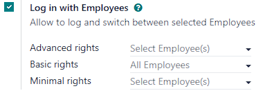

=========================
Multi-employee management
=========================

Odoo Point of Sale (POS) offers a **Multi Employees per Session** feature, allowing multiple users
to :ref:`log into a POS session <pos/employee_login/use>`. Activating this feature enables you to:

- :ref:`Select specific users who can log into the POS <pos/employee_login/use>`.
- Assign basic or advanced permissions to these users.
- :ref:`Track the employees involved in each order for enhanced analytics <pos/analytics>`.

.. _pos/employee_login/configuration:

Configuration
=============

To enable the multi-employee feature:

#. :ref:`Access the POS settings <configuration/settings>` and select your POS; or
#. Click the :icon:`fa-ellipsis-v` (:guilabel:`vertical ellipsis`) button located on the top-right
   corner of a POS card on the main POS dashboard.

Then,

#. Enable :guilabel:`Multi Employees per Session`.
#. Add the allowed employees in the :guilabel:`Basic rights` and :guilabel:`Advanced rights` fields.

.. tabs::

   .. tab:: Basic rights

      Employees with basic rights can perform the following actions within the POS:

      - :ref:`Open a POS session <pos/session-start>`.
      - :ref:`Process standard sales transactions <pos/sell>`.
      - Access past and current order history.
      - :ref:`Process refunds <pos/refund>`.
      - Lock the current POS session.
      - Toggle the visibility of product and category images.

   .. tab:: Advanced rights

      In addition to the basic rights, advanced employees can also:

      - :ref:`Perform cash in and cash out operations <pos/cash-register>`.
      - Access the Odoo backend interface.
      - :ref:`Close the current POS session <pos/session-close>`.

.. _pos/employee_login/use:

Usage guidelines
================

Logging in
----------

Once the **Multi Employees per Session** feature is enabled, employees need to log in to :ref:`open
a POS session <pos/session-start>` and access the POS interface. They can either :ref:`scan their
employee badge <pos/employee_login/badge>` or click :guilabel:`Select Cashier` to select their name
from the list of authorized users.

To switch between users during an :ref:`active session <pos/session-start>`, click on the currently
logged-in employee's name located at the top-right of the POS screen and select the user to switch
to.

.. _pos/employee_login/badge:

Logging in with badges
----------------------

To enable badge-based login for employees, each employee must have a unique badge ID assigned to
their profile in the **Employees** module. To configure this:

#. Navigate to the **Employees** module.
#. Open the form view of the specific employee.
#. Go to the :guilabel:`HR Settings` tab.
#. Within the :guilabel:`Attendance/Point of Sale` category, you have two options:

   - Manually enter a badge ID of your choice in the :guilabel:`Badge ID` field.
   - Click :guilabel:`Generate` to automatically create a unique badge ID.
#. Click :guilabel:`Print Badge` to generate a barcode representation of the assigned badge ID.

To switch users within an open POS session using a badge, click the :icon:`fa-bars` icon
(:guilabel:`hamburger menu`) and :guilabel:`Lock` the session. Then, the new employee can scan their
badge to log in.

Adding a PIN Code
-----------------

For enhanced security, you can require employees to enter a PIN code each time they log into a POS
session. To set up a PIN code for an employee:

#. Go to the **Employees** module.
#. Open the form view of the relevant employee.
#. Go to the :guilabel:`HR Settings` tab.
#. Enter a desired numerical code in the :guilabel:`PIN Code` field of the
   :guilabel:`Attendance/Point of Sale` category.

.. note::
   The PIN code must consist of a sequence of digits only.
