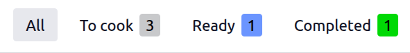
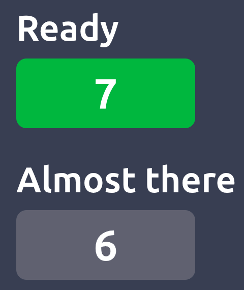

===================
Preparation display
===================

The preparation display helps manage POS orders that require preparation prior to completion. It is
intended for use in environments where ordered items must be assembled, cooked, or otherwise
processed before they are handed over to the customer.

.. admonition:: Use cases

   - **For retail**: Once an order is completed and paid in the :ref:`POS register
     <pos/use/open-register>`, it is sent to the preparation display. This notifies the preparation
     team to collect and prepare the purchased items for customer pickup.
   - **For restaurants**: Once orders are placed in the :ref:`POS register <pos/use/open-register>`,
     they are sent to the preparation display to inform the kitchen about the meals that need to be
     prepared.

.. _pos/preparation/configuration:

Configuration
=============

To create and set up a preparation display, go to :menuselection:`Point of Sale --> Orders -->
Preparation Display`, click :guilabel:`New`, and configure it:

- Enter a descriptive :guilabel:`Name` (e.g., `Main Kitchen`, `Bar`, `Pickup zone`).
- Select the :guilabel:`Point of Sale` that sends orders to this display. Leave the field empty to
  link it to *all* points of sale.
- Specify the POS :ref:`product categories <pos/products/categories>` to be sent to this display.
  Leave the field empty to allow *all* categories.
- Enable the :guilabel:`Auto clear` option to automatically remove orders from the :ref:`order
  status screen <preparation/order-status-screen>` after a given time.
- Define the steps required for orders to be processed in the :guilabel:`Stages` tab:

  #. Click :guilabel:`Add a line` to add a stage.
  #. Optionally, assign colors to stages for better visibility.
  #. Set an :guilabel:`Alert timer (min)` for each stage to define the expected processing time.
     Orders are highlighted when this time is exceeded.

.. tip::
   - Configure communication channels for the preparation display to keep customers informed. To do
     so:

     #. Install the :guilabel:`POS Enterprise SMS Whatsapp` module.
     #. Go to the :ref:`preparation display form <pos/preparation/configuration>`.
     #. Activate :guilabel:`SMS Enabled` and/or :guilabel:`WhatsApp Enabled` in the
        :guilabel:`Communication` tab.
     #. Select templates for :guilabel:`Order received` and :guilabel:`Order is ready`.

   - To edit an existing preparation display, click :icon:`fa-ellipsis-v` (:guilabel:`Dropdown
     menu`) on the display's card and select :guilabel:`Configure`.

.. _pos/preparation/application:

Preparation display
===================

To view all preparation displays and their related :ref:`order status screens
<preparation/order-status-screen>`, go to :menuselection:`Point of Sale --> Orders --> Preparation
Display`.

.. image:: preparation/display-card.png
   :alt: Kanban view of the preparation display
   :scale: 85 %

The display card shows:

- The configured stages, e.g., `To prepare`, `Ready`, `Completed`.
- The number of orders currently :guilabel:`In progress`.
- The :guilabel:`Average time` employees usually take to complete an order.
- The :ref:`Order Status Screen <preparation/order-status-screen>` button.

.. tip::
   - A default preparation display named :guilabel:`Kitchen Display` is automatically configured
     when creating a new :doc:`restaurant point of sale <../restaurant>` :ref:`through the
     onboarding screen <pos/use/create-pos>` and selecting the :guilabel:`Restaurant` card.
   - The **Kitchen Display** app is automatically installed whenever a :doc:`restaurant point of
     sale <../restaurant>` is :ref:`created <pos/use/create-pos>` and provides quick access to the
     :guilabel:`Preparation Display` overview from the main dashboard.
   - If at least one :doc:`restaurant point of sale <../restaurant>` is configured, the :ref:`order
     status screen <preparation/order-status-screen>` is installed by default. To use it in a shop
     environment, install the :guilabel:`PoS Order Tracking Customer Display` module.

.. note::
   To use the preparation display, log in via a web browser on a mobile device or a touchscreen
   connected via USB or HDMI. IoT boxes are not supported.

.. _pos/preparation/application/use:

Preparation display interface
-----------------------------

To open the preparation display, click :guilabel:`Preparation Screen` on the Kanban card. The
interface consists of a :ref:`top bar <pos/preparation/top-bar>`, a collapsible :ref:`side panel
<pos/preparation/sidepanel>`, and the :ref:`order cards <pos/preparation/order-cards>` section.

.. _pos/preparation/top-bar:

Top bar
~~~~~~~

The top bar shows the progress of :guilabel:`All` orders across configured stages, such as
`To prepare`/`To cook`, `Ready`, and `Completed`, along with the number of orders per stage. Click a
stage to see the related orders.

The top bar offers the following buttons:

- :icon:`fa-undo` :guilabel:`Recall`: Undo the most recent order stage move. This is only possible
  if this move was made on the selected stage.
- :icon:`fa-trash` :guilabel:`Done`: Delete all completed orders in the last stage at once.
- :icon:`fa-sign-out` :guilabel:`Close`: Exit the display.

.. _pos/preparation/sidepanel:

Side panel
~~~~~~~~~~

The side panel is folded by default. Open it by clicking the :icon:`oi-panel-right` icon in the
upper-left corner. Then, filter orders by:

- :guilabel:`Time`, such as :guilabel:`Today` or :guilabel:`Tomorrow`
- :doc:`Preset <presets>`, such as :guilabel:`Dine in` or :guilabel:`Delivery`, if applicable
- :ref:`POS categories <pos/products/categories>` defined on the :ref:`display form
  <pos/preparation/configuration>`, such as :guilabel:`Food` or :guilabel:`Drinks`

The total number of orders/category items is displayed next to the corresponding filter. Each
filter section consists of a breakdown of the individual elements.

Use the :icon:`fa-search-minus` and :icon:`fa-search-plus` zoom control at the bottom of the side
panel to adjust the card view size, and the :guilabel:`Clear All Orders` button to move all orders
in the current stage to the next one.

.. _pos/preparation/order-cards:

Order cards
~~~~~~~~~~~

Order cards represent individual orders and display the following information:

- Associated :ref:`tables <pos/restaurant/floors>`, order numbers, :ref:`customer
  <pos/use/customers>` or order names.
- Number of guests.
- :doc:`Presets <presets>`, if configured.
- The selected time and date, if :ref:`orders are managed by time for the preset
  <pos/presets/preset-form>`.
- Stages, i.e., the status such as `To prepare`, `Ready`, etc., highlighted in the defined color
  (only shown when :guilabel:`All` orders are displayed).
- Waiting time, with visual indicators, if the elapsed time exceeds the predefined alert time.

To update order progress from the order card, click individual items to cross them off individually
or click the order card itself to mark all items at once. Once all items are completed, the order
automatically moves to the next stage. Click :icon:`fa-undo` :guilabel:`Reset` on
:guilabel:`Completed` orders to move them back to the first stage if needed.

.. example::
   The preparation display shows several orders to process:

   - Order 1: The `Lunch Maki 18pc` for takeout with order name `John Meyer`, scheduled for `14/04`
     at `13:00`, is ready (crossed out). The `Bacon Burger` is still being prepared.
   - Order 2: The delivery order for the customer `Acme Corporation` is marked red because it has
     exceeded the expected time in the `Ready` stage.
   - Order 3: Table 2 `T2` has a `Dine in` order with 3 dishes and 3 guests (:icon:`fa-users` icon)
     at this table. You can click `Done` to archive the order or :guilabel:`Reset` to move it back
     to the `To cook` stage.

   .. image:: preparation/preparation-display-cards.png
      :alt: The preparation display interface with orders to process.
      :scale: 80 %

.. _preparation/order-status-screen:

Order status screen
===================

The :guilabel:`Order Status Screen` is automatically enabled once a :ref:`preparation display
<pos/preparation/application>` is created. It is an additional display showing customers an overview
of orders that are:

- :guilabel:`Ready` for pickup.
- :guilabel:`Almost there`, indicating they are taken care of.

To open this customer interface, click :guilabel:`Order Status Screen` on the :ref:`preparation
display card <pos/preparation/application>`.

.. note::
   - The order number can be found at the top of the customer's :doc:`receipt <../use/receipts>`.
   - To use the order status screen, log in via a web browser on a mobile device or a screen
     connected via USB or HDMI. IoT boxes are not supported.
