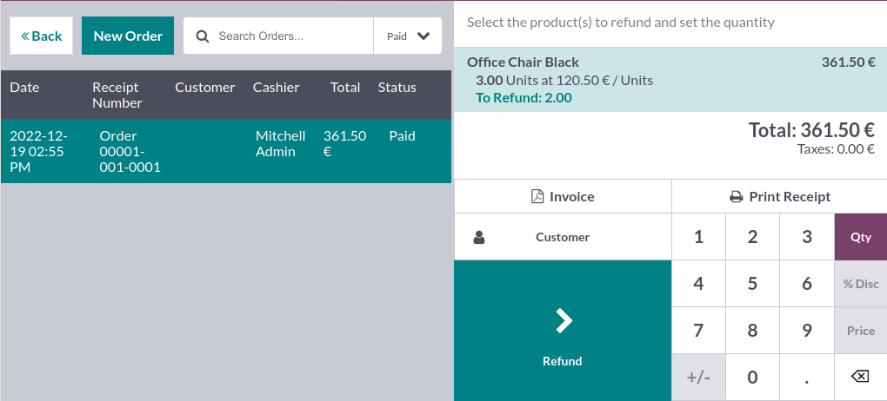

============
POS sessions
============

.. _pos/start-session:

Start the session
=================

From the **POS dashboard**, click :guilabel:`New Session`, and at the :guilabel:`Opening Cash
Control` screen, click :guilabel:`Open Session` to start a POS session, or click :guilabel:`Continue
Selling` if the session is already opened.

.. note::
   Multiple users can be connected to the same session at the same time. However, the session can
   only be opened once on the same browser.

Sell products
=============

Click products to add them to the cart. To change the **quantity**, click :guilabel:`Qty` and enter
the number of products using the keypad. To add a **discount** or modify the product **price**,
click respectively :guilabel:`% Disc` or :guilabel:`Price` and enter the amounts.

Once an order is completed, proceed to checkout by clicking :guilabel:`Payment`. Select the
**payment method**, enter the received amount, and click :guilabel:`Validate`. Click
:guilabel:`New Order` to move on to the next customer.

.. image:: sessions/pos-interface.png
   :align: center
   :alt: POS session interface.

.. tip::
   - You can use both `,` and `.` on your keyboard as decimal separators.
   - **Cash** is selected by default if you enter the amount without choosing a payment method.

Return and refund products
==========================

To return and refund a product,

#. :ref:`start a session <pos/start-session>` from the **POS dashboard**;
#. click :guilabel:`Refund` and select the corresponding order;
#. select the product and the quantity to refund using the keypad;
#. click :guilabel:`Refund` to go back to the previous screen;
#. once the order is completed, click :guilabel:`Payment` to proceed to the refund;
#. click :guilabel:`Validate` and :guilabel:`New Order` to move on to the next customer.

.. note::
   - You can filter the **orders list** by :guilabel:`Receipt Number`, :guilabel:`Date` or
     :guilabel:`Customer` using the search bar.
   - You can also refund a product by selecting the returned product from an open session, and
     setting a negative quantity that equals the number of returned products. To do so, click
     :guilabel:`Qty` and :guilabel:`+/-`, followed by the quantity of returned products.

Manage the cash register
========================

To add or take out cash from the register, click the **menu icon** in the upper right corner of your
screen and :guilabel:`Cash In/Out`.

.. image:: sessions/hamburger.png
   :align: center
   :alt: dropdown menu to close a POS session, reach the backend, add or take cash out or check
         orders

Doing so opens a pop-up window on which you can select :guilabel:`Cash In` or :guilabel:`Cash Out`,
enter the amount and the reason, and click :guilabel:`Confirm`.

Close the POS session
=====================

To close your session, click the **menu icon** in the upper right corner of your screen and
:guilabel:`Close Session`.

Doing so opens the :guilabel:`Closing Control` pop-up screen. From this screen, you can retrieve
various information:

- the number of orders made and the total amount made during the session;
- the expected amounts grouped by payment method.

Before closing this window, count your cash using the calculator icon. Doing so opens a pop-up
window that computes the total amount in the cash drawer depending on the coins and bills counted
and added manually. Then, click :guilabel:`Confirm` or :guilabel:`Discard` to close the window. The
computed amount is set in the :guilabel:`Counted` column, and the :guilabel:`Money Details` are
specified in the **Notes** section.

.. image:: sessions/closing-control.png
   :align: center
   :alt: How to close a POS session.

Once you are done controlling the amounts, click :guilabel:`Close Session` to close and go back to
the **POS dashboard**.

.. note::
   - To reach the backend without closing the session, click :guilabel:`Backend` on the dropdown
     menu.
   - To abort, click :guilabel:`Discard` on the pop-up window.
   - Depending on your setup, you might only be allowed to close a session if the expected cash
     revenue equals the counted cash. To close it anyway, click :guilabel:`Ok` on the
     :guilabel:`Payments Difference` screen.

.. tip::
   - It is strongly advised to close your POS session at the end of each day.
   - To look at all your previous sessions, go to :menuselection:`Point of Sale --> Orders -->
     Sessions`.
