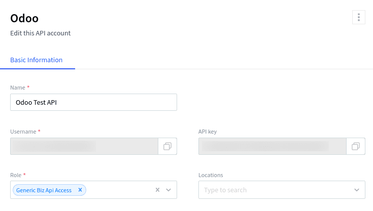
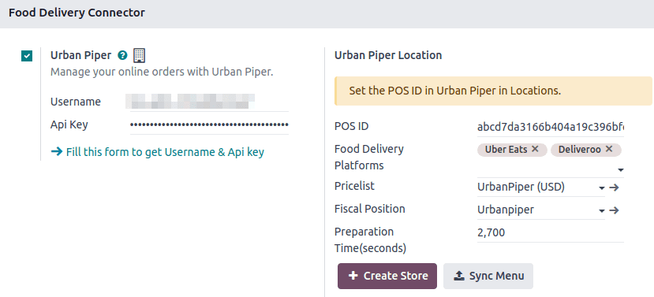
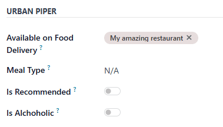
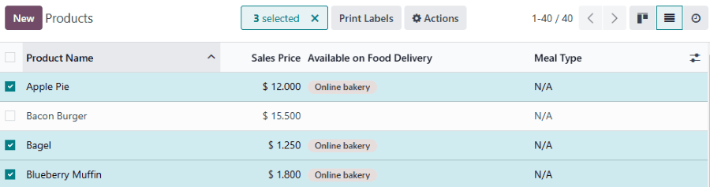
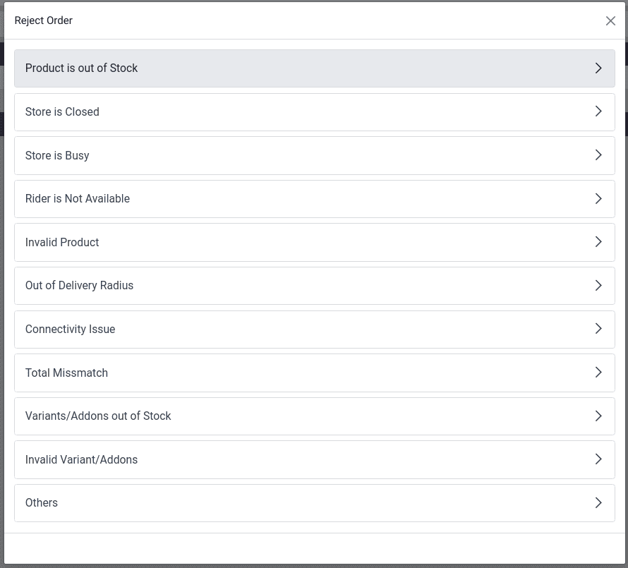

====================
Online food delivery
====================

**UrbanPiper** is an order management system that integrates with multiple food delivery platforms.
It consolidates orders from all connected platforms into a single interface, simplifying the
delivery process.

Supported providers:

- `Careem <https://www.careem.com>`_
- `Cari <https://getcari.com/>`_
- `ChowNow <https://www.chownow.com>`_
- `Deliveroo <https://deliveroo.co.uk/>`_
- `DoorDash <https://www.doordash.com>`_
- `EatEasy <https://www.eateasy.ae/dubai>`_
- `Glovo <https://glovoapp.com>`_
- `Grubhub <https://www.grubhub.com>`_
- `HungryPanda <https://www.hungrypanda.co>`_
- `HungerStation <https://hungerstation.com>`_
- `Jahez <https://www.jahez.net/>`_
- `Just Eat <https://www.just-eat.ie/>`_
- `Mrsool <https://mrsool.co>`_
- `Ninja <https://ananinja.com/>`_
- `NoonFood <https://www.noon.com>`_
- `Postmates <https://www.postmates.com>`_
- `Rafeeq <https://www.gorafeeq.com/en>`_
- `SkipTheDishes <https://www.skipthedishes.com/>`_
- `Swiggy <https://www.swiggy.com>`_
- `Talabat <https://www.talabat.com>`_
- `UberEats <https://www.ubereats.com>`_
- `Zomato <https://www.zomato.com>`_

Configuration
=============

.. _online_food_delivery/credentials:

UrbanPiper credentials
----------------------

#. Get your Atlas credentials:

   #. Go to the :ref:`POS settings <configuration/settings>`.
   #. Scroll down to the :guilabel:`Food Delivery Connector` section.
   #. Click :guilabel:`Fill this form to get Username & Api key` and fill out the survey.
#. `Go to your Atlas account <https://atlas.urbanpiper.com>`_ and retrieve your API key and username
   by navigating to :menuselection:`Settings --> API Access`.

Point of Sale
-------------

#. Enable the :guilabel:`Urban Piper` setting:

   #. Go to the :ref:`POS settings <configuration/settings>`.
   #. Scroll down to the :guilabel:`Food Delivery Connector` section.
   #. Check the :guilabel:`Urban Piper` setting.

#. Set up UrbanPiper:

   #. Fill in the :guilabel:`Username` and :guilabel:`Api Key` fields with your :ref:`UrbanPiper
      credentials <online_food_delivery/credentials>`.
   #. Select the desired delivery providers in the :guilabel:`Food Delivery Platforms` field under
      the :guilabel:`Urban Piper Location` section (i.e., Zomato, Uber Eats).
#. Save the settings.
#. Click the :guilabel:`+ Create Store` button. Doing so creates a new location on the UrbanPiper
   Atlas platform.

.. note::
   - The :guilabel:`Pricelist` and :guilabel:`Fiscal Position` fields are automatically selected
     after saving.
   - A successful store creation triggers a notification.
   - The store creation process may take 2–3 minutes to reflect changes on the UrbanPiper Atlas
     platform.
   - The store is automatically named after your point of sale name.

Products
--------

To make products available individually,

#. Go to :menuselection:`Point of Sale --> Products --> Products`.
#. Select any product to open its product form.
#. Go to the :guilabel:`Point of Sale` tab.
#. Complete the :guilabel:`Urban Piper` section:

   - Fill in the :guilabel:`Available on Food Delivery` with the desired POS.
   - Optionally, set up the :guilabel:`Meal Type` field and enable the :guilabel:`Is Recommended`
     and :guilabel:`Is Alcoholic` buttons.

To make multiple products available for food delivery at once,

#. Go to :menuselection:`Point of Sale --> Products --> Products`.
#. Click the list icon (:icon:`oi-view-list`) to switch to the list view.
#. Select the products.
#. Enter the desired POS in the :guilabel:`Available on Food Delivery` column.

.. note::
   - Currently, UrbanPiper does not support combo products.
   - As a workaround, create a product and define combo choices as :doc:`Attributes & Variants
     <../sales/products_prices/products/variants>`.

Synchronization
---------------

To make products available on food delivery platforms, synchronize with your UrbanPiper account:

#. Go to the :ref:`POS settings <configuration/settings>`.
#. Scroll down the :guilabel:`Food Delivery Connector` section.
#. Click the :guilabel:`Sync Menu` button.

   - The :guilabel:`Last Sync on` timestamp below the :guilabel:`Create Store` and :guilabel:`Sync
     Menu` buttons updates.

.. note::
   - A successful synchronization triggers a notification.
   - The synchronization process may take 2–3 minutes to reflect changes on the UrbanPiper Atlas
     platform.

Go live
-------

#. `Go to the Locations tab <https://atlas.urbanpiper.com/locations>`_ of your Atlas account.
#. Select the location to activate, then click :guilabel:`Request to go Live`.

   .. image:: online_food_delivery/go-live.png
      :alt: Request to go live button in the locations tab of the Atlas account

#. In the popup window:

   #. Select the platform(s) to activate and click :guilabel:`Next`.
   #. Enter the :guilabel:`Platform ID` and :guilabel:`Platform URL` in the corresponding fields to
      establish the connection between the platform and UrbanPiper.
   #. Click the :guilabel:`Request to Go Live` button.

   .. image:: online_food_delivery/go-live-parameters.png
      :alt: Go live parameters

   .. note::
      To find the location's :guilabel:`Platform ID` and :guilabel:`Platform URL`,

      #. Click the location to open its setup form.
      #. The location's parameters are available in the :guilabel:`HUB` tab.
#. Verify that your location is live:

   #. `Go to the Locations tab <https://atlas.urbanpiper.com/locations>`_ of your Atlas account.
   #. Select any provider in the :guilabel:`Assoc. platform(s)` column to review the status of that
      platform for this location.

Order flow
==========

An order placed via the configured delivery platform triggers a notification. To manage these
orders, open the orders' list view by:

#. Clicking :guilabel:`Review Orders` on the notification popup.
#. Clicking the bag-shaped icon for online orders and :guilabel:`New`.

   .. image:: online_food_delivery/cart-button.png
      :alt: Cart button

   .. note::
      - Clicking this icon displays the number of orders at each stage: :guilabel:`New`,
        :guilabel:`Ongoing`, and :guilabel:`Done`.
      - The :guilabel:`New` button indicates newly placed orders, :guilabel:`Ongoing` is for
        accepted orders, and :guilabel:`Done` is for orders ready to be delivered.

Then,

#. Select the desired order.
#. Click the :guilabel:`Accept` button.
#. When an order is accepted, its :guilabel:`Order Status` switches from :guilabel:`Placed` to
   :guilabel:`Acknowledged` and is automatically displayed on the preparation display.

When the order is ready,

#. Open the orders' list view.
#. Select the order.
#. Click the :guilabel:`Mark as ready` button. Its :guilabel:`Order Status` switches from
   :guilabel:`Acknowledged` to :guilabel:`Food Ready`, and its :guilabel:`Status` switches from
   :guilabel:`Ongoing` to :guilabel:`Paid`.

Order rejection
---------------

Sometimes, the shop or restaurant may want to **reject** an order. In this case, open the orders'
list view,

#. Select the desired order.
#. Click the :guilabel:`Reject` button.
#. Select one of the reasons from the popup window.

.. important::
   **Swiggy** orders cannot be directly rejected. Attempting to reject one prompts Swiggy customer
   support to contact the restaurant. Similarly, **Deliveroo**, **JustEat**, and **HungerStation**
   do not allow order rejection. Always follow the respective provider's guidelines for handling
   such cases.
