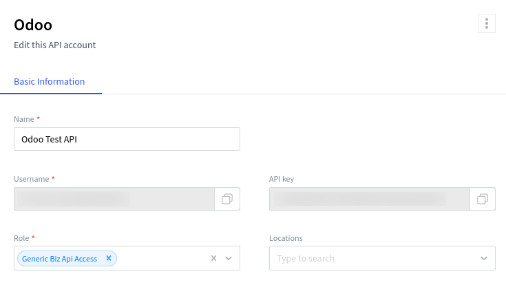

==========
UrbanPiper
==========

Integrating UrbanPiper allows you to connect multiple delivery platforms seamlessly, streamlining
order management and improving operational efficiency. UrbanPiper is essential for businesses that
manage multiple delivery platforms, as it simplifies the entire process. Instead of handling
separate systems for each delivery provider, UrbanPiper allows you to manage all orders from a
single interface.

Supported Providers

- `UberEats <https://www.ubereats.com>`_
- `Careem <https://www.careem.com>`_
- `Talabat <https://www.talabat.com>`_
- `DoorDash <https://www.doordash.com>`_
- `Grubhub <https://www.grubhub.com>`_
- `Deliveroo <https://deliveroo.co.uk/>`_
- `Just Eat <https://www.just-eat.ie/>`_
- `EatEasy <https://www.eateasy.ae/dubai>`_
- `Postmates <https://www.postmates.com>`_
- `NoonFood <https://www.noon.com>`_
- `SkipTheDishes <https://www.skipthedishes.com/>`_
- `Jahez <https://www.jahez.net/>`_
- `Rafeeq <https://www.gorafeeq.com/en>`_
- `HungryPanda <https://www.hungrypanda.co>`_
- `Ninja <https://ananinja.com/>`_
- `ChowNow <https://www.chownow.com>`_
- `Cari <https://getcari.com/>`_
- `HungerStation <https://hungerstation.com>`_
- `Mrsool <https://mrsool.co>`_
- `Swiggy <https://www.swiggy.com>`_
- `Zomato <https://www.zomato.com>`_
- `Glovo <https://glovoapp.com>`_

Configuration
=============

.. _urban_piper/credentials:

UrbanPiper credentials
----------------------

`Go to your Atlas account <https://atlas.urbanpiper.com>`_ and retrieve your API key and username by
navigating to :menuselection:`Settings --> API Access`

Point of Sale
-------------

#. :doc:`Activate <../../../general/apps_modules>` the Point of Sale - UrbanPiper module to enable
   UrbanPiper.

#. Go to :ref:`POS settings <configuration/settings>`, scroll down the :guilabel:`Food Delivery Connector`
   section, and enable :guilabel:`Urban Piper`.

    #. Fill in the :guilabel:`Username` and :guilabel:`Api Key` fields with your
       :ref:`credentials <urban_piper/credentials>`.

    #. Also add :guilabel:`Urban piper Delivery providers` (i.e. Zomato, UberEats).

#. Save the settings. The :guilabel:`Pricelist` and :guilabel:`Fiscal position` fields are
   automatically selected after saving.

#. Press the :guilabel:`Create Store` button.

    .. image:: urban_piper/create_store.png
        :alt: Create store

    .. note::
      After successfully creating the store, a notification will appear. Note that the
      create store process can take 2-3 minutes to update the locations on the UrbanPiper Atlas
      platform. The store name is the same as the point of sale name.

Products
--------

#. Go to :menuselection:`Point of Sale --> Products --> Products`, select any product, and open the
:guilabel:`Point of Sale` tab.

#. Fill in the details under the :guilabel:`Urban Piper` section.

    .. image:: urban_piper/product_form.png
        :alt: Product form

#. To make multiple products available for food delivery, switch to list view, select the products,
   and add Point of Sale in :guilabel:`Available on Food Delivery` field.

    .. image:: urban_piper/product_list.png
        :alt: Product list

Sync menu
=========

#. Go to :ref:`POS settings <configuration/settings>` and scroll down the
:guilabel:`Food Delivery Connector`.
#. Press the :guilabel:`Sync menu` button.

    .. note::
      After successfully syncing the menu, a notification will appear. Below the
      :guilabel:`Sync menu` button, the :guilabel:`Last Sync on` timestamp will be displayed. Note
      that the sync menu process can take 2-3 minutes to update the menu on the UrbanPiper Atlas
      platform.

    .. image:: urban_piper/sync_menu.png
        :alt: Sync menu

Go live request
===============

#. `Go to the Locations tab <https://atlas.urbanpiper.com/locations>`_ of your Atlas account.

    .. image:: urban_piper/atlas_location.png
        :alt: Locations menu

#. Click on the location you want to activate, then press the :guilabel:`Request to go Live` button.

    .. image:: urban_piper/location_go_live.png
        :alt: Go live

#. Select the platform(s) you want to activate and press :guilabel:`Next`.

    .. image:: urban_piper/go_live_popup.png
        :alt: Go live popup

#. Configure the platform’s parameters, such as :guilabel:`Platform ID` and :guilabel:`Platform URL`
   , to establish the connection between the platform and UrbanPiper, then press the
   :guilabel:`Request to Go Live` button.

    .. image:: urban_piper/go_live_parameters.png
        :alt: Go live parameters

#. To verify that your location is live, check the list view of locations. In the
   :guilabel:`Assoc. platform(s)` column, select any provider and review the status of that
   specific platform for this location.

    .. image:: urban_piper/platform_status.png
        :alt: Platform status

Order flow
==========

#. When someone places an order via any food delivery platform (e.g., Zomato, UberEats), you will be
   notified with a sound and text notification. To view the order, click  :guilabel:`Review Orders`
   and you will be redirected to the orders page.

    .. image:: urban_piper/order_notification.png
        :alt: Order notification

#. Additionally, there is a cart button in the navbar. Clicking this button displays the number of
   orders at each stage—:guilabel:`New`, :guilabel:`Ongoing`, and :guilabel:`Done`—providing an
   overview of their status.

    .. image:: urban_piper/cart_button.png
        :alt: Cart button

    .. note::
        The :guilabel:`New` button indicates placed orders, :guilabel:`Ongoing` is for acknowledged
        orders, and :guilabel:`Done` is for food-ready orders.

#. After clicking the :guilabel:`Accept` button, the order is acknowledged.

    .. image:: urban_piper/order_accept.png
        :alt: Order accepted

#. The order will be displayed on the preparation display if the kitchen display is configured.

    .. image:: urban_piper/kichen_display_order.png
        :alt: Kitchen display order

#. When the order is ready, click :guilabel:`Mark as ready`, and the order status changes to
   :guilabel:`Food Ready`, marking the order as paid.

    .. image:: urban_piper/order_ready.png
        :alt: Order ready

#. In some cases, the shop/restaurant may want to cancel an order. In this case, click
   :guilabel:`Reject`, and a pop-up will appear.

    .. image:: urban_piper/reject_order.png
        :alt: Reject order pop-up

    .. note::
        For Swiggy orders, they cannot be directly rejected. If you attempt to reject a Swiggy
        order, Swiggy customer support will contact the restaurant. Similarly, Deliveroo,
        JustEat, and HungerStation do not support order rejection. Ensure to follow the
        respective provider's guidelines for handling such cases.
