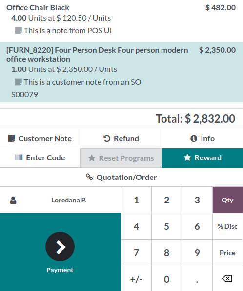
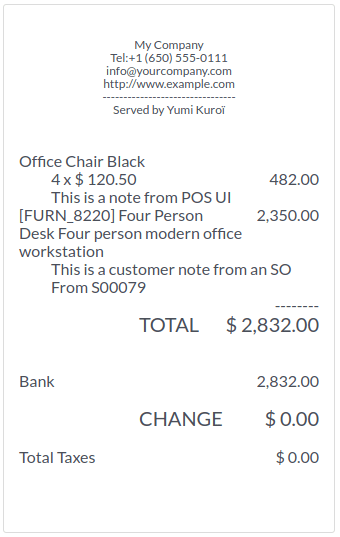

=============
Customer note
=============

The **Customer note** feature allows you to provide customers with further information on a specific
product. For instance, to provide cleaning and maintenance tips. They can also be used to track a
customer’s particular request, such as not wanting the product to be assembled for them.

Add a customer note
===================

You can add notes directly from an open :ref:`POS session <pos/start-session>`. To do so, click
:guilabel:`Customer Note` on the pad. Doing so opens a pop-up window in which you can add content
for the note.

.. note::
   Product notes from an :doc:`imported SO <../shop/sales_order>` are displayed identically in the
   cart.

Modify a customer note
======================

Select the product from the cart to modify an existing note and click :guilabel:`Customer Note`.
Doing so reopens the previous pop-up window. Alter the text and click :guilabel:`Add`.

Receipts and invoices
=====================

Customer notes appear on customers' receipts and invoices similarly to how they appear in the cart,
meaning under the related product.

