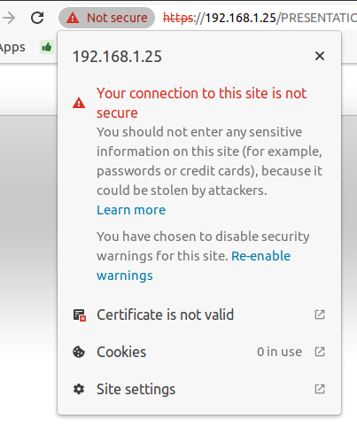

=========================================
Self-signed certificate for ePOS printers
=========================================

ePos printers are designed specifically to work with your Point of Sale system, which sends the
tickets directly to the printer.

Some models don't require an IoT box, but the connection between your web browser and the printer
may require a :doc:`secure connection with the HTTPS protocol <https>`. If so, a self-signed
certificate is necessary to use your printer.

.. note::
   Please check the following list of compatible `Epson ePOS printers
   <https://c4b.epson-biz.com/modules/community/index.php?content_id=91>`_. This list includes the
   following models:

   - TM-H6000IV-DT (Receipt printer only)
   - TM-T70II-DT
   - TM-T88V-DT
   - TM-L90-i
   - TM-T20II-i
   - TM-T70-i
   - TM-T82II-i
   - TM-T83II-i
   - TM-T88V-i
   - TM-U220-i
   - TM-m10
   - TM-m30
   - TM-P20 (Wi-Fi® model)
   - TM-P60II (Receipt: Wi-Fi® model)
   - TM-P60II (Peeler: Wi-Fi® model)
   - TM-P80 (Wi-Fi® model)

Generate a Self-signed certificate
==================================

Access your ePOS printer's settings with your web browser by navigating to its IP address, for
example, `http://192.168.1.25`.

.. note::
   - The printer automatically prints the IP address during startup.
   - We recommend assigning a **fixed IP address** to the printer from the network router.

Go to :menuselection:`Authentication --> Certificate List` and create a new **Self-Signed
Certificate**.

- **Common Name**: the IP address of the ePos Printer, for example, `192.168.1.25`
- **Validity Period**: `10`

Create and reboot the printer, go to :menuselection:`Security --> SSL/TLS`, and check if
**Selfsigned Certificate** is selected.

Export the Self-signed certificate
==================================

To avoid having to accept the self-signed certificate several times, you can export it and then
import it to your web browser or mobile device.

To do so, access your ePOS printer's settings with your web browser by navigating to its IP address,
for example, `https://192.168.1.25`. Then, accept the self-signed certificate.

.. note::
   Note that the protocol is now **HTTPS**.

Click on :menuselection:`Connection is not secure --> Certificate is not valid`.

Go to the :guilabel:`Details` tab and click on :guilabel:`Export` Select X.509 in base 64 and save it.

Import the Self-signed certificate to Windows (Using Chrome)
============================================================

In your Chrome browser, go to :menuselection:`Settings --> Privacy and security --> Security -->
Manage certificates`

Go to the :guilabel:`Authorities` tab and click on :guilabel:`Import` and select
your previous file. Accept all warnings and restart your browser.

Import the Self-signed certificate to your Android device
=========================================================

On your Android device, open the settings and search for *certificate*. Then, click on **Certificate
AC** (Install from device storage), and select the certificate.
