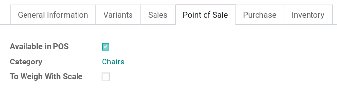
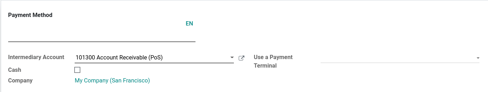
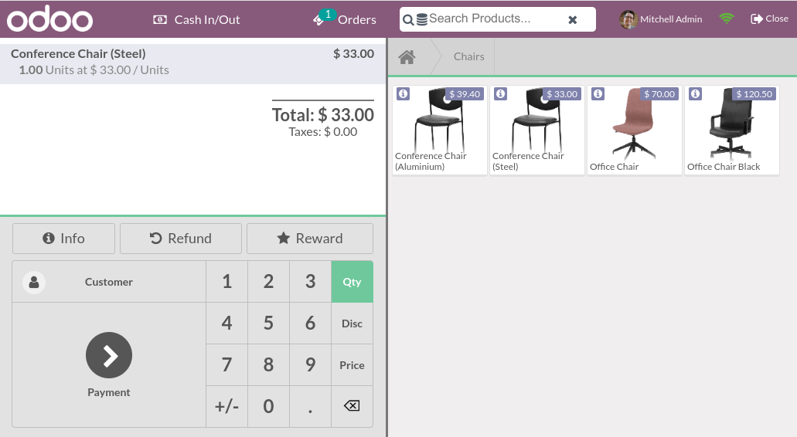
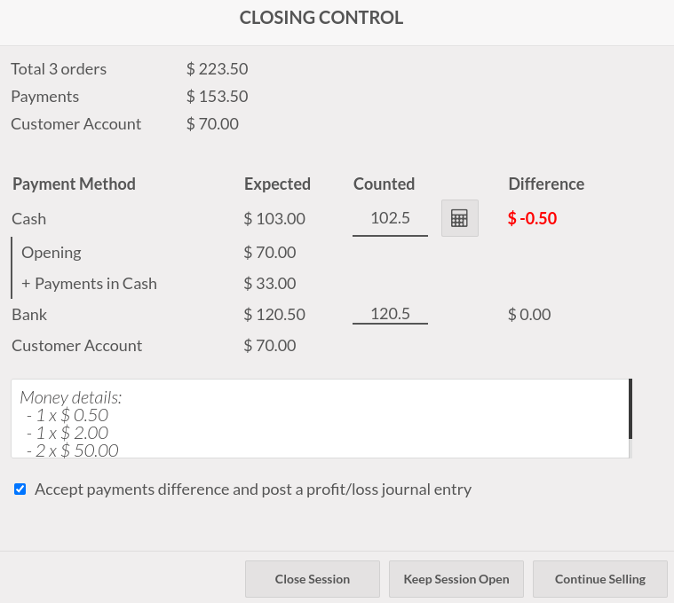

===============
Getting started
===============

**Point of Sale** is a fully integrated application that allows you to sell products (online or
offline) with any device. It also automatically registers product moves in your stock, gives you
real-time statistics, and consolidations across all shops.

Configuration
=============

Make products available
-----------------------

To make products available for sale, go to :menuselection:`Point of Sale --> Products --> Products`,
and select a product to open the product form. In the :guilabel:`Sales` tab, enable
:guilabel:`Available in POS`.

Configure payment methods
-------------------------

To add a payment method, you first need to create it. Go to :menuselection:`Point of Sale -->
Configuration --> Payment Methods --> Create`, and set a name. Check :guilabel:`Identify Customer`
to allow this payment method *exclusively* for registered customers.

Then, select the :guilabel:`Journal`. Choose :guilabel:`Cash` to use this payment method for cash
payments, or :guilabel:`Bank` to use it for card payments.

.. comment:
   when created, add a link to the customeraccount page under advanced_pricing_features

.. note::
   - Selecting a :guilabel:`bank` journal automatically adds the :guilabel:`Use a Payment Terminal`
     field in which you can add your terminal's information.
   - Credentials are mandatory to use a payment terminal. To learn how to configure the different
     terminals, check out the following documentation pages:

     - :doc:`Adyen configuration <../payment/adyen>`
     - :doc:`Vantiv configuration <../payment/vantiv>`
     - :doc:`Ingenico configuration <../payment/ingenico>`
     - :doc:`Six configuration <../payment/six>`
     - :doc:`Worldline configuration <../payment/worldline>`

Once the payment method is created, you can select it in your POS settings. To do so, go to
:menuselection:`Point of Sale --> Configuration --> Settings`. Select a POS for which you wish to
make the payment method available in the :guilabel:`Point of Sale` field, and add the payment
method(s) under the :guilabel:`Payment` section.

POS sessions
============

.. _pos/start-session:

Start a session
---------------

From the **POS dashboard**, click :guilabel:`New Session` and at the :guilabel:`Opening Cash
Control` screen, click :guilabel:`Open Session` to start a POS session, or click :guilabel:`Continue
Selling` if the session is already opened.

.. note::
   Multiple users can be connected to the same session at the same time. However, the session can
   only be opened once on the same browser.

Click products to add them to the cart. To change the **quantity**, click :guilabel:`Qty` and enter
the number of products using the keypad. To add a **discount** or modify the product **price**,
click respectively :guilabel:`% Disc` or :guilabel:`Price` and enter the amounts.

Once an order is completed, proceed to checkout by clicking :guilabel:`Payment`. Select the
**payment method**, enter the received amount, and click :guilabel:`Validate`. Click
:guilabel:`New Order` to move on to the next customer.

.. tip::
   - You can use both `,` and `.` on your keyboard as decimal separators.
   - **Cash** is selected by default if you enter the amount without choosing a payment method.

Return and refund products
--------------------------

To return and refund a product,

#. :ref:`start a session <pos/start-session>` from the **POS dashboard**;
#. click :guilabel:`Refund` and select the corresponding order;
#. select the product and the quantity to refund using the keypad;
#. click :guilabel:`Refund` to go back to the previous screen;
#. once the order is completed, click :guilabel:`Payment` to proceed to the refund;
#. click :guilabel:`Validate` and :guilabel:`New Order` to move on to the next customer.

.. image:: getting_started/refund.png
   :align: center
   :alt: refund view from a POS

.. note::
   - You can filter the **orders list** by :guilabel:`Receipt Number`, :guilabel:`Date` or
     :guilabel:`Customer` using the search bar.
   - You can also refund a product by selecting the returned product from an open session, and
     setting a negative quantity that equals the number of returned products. To do so, click
     :guilabel:`Qty` and :guilabel:`+/-`, followed by the quantity of returned products.

Close the POS session
---------------------

To close your session, click :guilabel:`Close` in the upper right corner of your screen; doing so
opens the :guilabel:`Closing Control` pop-up screen. From this screen, you can retrieve various
information:

- the number of orders made and the total amount made during the session;
- the expected amounts grouped by payment method.

Before closing this window, count your cash using the calculator icon. Doing so opens a pop-up
window that computes the total amount in the cash drawer depending on the coins and bills counted
and added manually. Then, click :guilabel:`Confirm` or :guilabel:`Discard` to close the window. The
computed amount is set in the :guilabel:`Counted` column, and the :guilabel:`Money Details` are
specified in the **Notes** section.

Once you are done controlling the amounts, click :guilabel:`Close Session` to close and go back to
the **POS dashboard**.

.. note::
   - You can let the session open by clicking :guilabel:`Backend` or abort and keep selling by
     clicking :guilabel:`Discard`.
   - Depending on your setup, you might only be allowed to close a session if the expected cash
     revenue equals the counted cash. To close it anyway, click :guilabel:`Ok` at the
     :guilabel:`Payments Difference` screen.

.. tip::
   - It is strongly advised to close your POS session at the end of each day.
   - To look at all your previous sessions, go to :menuselection:`Point of Sale --> Orders -->
     Sessions`.

View statistics
===============

To access your statistics, go to :menuselection:`Point of Sale --> Reporting --> Orders`. Or, from
the **POS dashboard**, click the vertical ellipsis (:guilabel:`⋮`) button, :guilabel:`Reporting`,
and :guilabel:`Orders`.

These statistics are available in a graph or pivot view that you can filter or group depending on
your needs.
