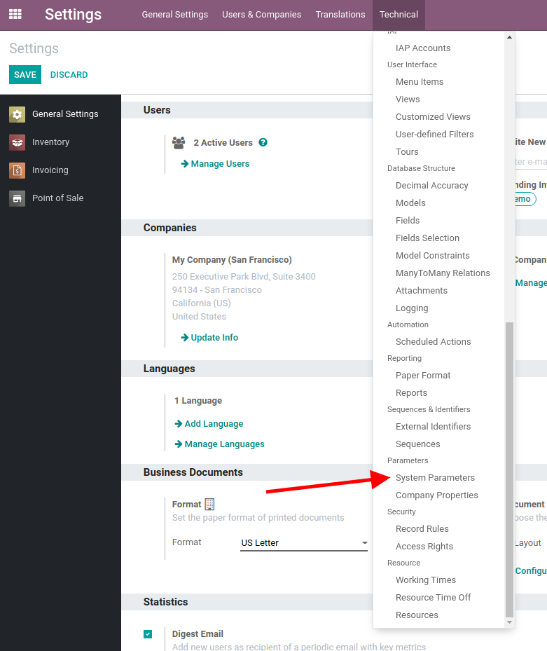
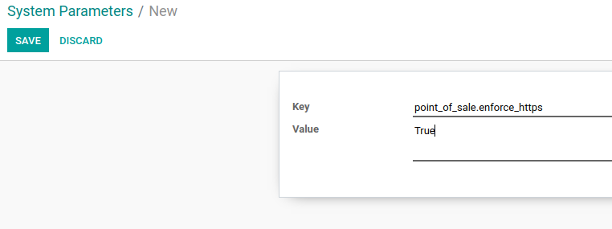

===========
Using HTTPS
===========

By default, POS loading is done in HTTP 
if "direct devices" are selected. (ePos printer or six terminal)

Create a system key to force the POS in HTTPS
=============================================

Load you domain in debug mode to allow you to edit system parameter
Please refer to the :doc:`Developer Mode </applications/general/developer_mode>`.

To add a key for the system, go to :menuselection:`Settings --> Technical --> Parameters --> System Parameters`

Create a new key:

**Key**: ``point_of_sale.enforce_https``

**Value**: ``True``

and save it.

Now your POS will be loaded in HTTPS.
