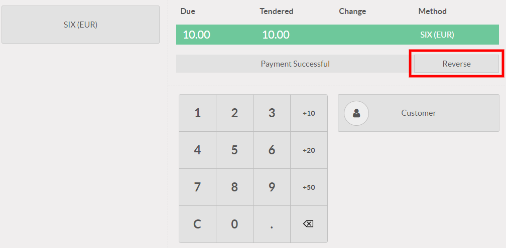

====
SIX
====

Connecting a SIX payment terminal allows you to offer a fluid payment flow to your customers and
ease the work of your cashiers.

.. warning::
   - Starting in July 2022, it will **not** be possible anymore to connect and use a Six payment
     terminal in PoS.
   - Even though Worldline has recently acquired SIX Payment Services and both companies use Yomani
     payment terminals, the firmware they run is different. Terminals received from Worldline are
     therefore not compatible with this integration.

Configuration
=============

Configure the Payment Method
----------------------------

First, make sure that the :guilabel:`POS Six` module is installed. For this, go to
:guilabel:`Apps`, remove the :guilabel:`Apps` filter, and search for *POS Six*.

.. image:: six/pos-six-module.png
   :align: center
   :alt: The POS Six module.

Back in :menuselection:`Point of Sale --> Configuration --> Payment Methods`, click
:guilabel:`Create` to create a new payment method for SIX, select the payment terminal option
:guilabel:`SIX`, and enter the payment terminal IP address.

.. image:: six/new-payment-method.png
   :align: center
   :alt: Create a new payment method for the SIX payment terminal.

Pay with a Payment Terminal
===========================

In the :abbr:`PoS (Point of Sale)` interface, at the moment of the payment, select a payment method
using a payment terminal. Verify that the amount in the tendered column is the one that has to be
sent to the payment terminal and click on :guilabel:`Send`. To cancel the payment request, click on
:guilabel:`Cancel`.

.. image:: six/pos-send-payment.png
   :align: center
   :alt: The PoS interface.

When the payment is done, the status will change to :guilabel:`Payment Successful`. If needed,
reverse the last transaction by clicking on :guilabel:`Reverse`.

If there is any issue with the payment terminal, you can still force the payment using the
:guilabel:`Force Done` button. This will allow you to validate the order in Odoo even if there are
connection issues between the payment terminal and Odoo.
