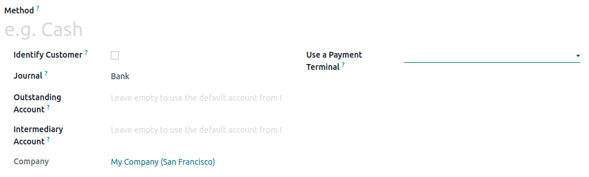

:show-content:

===============
Payment methods
===============

To add a payment method, you first need to create it. Go to :menuselection:`Point of Sale -->
Configuration --> Payment Methods --> New`, and set a name. Check :guilabel:`Identify Customer` to
allow this payment method *exclusively* for registered customers.

Then, select the :guilabel:`Journal`. Choose :guilabel:`Cash` to use this payment method for cash
payments, or :guilabel:`Bank` to use it for card payments.

.. note::
   Selecting a :guilabel:`bank` journal automatically adds the :guilabel:`Use a Payment Terminal`
   field in which you can add your :doc:`payment terminal's information
   <payment_methods/terminals>`.

.. seealso::
   :doc:`payment_methods/terminals`.

Once the payment method is created, you can select it in your POS settings. To do so, go to the
:ref:`POS' settings <configuration/settings>`, click :guilabel:`Edit`, and add the payment method
under the :guilabel:`Payments` section.

.. toctree::
   :titlesonly:

   payment_methods/terminals
