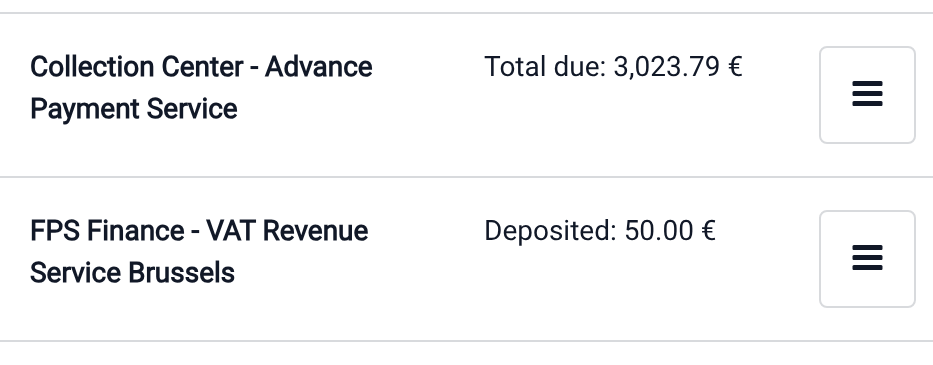

================
Customer account
================

The **Customer account** feature allows customers to use their account to make purchases. They can
deposit money for future purchases or select their account as a :doc:`payment method
<../payment_methods>` to purchase items on credit and :ref:`settle the debt later <pos/settle_debt>`
through a point-of-sale transaction or via an issued invoice.

.. _pos/payment_method/configuration:

Configuration
=============

To allow customers to pay using their customer account, :doc:`create a payment method
<../payment_methods>` and configure it as follows:

#. Enable :guilabel:`Identify Customer` to force the :ref:`selection of a customer <pos/customers>`
   to allow using this payment method.
#. Keep the :guilabel:`Journal` field blank to use the customer's receivable account.
#. Select the points of sale where this payment method is available in the :guilabel:`Point of Sale`
   field.

.. note::
   Set a maximum sales credit to prevent customers from exceeding a defined credit limit. Once the
   maximum credit amount is reached, the selected customer button turns orange and a
   :icon:`fa-warning` (:guilabel:`warning sign`) icon appears next to the customer’s name as a
   warning. However, this warning does **not** prevent a sale from proceeding.

.. seealso::
   - :doc:`../../../finance/accounting/payments`
   - :doc:`../../../finance/accounting/get_started/chart_of_accounts`

Payment process
===============

Deposit money
-------------

To deposit money to the customer account from the POS interface:

#. Click :guilabel:`Customer` and locate the desired customer in the list.
#. Click the :icon:`fa-bars` (:guilabel:`hamburger menu`) icon, then select :guilabel:`Deposit
   money`.
#. Choose the payment method.
#. When redirected to the payment screen, enter the amount to deposit using the keypad.
#. :guilabel:`Validate` the transaction.
#. Click :guilabel:`Yes` on the popup window to confirm.

Customer account as payment method
----------------------------------

To use the customer account as a payment method for a purchase from the POS payment screen:

#. Select the payment method :ref:`created for the customer account
   <pos/payment_method/configuration>`.
#. Click :icon:`fa-user` :guilabel:`Customer` to open the customer list and select the customer.
#. Click the :guilabel:`Invoice` button.
#. :guilabel:`Validate` the purchase.

.. important::
   To effectively monitor and manage the customer’s unpaid debt, either :doc:`create an invoice
   <../receipts_invoices>` for the order or install the :doc:`Accounting application
   <../../../finance/accounting>`.

Debt tracking
=============

When a customer pays using their customer account, the purchase amount is recorded as debt until it
is paid off. To keep track of a customer’s debt, consult their customer statement in the backend or
their profile in an open session.

To access the :guilabel:`Customer Statement` report, go to :menuselection:`Point of Sale --> Orders
--> Customers`, select a customer to open their form, and click the :guilabel:`Customer Statements`
smart button.

To view the total amount due or deposited by a customer from an open session, access the customer
list by clicking :guilabel:`Customer` and search for the desired customer; the amount due or
deposited is displayed next to their name.

.. seealso::
   :doc:`../../../finance/accounting/payments/follow_up`

.. note::
   When a customer is related to a company, the customer statement report might be related to the
   company itself, and not the customer.

.. _pos/settle_debt:

Due amount settlement
=====================

To settle a customer's due amount, :ref:`register the payment from the invoice
<accounting/payments/from-invoice-bill>` or, from the POS interface, follow these steps:

#. Click :guilabel:`Customer` and search for the desired customer in the list.
#. Click the :icon:`fa-bars` (:guilabel:`hamburger menu`) icon next to the customer's name.
#. Select :guilabel:`Settle orders` or :guilabel:`Settle invoices`.
#. Select the orders or invoices to settle.
#. Click :guilabel:`Payment` and select the relevant payment method.
#. Click :guilabel:`Validate`.
#. Click :guilabel:`Yes` on the popup window to confirm the deposit of the payment received from the
   customer.
