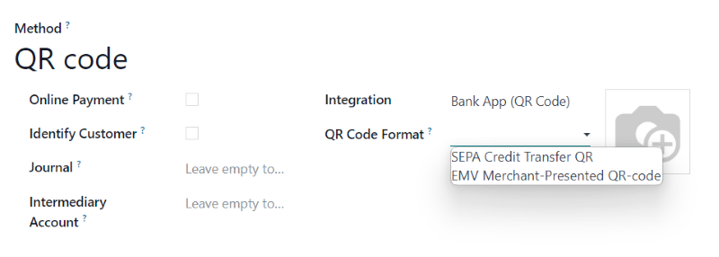

================
QR code payments
================

QR code payments allow users to generate a code that customers can scan with their mobile banking
app to initiate a bank transfer or pay instantly.

Configuration
=============

Activate and set up QR code payments
------------------------------------

Go to :menuselection:`Accounting --> Configuration --> Settings`, and

#. Activate or upgrade your country's fiscal localization package under the :guilabel:`Fiscal
   Localization` section to access all country-specific accounting features.
#. Activate :guilabel:`QR codes` under the :guilabel:`Customer Payments` section.

Then, as the QR code type differs depending on your country, follow the corresponding documentation
page from the following table to set them up.

.. list-table::
   :widths: 20 20 20 40
   :header-rows: 1

   * - QR code types
     - Module name
     - Technical name
     - Description
   * - Pix
     - :doc:`Brazilian - Accounting<../../../finance/fiscal_localizations/brazil>`
     - `l10n_br`
     - The base module to manage the accounting chart and localization for Brazil.
   * - FPS
     - :doc:`Hong Kong - Accounting<../../../finance/fiscal_localizations/hong_kong>`
     - `l10n_hk`
     - The base module to manage the accounting chart and localization for Hong Kong.
   * - QRIS
     - :doc:`Indonesian - Accounting<../../../finance/fiscal_localizations/indonesia>`
     - `l10n_id`
     - The base module to manage the accounting chart and localization for Indonesia.
   * - PayNow
     - :doc:`Singapore - Accounting<../../../finance/fiscal_localizations/singapore>`
     - `l10n_sg`
     - The base module to manage the accounting chart and localization for Singapore.
   * - QR-bill
     - :doc:`Switzerland - Accounting<../../../finance/fiscal_localizations/switzerland>`
     - `l10n_ch`
     - The base module to manage the accounting chart and localization for Switzerland.
   * - PromptPay
     - :doc:`Thailand - Accounting<../../../finance/fiscal_localizations/thailand>`
     - `l10n_th`
     - The base module to manage the accounting chart and localization for Thailand.
   * - VietQR
     - :doc:`Vietnam - Accounting<../../../finance/fiscal_localizations/vietnam>`
     - `l10n_vn`
     - The base module to manage the accounting chart and localization for Vietnam.
   * - EPC
     - :doc:`Account SEPA QR Code<../../../finance/accounting/customer_invoices/epc_qr_code>`
     - `account_qr_code_sepa`
     - This module adds support for SEPA Credit Transfer QR-code generation.

Create the payment method
-------------------------

#. Open the Point of Sale application.
#. Go to :menuselection:`Configuration --> Payment Methods` and create a payment method.
#. Set a bank-type journal.
#. Select :guilabel:`Bank App (QR Code)` under the :guilabel:`Integration` section.
#. Select the :guilabel:`QR Code Format` from the dropdown menu.

   - Select :guilabel:`SEPA Credit Transfer QR` if you are part of the Single Euro Payments Area
     (SEPA).
   - Select :guilabel:`EMV Merchant-Presented QR-code` for other QR code types.

.. important::
   At least one bank account must be defined in the journal to allow QR code payments to be
   registered with bank apps.

Once the payment method is created, go to the :ref:`POS' settings <configuration/settings>` and add
the payment method to your POS under the :guilabel:`Payment` section.

.. image:: qr_code_payment/qr-configuration-setting.png
   :alt: Enable QR code payment method
   :scale: 85 %

Register payments using QR codes
================================

When processing a payment, select the payment method for QR code payments. A QR code is generated
and displayed on the screen for the customer to scan and pay with their mobile banking app.

.. image:: qr_code_payment/qr-payment-example.png
   :alt: QR code payment example
   :scale: 75 %

Hit :guilabel:`Confirm Payment` to validate the transaction.

.. important::
   Odoo does **not** check the bank payment. It is recommended that users verify payments for
   validity before confirming them on the POS register.
