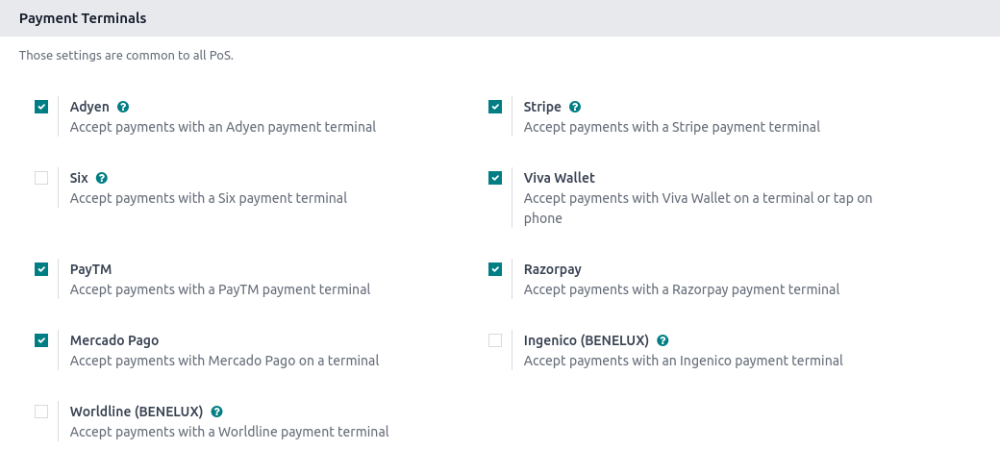

:show-content:

=================
Payment terminals
=================

Connecting and integrating a payment terminal with your POS system allows you to accept multiple
payment options, including credit and debit cards, making the payment process more efficient.

.. _terminals/configuration:

Configuration
=============

Go to the :ref:`application settings <configuration/settings>`, scroll down to the
:guilabel:`Payment Terminals` section, and tick your terminal's checkbox.

Then, follow the corresponding documentation to configure your device:

- :doc:`Adyen configuration <terminals/adyen>`
- :doc:`Ingenico configuration <terminals/ingenico>`
- :doc:`Mercado Pago configuration <terminals/mercado_pago>`
- :doc:`Razorpay configuration <terminals/razorpay>`
- :doc:`SIX configuration <terminals/six>`
- :doc:`Stripe configuration <terminals/stripe>`
- :doc:`Viva Wallet configuration <terminals/viva_wallet>`
- :doc:`Worldline configuration <terminals/worldline>`

Once the terminal is configured, you can :doc:`create the corresponding payment method and add it to
the POS <../payment_methods>`.

Pay with a payment terminal
===========================

When processing a payment, select the terminal's payment method. Check the amount and
click on :guilabel:`Send`. Once the payment is successful, the status changes to :guilabel:`Payment
Successful`.

.. note::
   - | In case of connection issues between Odoo and the payment terminal, force the payment by
       clicking on :guilabel:`Force Done`, which allows you to validate the order.
     | This option is only available after receiving an error message informing you that the
       connection failed.
   - To cancel the payment request, click on :guilabel:`Cancel`.

.. toctree::
   :titlesonly:

   terminals/adyen
   terminals/ingenico
   terminals/mercado_pago
   terminals/razorpay
   terminals/six
   terminals/stripe
   terminals/viva_wallet
   terminals/worldline
