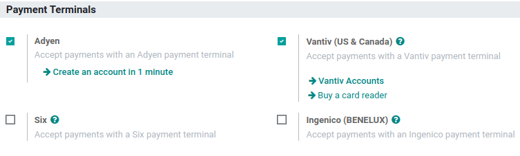

:show-content:

=================
Payment terminals
=================

Connecting and integrating a payment terminal with your POS system allows you to accept multiple
payment options, including credit and debit cards, making the payment process more efficient.

Configuration
=============

Go to the :doc:`application settings <../configuration>`, scroll down to the :guilabel:`Payment
Terminals` section, and tick your terminal's checkbox.

Then, follow the corresponding documentation to configure your device:

- :doc:`Adyen configuration <terminals/adyen>`
- :doc:`Ingenico configuration <terminals/ingenico>`
- :doc:`SIX configuration <terminals/six>`
- :doc:`Stripe configuration <terminals/stripe>`
- :doc:`Vantiv configuration <terminals/vantiv>`
- :doc:`Worldline configuration <terminals/worldline>`

Once the terminal is configured, you can :doc:`create the corresponding payment method and add it to
the POS <../payment_methods>`.

.. toctree::
   :titlesonly:

   terminals/adyen
   terminals/ingenico
   terminals/six
   terminals/stripe
   terminals/vantiv
   terminals/worldline
