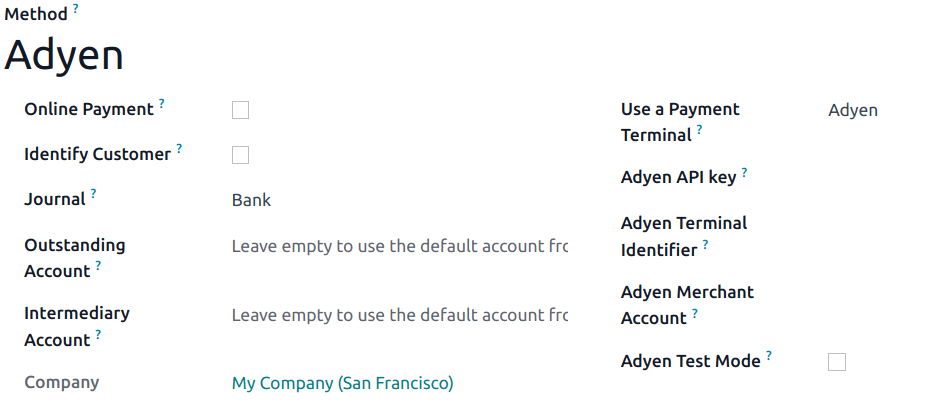

=====
Adyen
=====

Connecting an **Adyen payment terminal** allows you to offer a fluid payment flow to your customers
and ease the work of your cashiers.

.. note::
   Adyen works only with businesses processing **more** than **10 million annually** or invoicing a
   **minimum** of **1,000** transactions **per month**.

Configuration
=============

Start by creating your Adyen account on `Adyen's website <https://www.adyen.com/>`_. Then, board
your terminal following the steps described on your terminal's screen.

.. seealso::
   - `Adyen Docs - Payment terminal quickstart guides
     <https://docs.adyen.com/point-of-sale/user-manuals>`_.

.. _adyen/api:

Generate an Adyen API key
-------------------------

The **Adyen API key** is used to authenticate requests from your Adyen terminal. To generate an API
key, go to your :menuselection:`Adyen account --> Developers --> API credentials`, and **create**
new credentials or select **existing** ones. Click :guilabel:`Generate an API key` and save the key
to paste it into the Odoo :guilabel:`Adyen API key` field at :ref:`the payment method creation
<adyen/method-creation>`.

.. seealso::
   - `Adyen Docs - API credentials
     <https://docs.adyen.com/development-resources/api-credentials#generate-api-key>`_.

.. _adyen/identifier:

Locate the Adyen terminal identifier
------------------------------------

The **Adyen Terminal Identifier** is the terminal's serial number, which is used to identify the
hardware.

To find this number, go to your :menuselection:`Adyen account --> Point of Sale --> Terminals`,
select the terminal to link with, and save its serial number to paste it into the Odoo
:guilabel:`Adyen Terminal Identifier` field at :ref:`the payment method creation
<adyen/method-creation>`.

Set the Event URLs
------------------

For Odoo to know when a payment is made, you must configure the terminal **Event URLs**. To do so,

#. Log in to `Adyen's website <https://www.adyen.com/>`_;
#. Go to :menuselection:`Adyen's dashboard --> Point of Sale --> Terminals` and select the connected
   terminal;
#. From the terminal settings, click :guilabel:`Integrations`;
#. Set the :guilabel:`Switch to decrypted mode to edit this setting` field as :guilabel:`Decrypted`;
#. Click the **pencil icon** button and enter your server address, followed by
   `/pos_adyen/notification` in the :guilabel:`Event URLs` field;
#. Click :guilabel:`Save` at the bottom of the screen to save changes.

.. _adyen/method-creation:

Configure the payment method
----------------------------

Enable the payment terminal :ref:`in the application settings <configuration/settings>` and
:doc:`create the related payment method <../../payment_methods>`. Set the journal type as
:guilabel:`Bank` and select :guilabel:`Adyen` in the :guilabel:`Use a Payment Terminal` field.

Finally, fill in the mandatory fields with your :ref:`Adyen API key <adyen/api>`, :ref:`Adyen
Terminal Identifier <adyen/identifier>`, and :guilabel:`Adyen Merchant Account`.

Once the payment method is created, you can select it in your POS settings. To do so, go to the
:ref:`POS' settings <configuration/settings>`, click :guilabel:`Edit`, and add the payment method
under the :guilabel:`Payments` section.

Pay with a payment terminal
===========================

When processing a payment, select :guilabel:`Adyen` as the payment method. Check the amount and
click on :guilabel:`Send`. Once the payment is successful, the status changes to :guilabel:`Payment
Successful`.

.. note::
   - | In case of connection issues between Odoo and the payment terminal, force the payment by
       clicking on :guilabel:`Force Done`, which allows you to validate the order.
     | This option is only available after receiving an error message informing you that the
       connection failed.
   - To cancel the payment request, click on :guilabel:`cancel`.
