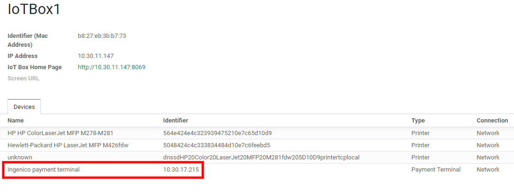

========
Ingenico
========

Connecting a payment terminal allows you to offer a fluid payment flow to your customers and ease
the work of your cashiers.

.. important::
   - Ingenico payment terminals require an :doc:`IoT system </applications/general/iot>`.
   - Ingenico is currently only available in Belgium, the Netherlands and Luxembourg.
   - Odoo works with the Ingenico Lane/Desk/Move 5000 payment terminals, as they support the TLV
     communication protocol through TCP/IP.

.. _pos/ingenico/terminal-configuration:

Lane/Desk/Move 5000 terminal configuration
==========================================

The configuration of Ingenico requires to first enable the terminal in Point of Sale. To do so,
follow these steps:

#. Go to :menuselection:`Point of Sale --> Configuration --> Settings`.
#. Scroll down to the :guilabel:`Payment Terminals` section, enable the :guilabel:`Ingenico
   (BENELUX)` payment terminal.
#. Click :guilabel:`Save`.

Then :doc:`connect the IoT system to Odoo </applications/general/iot/connect>` and follow
these steps on the terminal to configure the Ingenico Lane/Desk/Move 5000 terminal:

#. Press the function button (:guilabel:`F` on Lane/5000, :guilabel:`⦿` on Desk/5000 and
   Move/5000).
#. Go to :menuselection:`Kassa Menu --> Settings Menu`, enter the settings password (default:
   `2009`), and press :guilabel:`OK`.
#. Select :guilabel:`Protocol` and press :guilabel:`OK`.
#. Select `CTEP` and press :guilabel:`OK`.
#. Select :guilabel:`Change Connection` and press :guilabel:`OK`.
#. Select :guilabel:`TCP/IP` and press :guilabel:`OK`. Then, select :guilabel:`IP-address` and press
   :guilabel:`OK`.
#. Enter the IoT's IP address and press :guilabel:`OK`.
#. Enter port number `9001` (or `9050` if using Windows IoT).
#. Select :guilabel:`No SSL` and press :guilabel:`OK`.

The terminal restarts and should be displayed on the IoT system's form in Odoo. Continue the
configuration and create a :ref:`payment method <pos/ingenico/payment-method>`.

.. _pos/ingenico/payment-method:

Odoo configuration
==================

To connect the Ingenico terminal with Odoo Point of Sale, follow these steps:

#. Go to :menuselection:`Point of Sale --> Configuration --> Payment Methods` and :doc:`create a
   payment method <../../payment_methods>`.
#. Set the :guilabel:`Journal` field to :guilabel:`Bank`.
#. Set the :guilabel:`Point of Sale` field to the desired point of sale.
#. Set the :guilabel:`Integration` field to :guilabel:`Terminal`.
#. Select the Ingenico terminal number in the :guilabel:`Payment Terminal Device` field, then save.
