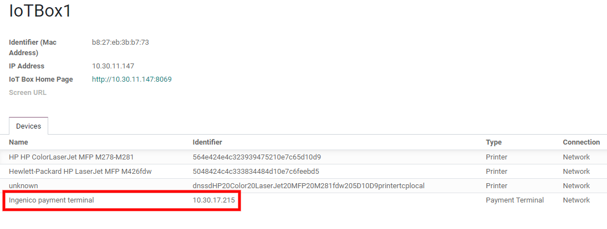

========
Ingenico
========

Connecting a payment terminal allows you to offer a fluid payment flow to your customers and ease
the work of your cashiers.

.. important::
   - Ingenico payment terminals require an :doc:`IoT system </applications/general/iot>`.
   - Ingenico is currently only available in Belgium, the Netherlands and Luxembourg.
   - Odoo works with Ingenico's `Lane/5000
     <https://ingenico.com/en/products-services/payment-terminals/tetra/lane5000-le>`_, `Desk/5000
     <https://ingenico.com/en/products-services/payment-terminals/tetra/desk5000>`_, `Move/5000
     <https://ingenico.com/en/products-services/payment-terminals/tetra/move5000>`_ payment
     terminals, as they support the TLV communication protocol through TCP/IP.

.. _pos/ingenico/terminal-configuration:

Ingenico terminal configuration
===============================

To configure the Lane/5000, Desk/5000, or Move/5000, follow these steps:

#. Press the function button (:guilabel:`F` on the Lane/5000 terminal, :guilabel:`⦿` on the
   Desk/5000 and Move/5000 terminals).
#. Go to :menuselection:`Kassa Menu --> Settings Menu`, enter the settings password (default:
   `2009`), and press :guilabel:`OK`.
#. Select :guilabel:`Protocol` and press :guilabel:`OK`.
#. Select :guilabel:`CTEP` and press :guilabel:`OK`.
#. Select :guilabel:`Change Connection` and press :guilabel:`OK`.
#. Select :guilabel:`TCP/IP` and press :guilabel:`OK`. Then, select :guilabel:`IP-address` and press
   :guilabel:`OK`.
#. Enter the IoT system's IP address and press :guilabel:`OK`.
#. Enter port number `9001` if using an IoT box or `9050` if using the Windows virtual IoT.
#. Select :guilabel:`No SSL` and press :guilabel:`OK`.

The terminal restarts and should be displayed on the IoT system's form in Odoo.

.. _pos/ingenico/payment-method:

Odoo configuration
==================

The configuration of an Ingenico terminal with Odoo requires to first :doc:`connect the IoT system
to Odoo </applications/general/iot/connect>`, then to enable the :guilabel:`Worldline` terminal in
the :ref:`POS settings <pos/use/settings>` under the :guilabel:`Payment Terminals` section.

To connect the Ingenico terminal with Odoo Point of Sale, follow these steps:

#. Go to :menuselection:`Point of Sale --> Configuration --> Payment Methods` and :doc:`create a
   payment method <../../payment_methods>`.
#. Set the :guilabel:`Journal` field to :guilabel:`Bank`.
#. Set the :guilabel:`Point of Sale` field to the desired point of sale.
#. Set the :guilabel:`Integration` field to :guilabel:`Terminal`.
#. Select the Worldline terminal number in the :guilabel:`Payment Terminal Device` field, then save.
