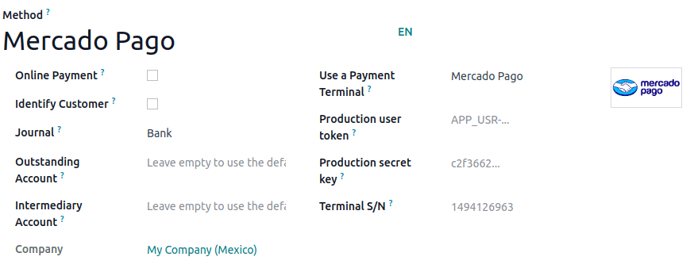

============
Mercado Pago
============

Connecting a payment terminal allows you to offer a fluid payment flow to your customers and ease
the work of your cashiers.

.. important::
   Only **Point Smart** payment terminals in **Argentina**, **Brazil**, and **Mexico** are
   supported. They can be purchased on `Mercado Pago's website
   <https://www.mercadopago.com.mx/herramientas-para-vender/lectores-point>`_.

.. seealso::
   `Mercado Pago online payments
   <https://www.mercadopago.com.mx/herramientas-para-vender/check-out#benefits-checkout>`_

.. _pos-mercado-pago-configuration:

Configuration
=============

#. Create a `Mercado Pago account <https://www.mercadopago.com.mx/>`_.
#. Associate your Point Smart terminal with a :guilabel:`store` and a :guilabel:`cash drawer` by
   following `Mercado Pago's documentation <https://vendedores.mercadolibre.com.ar/nota/locales-una-herramienta-para-mejorar-la-gestion-de-tus-puntos-de-venta/>`_.

   .. note::
      All purchased terminals are automatically displayed on your Mercado dashboard.

#. Set your Point Smart terminal to the :guilabel:`Point of Sale` operation mode.

   .. warning::
      Odoo does not support the :guilabel:`Standalone` operation mode.

#. :ref:`Create a Point Smart application <pos-mercado-pago-application>`.
#. :ref:`Generate your credentials <pos-mercado-pago-credentials>`.
#. :ref:`Create and configure the related payment method <pos-mercado-pago-method>`.

.. _pos-mercado-pago-application:

Point Smart application
-----------------------

Create a new application from Mercado Pago's `developer panel
<https://www.mercadopago.com/developers>`_ by following `Mercado Pago's applications documentation
<https://www.mercadopago.com.mx/ayuda/20152>`_, making sure you select :guilabel:`In
person Payments`.

.. _pos-mercado-pago-credentials:

Credentials
-----------

Once the Point Smart application is created, three credentials are required:

- An access token that Odoo uses to call Mercado Pago.
- A webhook secret key that Odoo uses to authenticate notifications sent by Mercado Pago.
- The **terminal serial number** at the back of your Point Smart terminal.

Retrieve the access token and webhook secret key by following `Mercado Pago's credentials
documentation <https://www.mercadopago.com.mx/developers/en/docs/your-integrations/credentials>`_.
Then, copy and paste them into Odoo when creating the payment method.

.. important::
   For the webhooks configuration, add the URL of your Odoo database (e.g.,
   `https://mycompany.odoo.com`) followed by `/pos_mercado_pago/notification` (e.g.,
   `https://mycompany.odoo.com/pos_mercado_pago/notification`).

   .. image:: mercado_pago/webhooks.png
      :alt: Webhooks configuration on Mercado Pago.

.. _pos-mercado-pago-method:

Payment method
--------------

#. Go to :menuselection:`Point of Sale --> Configuration --> Settings` and enable :guilabel:`Mercado
   Pago` under the :guilabel:`Payment Terminals` section.
#. :doc:`Create the related payment method <../../payment_methods>` by going to
   :menuselection:`Point of Sale --> Configuration --> Payment Methods`.
#. Set the journal type as :guilabel:`Bank`
#. Select :guilabel:`Mercado Pago` in the :guilabel:`Use a Payment Terminal` field.
#. Fill in the mandatory fields with the :ref:`previously generated credentials
   <pos-mercado-pago-credentials>`:

   - Fill in the :guilabel:`Production user token` field using the access token.
   - Fill in the :guilabel:`Production secret key` field using the webhook secret key.
   - Fill in the :guilabel:`Terminal S/N` field using the terminal serial number. You can find it at
     the back of your terminal.
   - Click the :guilabel:`Force PDV` button to activate the Point of Sale mode.

Select the payment method by going to the :ref:`POS' settings <configuration/settings>` and adding
it to the payment method under the :guilabel:`Payment Methods` field of the :guilabel:`Payment`
section.

.. important::
   Any action made on the terminal should trigger a notification on the POS interface. Ensure the
   :ref:`webhook secret key <pos-mercado-pago-credentials>` is correctly configured if you are not
   notified.
