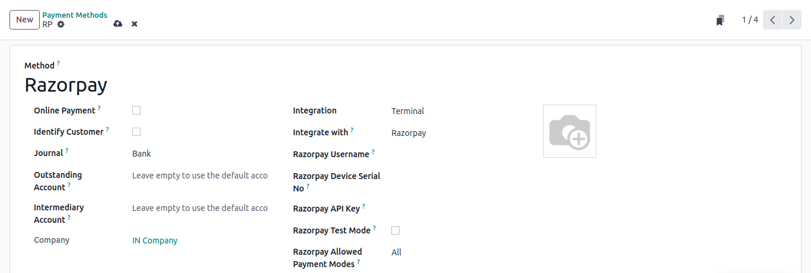
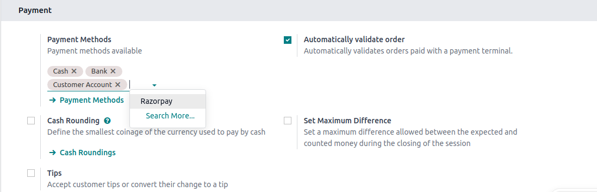
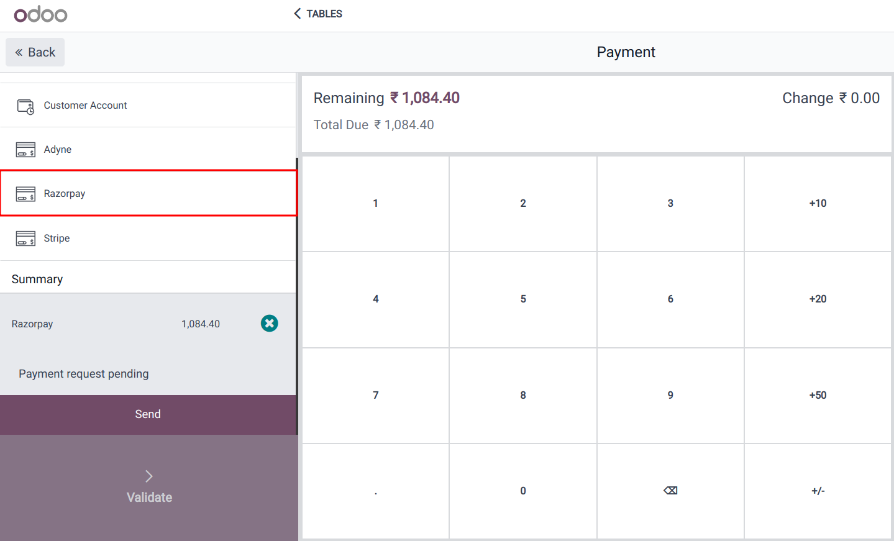

========
Razorpay
========

Connecting a Razorpay payment terminal allows you to offer a fluid payment flow to your customers and ease
the work of your cashiers.

.. seealso::
   - :doc:`Use Razorpay as payment provider. <../../../../finance/payment_providers/razorpay>`

Configuration
=============

Configure the payment method
----------------------------

Activate **Razorpay** in the settings by going to :menuselection:`Point of Sale --> Configuration -->
Settings --> Payment Terminals` and enabling :guilabel:`Razorpay`.

Then, create the payment method:

- Go to :menuselection:`Point of Sale --> Configuration --> Payment Methods`, click
  :guilabel:`Create`, and complete the :guilabel:`Method` field with your payment method's name.
- Set the :guilabel:`Journal` field as :guilabel:`Bank`.

  - If you find the field :guilabel:`Integration` set it as terminal then set the field :guilabel:`Integrate with` as razorpay.
  - Else set the :guilabel:`Use a Payment Terminal` field as razorpay.

- Enter your username in the :guilabel:`Razorpay Username` field and input device's serial number
  in the :guilabel:`Razorpay Device Serial No` field.
- Now set your `Razorpay API Key
  <https://razorpay.com/support/>`_ in the :guilabel:`Razorpay API Key` field.
- You can enable the :guilabel:`Razorpay Test Mode` field while testing or leave it as it is for live and production.
- Set the :guilabel:`Razorpay Allowed Payment Modes` according to your needs.

.. note::
   - Click :guilabel:`Identify Customer` to allow this payment method **exclusively** for identified
     customers. For any unidentified customers to be able to pay with razorpay, leave the
     :guilabel:`Identify Customer` field unchecked.
   - The :guilabel:`Outstanding Account` and the :guilabel:`Intermediary Account` can stay empty to
     use the default accounts.
   - Find your payment terminal serial number under the device or on the `Razorpay's dashboard
     <https://dashboard.razorpay.com/>`_.

Link the payment method to a POS
--------------------------------

For adding payment methods in your point of sale, go to :menuselection:`Point of Sale -->
Configuration --> Settings`. Select the POS, scroll down to the :guilabel:`Payments` section, and
add your payment method for **Razorpay** in the :guilabel:`Payment Methods` field.

Pay with a payment terminal
===========================

When processing a payment, select :guilabel:`Razorpay` as the payment method. Check the amount and
click :guilabel:`Send`. Once the payment is successful, the status changes to :guilabel:`Payment
Successful`. To cancel the payment request, click :guilabel:`Cancel`.

.. note::
   - | In case of connection issues between Odoo and the payment terminal, force the payment by
       clicking on :guilabel:`Force Done`, which allows you to validate the order.
     | This option is only available after receiving an error message informing you that the
       connection failed.
   - The terminal must have at least 10% battery level to use it.
