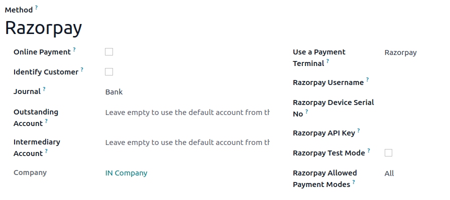
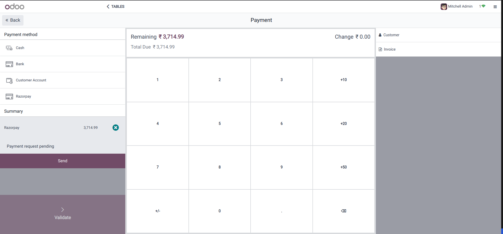

========
Razorpay
========

Connecting a **Razorpay payment terminal** allows you to offer a fluid payment flow to your customers
and ease the work of your cashiers.

.. note::
    Please note that Razorpay is currently only available for customers in India.

Configuration
=============

Start by creating your Razorpay account on `Razorpay's website <https://www.razorpay.com/>`_.

.. seealso::
   - `Razorpay Docs - Payment terminal quickstart guides`

.. _razorpay/api:

Generate a Razorpay API key
---------------------------

The **Razorpay API key** is used to authenticate requests from your Razorpay terminal. To generate an API
key, go to your :menuselection:`Razorpay account --> Developers --> API credentials`, and **create**
new credentials or select **existing** ones. Click :guilabel:`Generate an API key` and save the key
to paste it into the Odoo :guilabel:`Razorpay API key` field at :ref:`the payment method creation
<razorpay/method-creation>`.

.. seealso::
   - `Razorpay Docs - API credentials
     <https://razorpay.com/docs/payments/dashboard/account-settings/api-keys/>`_.

.. _razorpay/serial:

Locate the Razorpay Device Serial No.
-------------------------------------

The **Razorpay Device Serial No.** is the device's serial number, which is used to identify the
hardware.

To find this number, check your device, and write it's serial number in Odoo
:guilabel:`Razorpay Device Serial No.` field at :ref:`the payment method creation
<razorpay/method-creation>`.

.. _razorpay/method-creation:

Configure the payment method
----------------------------

Then :doc:`create the related payment method <../../payment_methods>`. Set the journal type as
:guilabel:`Bank` and select :guilabel:`Razorpay` in the :guilabel:`Use a Payment Terminal` field.

Finally, fill in the mandatory fields with your :ref:`Razorpay API key <razorpay/api>`, :ref:`Razorpay
Device Serial No. <razorpay/serial>`, and :guilabel:`Razorpay Username`.

Once the payment method is created, you can select it in your POS settings. To do so, go to the
:ref:`POS' settings <configuration/settings>`, and add the payment method under the
:guilabel:`Payments` section.

Pay with a payment terminal
===========================

When processing a payment, select :guilabel:`Razorpay` as the payment method. Check the amount and
click on :guilabel:`Send`. Once the payment is successful, the status changes to :guilabel:`Payment
Successful`.

.. note::
   - | In case of connection issues between Odoo and the payment terminal, force the payment by
       clicking on :guilabel:`Force Done`, which allows you to validate the order.
     | This option is only available after receiving an error message informing you that the
       connection failed.
   - To cancel the payment request, click on :guilabel:`cancel`.
