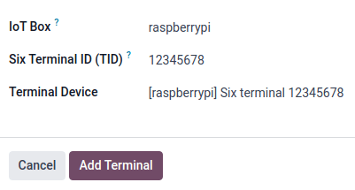

===
SIX
===

Connecting a SIX payment terminal allows you to offer a fluid payment flow to your customers and
ease the work of your cashiers.

.. warning::
   Although Worldline has acquired SIX Payment Services and both entities utilize Yomani payment
   terminals, their firmware differs. Terminals supplied by Worldline are, therefore, incompatible
   with this integration.

Configuration
=============

Prerequisites
-------------

#. Install the POS IoT Six module: :doc:`Activate the POS IoT Six module module
   <../../../../general/apps_modules>` to enable the payment terminal.

   .. note::
      This module replaces the **POS Six** module.
#. Connect an IoT system: :doc:`A Raspberry Pi or a virtual IoT system (for Windows OS only)
   </applications/general/iot/connect>` is required to connect a SIX payment terminal to Odoo.

.. _six/configure:

Configure the payment method
----------------------------

#. Enable the payment terminal :ref:`in the application settings <configuration/settings>` and
   :doc:`create a payment method for SIX terminals <../../payment_methods>`.
#. Set the journal type as :guilabel:`Bank`.
#. Fill in the :guilabel:`Outstanding Account` field.
#. Select :guilabel:`Terminal` in the :guilabel:`Integration` field.
#. Select :guilabel:`SIX IOT` in the :guilabel:`Integrate with` field.
#. Click :guilabel:`Setup Six Terminal`.

.. image:: six/new-payment-method.png
   :alt: Creating a new payment method for the SIX payment terminal
   :scale: 45 %

In the modal window,

#. Click the :guilabel:`IoT Box` field and select the IoT system from the dropdown menu.
#. Enter the :guilabel:`Six Terminal ID (TID)` provided by SIX.
#. Select the :guilabel:`Terminal Device` from dropdown menu.
#. Finally, click :guilabel:`Add Terminal`.

.. note::
   Ensure the SIX terminal is online and connected to the same network as the IoT system.

Link the payment method to a POS
--------------------------------

Once the payment method is created, it can be selected in the POS settings. To do so,

#. Go to the :ref:`POS' settings <configuration/settings>`.
#. Add the payment method under the :guilabel:`Payment methods` field within the :guilabel:`Payment`
   section.
