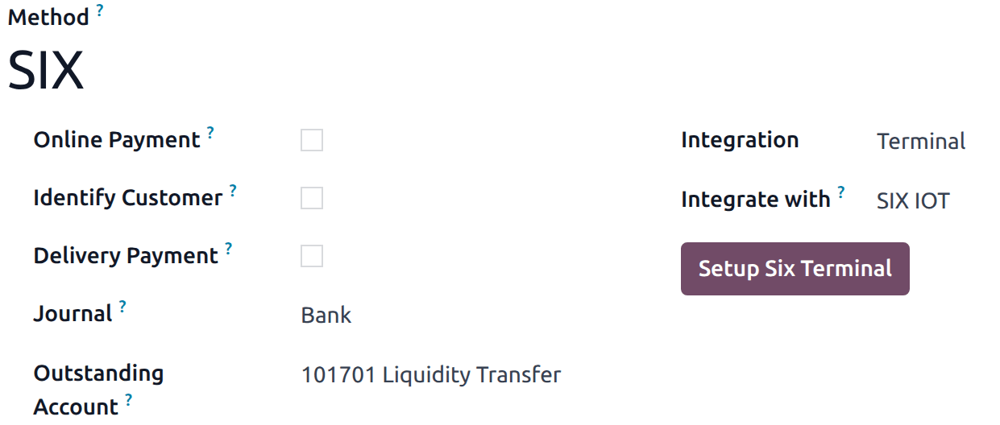
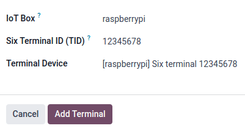

===
SIX
===

Connecting a SIX payment terminal allows you to offer a fluid payment flow to your customers and
ease the work of your cashiers.

.. warning::
   Even though Worldline has recently acquired SIX Payment Services and both companies use Yomani
   payment terminals, the firmware they run is different. Terminals received from Worldline are,
   therefore, not compatible with this integration.

Configuration
=============

Install the POS IoT Six module
------------------------------

To activate the POS IoT Six module, go to :guilabel:`Apps`, remove the :guilabel:`Apps` filter, and
search for **POS IoT Six**. This module adds the necessary driver and interface to your database to
detect Six terminals.

.. note::
   This module replaces the **POS Six** module.

Connect an IoT system
---------------------

Connecting a Six payment terminal to Odoo requires :doc:`using a Raspberry Pi or virtual (for
Windows OS only) IoT box </applications/general/iot/connect>`.

.. _six/configure:

Configure the payment method
----------------------------

#. Enable the payment terminal :ref:`in the application settings <configuration/settings>` and
   :doc:`create a payment method for Six terminals <../../payment_methods>`.
#. Set the journal type as :guilabel:`Bank`.
#. Fill in the :guilabel:`Outstanding Account` field.
#. Select :guilabel:`Terminal` in the :guilabel:`Integration` field.
#. Select :guilabel:`SIX IOT` in the :guilabel:`Integrate with` field.
#. Click :guilabel:`Setup Six Terminal`.

Ensure your Six terminal is online and connected to the same network as the IoT box. Select your
:guilabel:`IoT Box` and fill in the :guilabel:`Six Terminal ID (TID)` with the ID received from Six.
After a short time, the Six terminal should appear in the :guilabel:`Terminal Device`
dropdown menu.

.. note::
   If you receive a notification with the message :guilabel:`Failed to save Terminal ID to IoT Box`,
   please ensure that your computer is on the same network as the IoT box and that you can access
   its homepage.

Finally, select :guilabel:`Add Terminal`.

