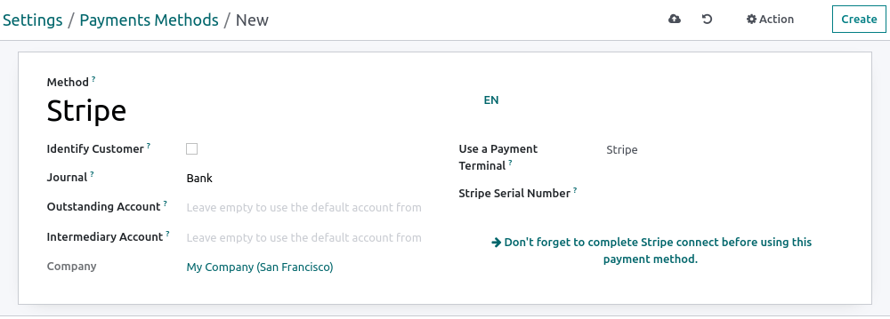

======
Stripe
======

Connecting a payment terminal allows you to offer a fluid payment flow to your customers and ease
the work of your cashiers.

.. seealso::
   - :doc:`Use Stripe as payment provider. <../../../../finance/payment_providers/stripe>`

Configuration
=============

Configure the payment method
----------------------------

Activate **Stripe** in the settings by going to :menuselection:`Point of Sale --> Configuration -->
Settings --> Payment Terminals` and enabling :guilabel:`Stripe`.

Then, create the payment method:

- Go to :menuselection:`Point of Sale --> Configuration --> Payment Methods`, click
  :guilabel:`Create`, and complete the :guilabel:`Method` field with your payment method's name;
- Set the :guilabel:`Journal` field as :guilabel:`Bank` and the :guilabel:`Use a Payment Terminal`
  field as :guilabel:`Stripe`;
- Enter your payment terminal serial number in the :guilabel:`Stripe Serial Number` field;
- Click :guilabel:`Don't forget to complete Stripe connect before using this payment method.`

.. note::
   - Click :guilabel:`Identify Customer` to allow this payment method **exclusively** for identified
     customers. For any unidentified customers to be able to pay with Stripe, leave the
     :guilabel:`Identify Customer` field unchecked.
   - The :guilabel:`Outstanding Account` and the :guilabel:`Intermediary Account` can stay empty to
     use the default accounts.
   - Find your payment terminal serial number under the device or on `Stripe's dashboard
     <https://dashboard.stripe.com>`_.

Connect Stripe to Odoo
----------------------

Click :guilabel:`Connect Stripe`. Doing so redirects you automatically to a configuration page.
Fill in all the information to create your Stripe account and link it with Odoo. Once the forms are
completed, the API keys (:guilabel:`Publishable Key` and :guilabel:`Secret Key`) can be retrieved on
**Stripe's** website. To do so, click :guilabel:`Get your Secret and Publishable keys`,
click the keys to copy them, and paste them into the corresponding fields in Odoo. Your terminal is
ready to be configured in a POS.

.. image:: stripe/stripe-connect.png
   :align: center
   :alt: stripe connection form

.. note::
   - When you use **Stripe** exclusively in Point of Sale, you only need the **Secret Key** to use
     your terminal.
   - When you use Stripe as **payment provider**, the :guilabel:`State` can stay set as
     :guilabel:`Disabled`.
   - For databases hosted **On-Premise**, the :guilabel:`Connect Stripe` button does not work. To
     retrieve the API keys manually, log in to your `Stripe dashboard
     <https://dashboard.stripe.com>`_, type `API` in the search bar, and click
     :guilabel:`Developers > API`.

Configure the payment terminal
------------------------------

Swipe right on your payment terminal, click :guilabel:`Settings`, enter the admin PIN code, validate
and select your network.

.. note::
   - The device must be connected to a secured WI-FI network.
   - Your Odoo database and payment terminal must share the same network.
   - You must enter the admin PIN code to access your payment terminal settings. By default, this
     code is `07139`.

Link the payment method to a POS
--------------------------------

To add a **payment method** to your point of sale, go to :menuselection:`Point of Sale -->
Configuration --> Settings`. Select the POS, scroll down to the :guilabel:`Payments` section, and
add your payment method for **Stripe** in the :guilabel:`Payment Methods` field.

Pay with a payment terminal
===========================

When processing a payment, select :guilabel:`Stripe` as the payment method. Check the amount and
click :guilabel:`Send`. Once the payment is successful, the status changes to :guilabel:`Payment
Successful`. To cancel the payment request, click :guilabel:`cancel`.

.. note::
   - | In case of connection issues between Odoo and the payment terminal, force the payment by
       clicking on :guilabel:`Force Done`, which allows you to validate the order.
     | This option is only available after receiving an error message informing you that the
       connection failed.
   - The terminal must have at least 10% battery level to use it.
   - The device does not work for payments under €0.50.

Troubleshooting
===============

Payment terminal unavailable in your Stripe account
---------------------------------------------------

If the payment terminal is unavailable in your Stripe account, you must add it manually:

#. Log into your `Stripe's dashboard <https://dashboard.stripe.com>`_ and go to
   :menuselection:`Stripe dashboard --> Payments --> Readers --> Locations`;
#. Add a location by clicking the :guilabel:`+ New` button or selecting an already created location;
#. Click the :guilabel:`+ New` button in the :guilabel:`Readers` box and fill in the required
   information.

.. note::
   You must provide a **registration code**. To retrieve that code, swipe right on your device,
   enter the admin PIN code (by default: `07139`), validate, and click :guilabel:`Generate a
   registration code`.
