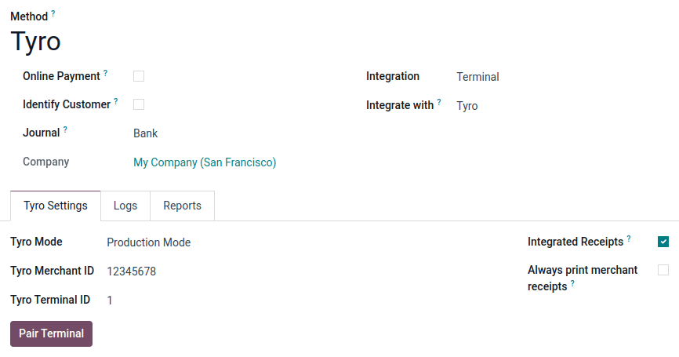

====
Tyro
====

Connecting a **Tyro** :doc:`payment terminal <../terminals>` allows you to offer a fluid
payment flow to your customers and ease the work of your cashiers.

.. important::
   **Tyro** payment terminals are only supported in **Australia**.

.. _pos-tyro-configuration:

Configuration
=============

Install the POS Tyro module
---------------------------

To install the POS Tyro module, go to :guilabel:`Apps`, remove the :guilabel:`Apps` filter, and
search for **POS Tyro**. Click :guilabel:`Activate` to enable the module.

Begin the pairing process on the terminal
-----------------------------------------

#. On your payment terminal, go to :menuselection:`Payments settings --> Pair with POS`.
#. Select :guilabel:`Pair with POS`. Your **MID (Merchant ID)** and **TID (Terminal ID)** should appear on the screen.

.. note::
   The steps to reach the pairing screen may be different depending on your model of terminal.
   Information on configuring the various terminals can be found on `Tyro's website
   <https://www.tyro.com/set-up/>`_.

Configure payment method
------------------------

#. :doc:`Create a new payment method <../../payment_methods>` by going to
   :menuselection:`Point of Sale --> Configuration --> Payment Methods`.
#. Set the journal type as :guilabel:`Bank`
#. Select :guilabel:`Terminal` in the :guilabel:`Integration` field.
#. Select :guilabel:`Tyro` in the :guilabel:`Integrate with` field.
#. Fill in the :guilabel:`Merchant ID (MID)` and :guilabel:`Terminal ID (TID)` with the ones shown on
   your payment terminal. Ensure the :guilabel:`Tyro Mode` is set to :guilabel:`Production Mode`.
#. Click the :guilabel:`Pair Terminal` button, and after a few seconds the pairing should complete.

Select the payment method by going to the :ref:`POS' settings <configuration/settings>` and adding
it to the payment method under the :guilabel:`Payment Methods` field of the :guilabel:`Payment`
section.
