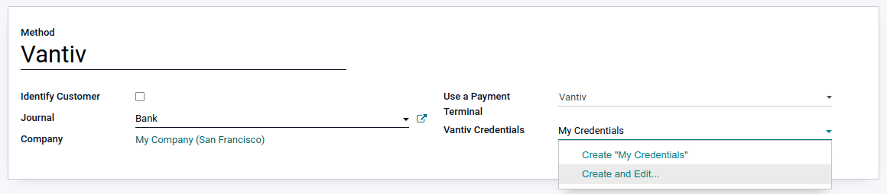

======
Vantiv
======

Connecting a Vantiv payment terminal allows you to offer a fluid payment flow to your customers and
ease the work of your cashiers.

.. note::
   Please note MercuryPay only operates with US and Canadian banks, making this procedure only
   suitable for North American businesses.

.. warning::
   Vantiv card readers should be purchased exclusively from Vantiv, as certain Vantiv terminals
   bought on Amazon do not include the correct encryption needed to be used with an Odoo database.

Configuration
=============

Configure the payment method
----------------------------

Enable the payment terminal in the :guilabel:`Payment Terminals` section :ref:`of the application
settings <configuration/settings>`.

Then, go to :menuselection:`Point of Sale --> Configuration --> Payment Methods`, and :doc:`create
the related payment method <../../payment_methods>`. Set the journal type as :guilabel:`Bank` and
select :guilabel:`Vantiv` in the :guilabel:`Use a Payment Terminal` field.

Type the name you want to give to your :guilabel:`Vantiv Credentials` and click :guilabel:`Create
and edit`. Enter your :guilabel:`Merchant ID` and :guilabel:`Merchant Password`, then click
:guilabel:`Save & Close`.

Once the payment method is created, you can select it in your POS settings. To do so, go to the
:ref:`POS' settings <configuration/settings>` and add the payment method under the
:guilabel:`Payment` section.

Pay with a payment terminal
===========================

When processing a payment, select the related payment method. Check the amount and click on
:guilabel:`Send`. Once the payment is successful, the status changes to :guilabel:`Payment
Successful`.
