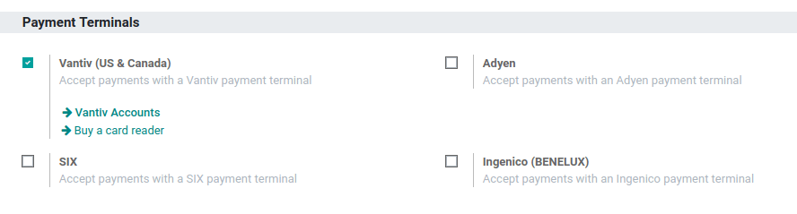

======
Vantiv
======

Connecting a Vantiv payment terminal allows you to offer a fluid payment flow to your customers and
ease the work of your cashiers.

.. note::
   Please note MercuryPay only operates with US and Canadian banks, making
   this procedure only suitable for North American businesses.

Configuration
=============

Configure the Payment Method
----------------------------

First, go in the general settings of the POS app, and activate the
Vantiv setting.

Back in :menuselection:`Point of Sale --> Configuration --> Point of Sale`, go in the
payments section and access your payment methods. Create a new payment
method for Vantiv, select the payment terminal option Vantiv, and create
new Vantiv credentials.

.. image:: vantiv/vantiv_02.png
    :align: center

To create new Vantiv credentials, fill in your merchant ID and password,
then save. Make sure the credentials you just created are selected, then
save the payment method.

.. image:: vantiv/vantiv_03.png
    :align: center

Pay with a Payment Terminal
===========================

In your PoS interface, at the moment of the payment, select your Vantiv
payment method and… that’s all.

.. image:: vantiv/vantiv_04.png
    :align: center
