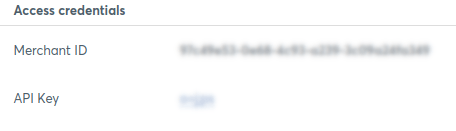
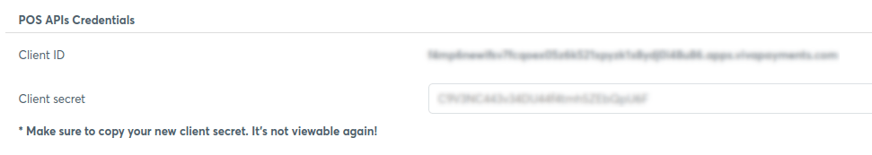
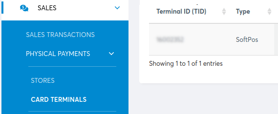
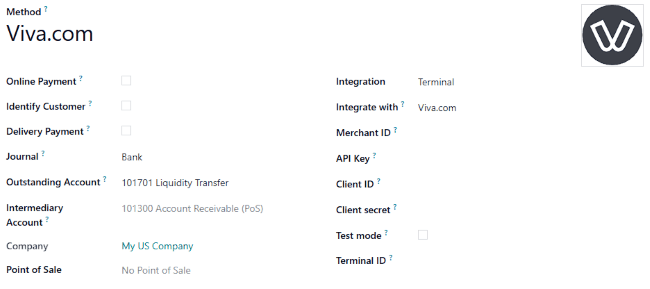

========
Viva.com
========

Connecting a **Viva.com** :doc:`payment terminal <../terminals>` gives customers a fluid payment
flow and eases cashiers' work.

.. important::
   - Viva.com payment terminals do not require an :doc:`IoT Box </applications/general/iot>` to
     operate.
   - Many European countries support the use of Viva.com payment terminals. Check the `availability
     of the Viva Terminal app in Europe <https://developer.viva.com/about-viva/>`_.

.. note::
   Viva.com turns phones into card readers with `tapping options
   <https://www.viva.com/en-gb/blog/tap-on-phone-turn-your-phone-into-a-mobile-card-reader>`_.

Configuration
=============

Start by creating a Viva.com account on the `Viva.com website <https://www.viva.com>`_.

Viva.com account credentials
----------------------------

When configuring Viva.com in Odoo Point of Sale, use the specific credentials available in the
created Viva.com account. These credentials include a :ref:`Merchant ID <pos/viva_com/id-key>`,
:ref:`API key <pos/viva_com/id-key>`, :ref:`POS API credentials <pos/viva_com/pos-api>`, and a
:ref:`Terminal ID <pos/viva_com/identifier>` number.

.. _pos/viva_com/id-key:

Merchant ID and API key
~~~~~~~~~~~~~~~~~~~~~~~

Locate the `Merchant ID and API key
<https://developer.viva.com/getting-started/find-your-account-credentials/merchant-id-and-api-key/>`_,
then save the keys and paste them into the Odoo :guilabel:`Merchant ID` and :guilabel:`API Key`
fields :ref:`when creating the payment method <pos/viva_com/method-creation>`.

.. note::
   These credentials are used for APIs that authenticate with Basic Auth.

.. _pos/viva_com/pos-api:

POS API credentials
~~~~~~~~~~~~~~~~~~~

Locate and generate the `POS API credentials
<https://developer.viva.com/getting-started/find-your-account-credentials/pos-apis-credentials/>`_,
then save the keys and paste them in the Odoo :guilabel:`Client secret` and :guilabel:`Client ID`
fields :ref:`when creating the payment method <pos/viva_com/method-creation>`.

.. warning::
   These credentials are only displayed once. Make sure to keep a copy to secure them.

.. note::
   These credentials are used for Android and iOS POS Activation requests, as well as the Cloud
   Terminal API.

.. _pos/viva_com/identifier:

Terminal ID
~~~~~~~~~~~

The terminal ID number identifies the terminal. Follow these steps to find it:

#. Go to your Viva.com account and select the relevant account.
#. Go to :menuselection:`Sales --> Physical payments --> Card terminals` in the navigation menu.
#. Save the terminal ID number under the :guilabel:`Terminal ID (TID)` column.
#. Paste the terminal ID number into the :guilabel:`Terminal ID` field :ref:`when creating the
   payment method <pos/viva_com/method-creation>`.

.. _pos/viva_com/method-creation:

Payment method configuration
----------------------------

#. :doc:`Activate the POS Viva.com module <../../../../general/apps_modules>` to enable the
   payment terminal.
#. :doc:`Create the related payment method <../../payment_methods>` by going to
   :menuselection:`Point of Sale --> Configuration --> Payment Methods` and clicking
   :guilabel:`New`.
#. Set the journal type as :guilabel:`Bank`.
#. Select :guilabel:`Terminal` in the :guilabel:`Integration` field.
#. Select :guilabel:`Viva.com` in the :guilabel:`Integrate with` field.
#. Fill in the mandatory fields with your:

   - :ref:`Merchant ID and API key <pos/viva_com/ID-key>`
   - :ref:`Client ID and Client secret <pos/viva_com/pos-api>`
   - :ref:`Terminal ID <pos/viva_com/identifier>`

#. Save the form and copy the generated webhook URL from the :guilabel:`Viva.com Webhook
   Endpoint` field. This URL is necessary :ref:`when configuring the webhook <pos/viva_com/webhook>`.

.. _pos/viva_com/webhook:

Webhook configuration
---------------------

Webhooks enable the reception of real-time notifications whenever a transaction occurs within your
Viva.com account. Set them up for `payment transactions following the Viva.com documentation
<https://developer.viva.com/webhooks-for-payments/transaction-payment-created/>`_.

.. seealso::
   `Setting up webhooks <https://developer.viva.com/webhooks-for-payments/#setting-up-webhooks>`_

POS and Payment method link
---------------------------

To select a payment method after the :ref:`configuration <pos/viva_com/method-creation>`, go to the
:ref:`POS settings <configuration/settings>` and add the payment method under the
:guilabel:`Payment methods` field of the :guilabel:`Payment` section.
