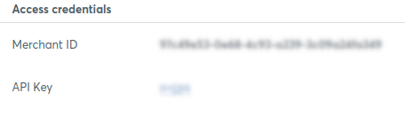
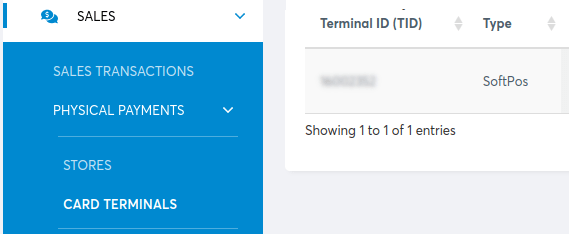
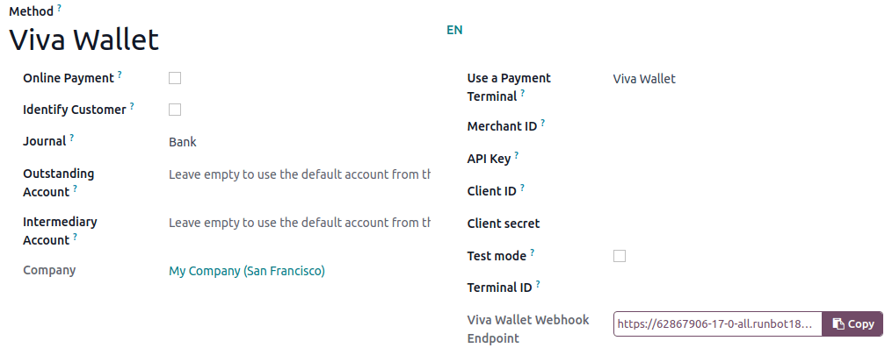

===========
Viva Wallet
===========

Connecting a **Viva Wallet** :doc:`payment terminal <../terminals>`  allows you to offer a fluid
payment flow to your customers and ease the work of your cashiers.

.. note::
   Viva Wallet lets you turn your phone into a mobile card reader: `Tap On Phone
   <https://www.vivawallet.com/gb_en/blog-tap-on-phone-gb>`_.

Configuration
=============

Start by creating your Viva Wallet account on `Viva Wallet's website <https://www.vivawallet.com>`_.

Locate your Viva Wallet credentials
-----------------------------------

When configuring Viva Wallet in Point of Sale, you need to use specific credentials that are
available in your Viva Wallet account. These credentials include your :ref:`Merchant ID
<viva_wallet/id-key>`, :ref:`API key <viva_wallet/id-key>`, :ref:`POS API credentials
<viva_wallet/pos-api>`, and :ref:`Terminal ID <viva_wallet/identifier>` number.

.. _viva_wallet/id-key:

Merchant ID and API key
~~~~~~~~~~~~~~~~~~~~~~~

Locate your `Merchant ID and API key following the Viva documentation
<https://developer.vivawallet.com/getting-started/find-your-account-credentials/merchant-id-and-api-key/>`_.
Then, save the keys and paste them into the Odoo :guilabel:`Merchant ID` and :guilabel:`API Key`
fields :ref:`when creating the payment method <viva_wallet/method-creation>`.

.. note::
   These credentials are used for APIs that authenticate with Basic Auth.

.. _viva_wallet/pos-api:

POS API credentials
~~~~~~~~~~~~~~~~~~~

Locate and generate your `POS API credentials following the Viva documentation
<https://developer.vivawallet.com/getting-started/find-your-account-credentials/pos-api-credentials/>`_.
Then, save the keys and paste them in the Odoo :guilabel:`Client secret` and :guilabel:`Client ID`
fields :ref:`when creating the payment method <viva_wallet/method-creation>`.

.. warning::
   These credentials are only displayed once. Ensure you keep a copy to secure them.

.. image:: viva_wallet/api-cred.png
   :alt: Client secret and client ID fields

.. note::
   These credentials are used for Android and iOS POS Activation requests, as well as the Cloud
   Terminal API.

.. _viva_wallet/identifier:

Terminal ID
~~~~~~~~~~~

Your terminal ID number is used to identify your terminal. To find it:

#. Go to your Viva Wallet account and select the relevant account.
#. Go to :menuselection:`Sales --> Physical payments --> Card terminals` in the navigation menu.

The terminal ID number is located under the :guilabel:`Terminal ID (TID)` column. Save it to paste
it into the :guilabel:`Terminal ID` field :ref:`when creating the payment method
<viva_wallet/method-creation>`.

.. _viva_wallet/method-creation:

Configure the payment method
----------------------------

#. :doc:`Activate the POS Viva Wallet module <../../../../general/apps_modules>` to enable the
   payment terminal.
#. :doc:`Create the related payment method <../../payment_methods>` by going to
   :menuselection:`Point of Sale --> Configuration --> Payment Methods` and clicking
   :guilabel:`New`.
#. Set the journal type as :guilabel:`Bank`.
#. Select :guilabel:`Viva Wallet` in the :guilabel:`Use a Payment Terminal` field.
#. Fill in the mandatory fields with your:

   - :ref:`Merchant ID and API key <viva_wallet/ID-key>`
   - :ref:`Client ID and Client secret <viva_wallet/pos-api>`
   - :ref:`Terminal ID <viva_wallet/identifier>`

#. Save the form and copy the generated webhook URL from the :guilabel:`Viva Wallet Webhook
   Endpoint` field. This URL is necessary :ref:`when configuring the webhook <viva_wallet/webhook>`.

.. _viva_wallet/webhook:

Configure the webhook
---------------------

Webhooks allow you to receive real-time notifications whenever a transaction occurs within your Viva
Wallet account. Set them up for `payment transactions following the Viva documentation
<https://developer.vivawallet.com/webhooks-for-payments/transaction-payment-created/>`_.

.. seealso::
   `Setting up webhooks <https://developer.viva.com/webhooks-for-payments/#setting-up-webhooks>`_

Link the payment method to a POS
--------------------------------

You can select the payment method in your POS settings once the payment method is created. To do so,
go to the :ref:`POS' settings <configuration/settings>` and add the payment method under the
:guilabel:`Payment methods` field of the :guilabel:`Payment` section.

Pay with a payment terminal
===========================

When processing a payment, select the related payment method. Check the amount and click on
:guilabel:`Send`. Once the payment is successful, the status changes to :guilabel:`Payment
Successful`.

.. note::
   - | In case of connection issues between Odoo and the payment terminal, force the payment by
       clicking on :guilabel:`Force Done`, which allows you to validate the order.
     | This option is only available after receiving an error message informing you that the
       connection failed.
   - To cancel the payment request, click :guilabel:`cancel`.
