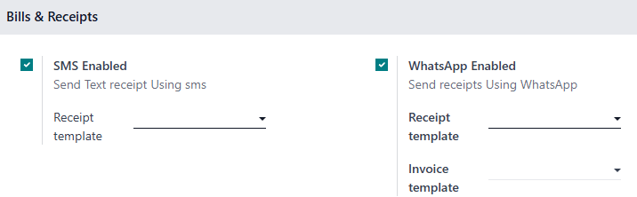
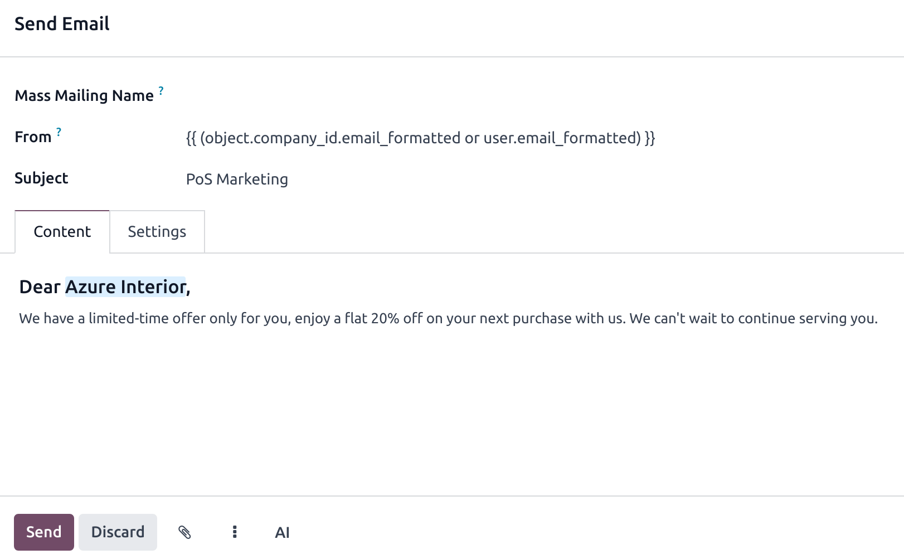
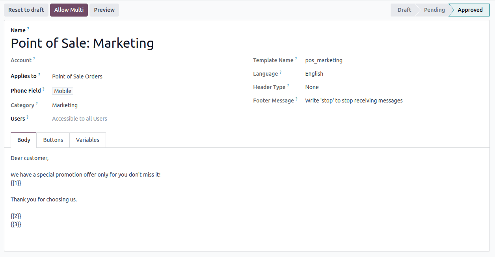
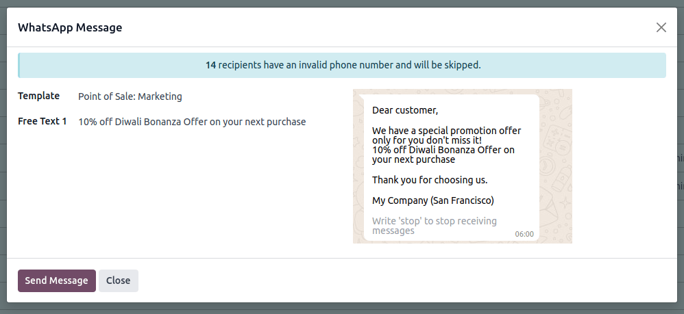

==================
Marketing features
==================

Use your POS system to engage with customers directly by sending them promotional offers via email
or WhatsApp.

Storing contact details
=======================

This feature requires your customer's contact details, either their email address or phone number.

- **Email addresses**: automatically collected and saved in POS orders when sending a receipt by
  email.
- **Phone numbers**: to store phone numbers when sending receipts on WhatsApp or by SMS,

  #. Go to :menuselection:`Configuration --> Settings` and scroll to the :guilabel:`Bills &
     Receipts` section;
  #. Activate the :guilabel:`WhatsApp Enabled` or :guilabel:`SMS Enabled` option(s).

If a customer’s contact information is missing, it will be automatically saved in POS orders when
the receipt is sent via email, SMS, or WhatsApp.

.. tip::
   From a POS order form, navigate to the :guilabel:`Contact Info` category under the
   :guilabel:`Extra Info` tab, then click the email icon or whatsapp icon to send standalone
   marketing messages.

   .. image:: pos_based_marketing/standalone-marketing-from-pos.png
      :alt: pos orders form's standalone marketing message option

Email marketing
===============

To send marketing emails to your customers from POS orders,

#. Go to :menuselection:`Point of Sale --> Orders --> Orders`;
#. Select the orders;
#. Click :guilabel:`Actions`, then :guilabel:`Send Email` from the dropdown menu.

Doing so opens an email composing form. Fill it in and hit :guilabel:`Send`.

.. tip::
   - Save some time by saving your content as a template. Click the vertical ellipsis button and
     select your template under the :guilabel:`Insert Template` section.
   - You can also save your content as template for later use. Click the vertical ellipsis button
     and select :guilabel:`Save as Template`.

.. note::
   - Fill in the :guilabel:`Mass Mailing Name` field to create a mass mailing and track its results
     in the :doc:`Email Marketing app <../../marketing/email_marketing>`.
   - If an email address is not related to an existing customer, a new customer is automatically
     created when sending marketing emails.

.. seealso::
   :doc:`Use the email marketing app for more advanced marketing features
   <../../marketing/email_marketing>`.

Whatsapp marketing
==================

.. _pos_based_marketing/whatsapp_config:

Configuration
-------------

You first need to enable the related server action to send WhatsApp marketing messages from your POS
using the phone numbers collected from POS orders. To do so,

#. Go to the WhatsApp application;
#. Create a new :ref:`WhatsApp template <WhatsApp/templates>`;
#. Configure the fields:

   - :guilabel:`Applies to` field set to :guilabel:`Point of Sale Orders`;
   - :guilabel:`Category` field to :guilabel:`Marketing`;
   - :guilabel:`Phone Field` to either :guilabel:`Mobile` or :guilabel:`Customer > Phone`.
#. Click :guilabel:`Submit for Approval`;
#. Once approved, click the :guilabel:`Allow Multi` button to create a server action in the POS
   orders list view.

.. warning::
   If you modify the template's content, you must request for approval again, as its status returns
   to the :guilabel:`Draft` state.

.. seealso::
   :doc:`WhatsApp configuration <../../productivity/whatsapp>`

Send WhatsApp marketing messages
--------------------------------

#. Go to :menuselection:`Point of Sale --> Orders --> Orders`;
#. Select the orders;
#. Click :guilabel:`Actions`, then :guilabel:`WhatsApp Message` from the dropdown menu.

Doing so opens a WhatsApp message composing form. Select the desired marketing template in the
:guilabel:`Template` field and hit :guilabel:`Send Message`.

.. note::
   - To use WhatsApp marketing in the Point of Sale, approved marketing templates must have the
     :guilabel:`Allow Multi` option enabled and :guilabel:`Point of Sale Orders` selected in the
     :guilabel:`Applies to` field.
   - If the server action is displayed without a properly configured template, an error message
     appears. Click :guilabel:`Configure Templates` and complete the :ref:`WhatsApp setup
     <pos_based_marketing/whatsapp_config>` steps.

.. seealso::
   :doc:`../../productivity/whatsapp`
