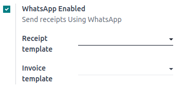
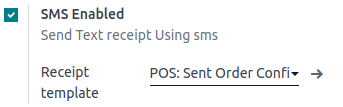
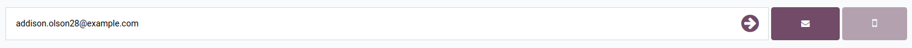

:show-content:

===================
PoS-based Marketing
===================

Point of Sale marketing uses the Point of sale to reach customers. We send promotional offers through email and WhatsApp.

Configuration
=============

We need to enable :menuselection:`Configuration --> Setting --> WhatsApp Enabled` to store mobile while sending receipts on WhatsApp.

We need to enable :menuselection:`Configuration --> Setting --> SMS Enabled` to store mobile while sending receipts on SMS.

Basic Flow for Storing Contact Details:
=======================================

-   Open the Point of Sale session.
-   Create and validate an order.
-   If a partner is selected, their contact details are saved with the order.
-   If no partner is selected, contact details are saved after sending the receipt via email, SMS, or WhatsApp.

-   After that, the user can proceed with the email and WhatsApp marketing steps described in the Email Marketing and WhatsApp Marketing documents.

.. seealso::
   - :doc:`pos_based_marketing/email`
   - :doc:`pos_based_marketing/whatsapp`

.. toctree::
   :titlesonly:

   pos_based_marketing/email
   pos_based_marketing/whatsapp
