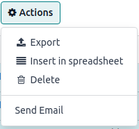
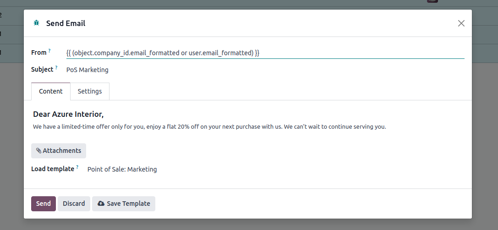
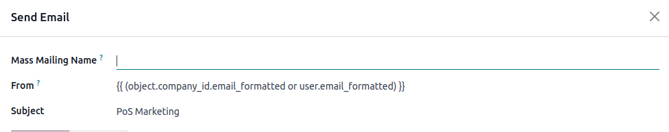
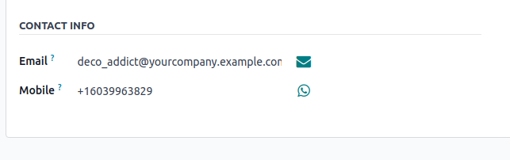

:show-content:

===============
Email Marketing
===============

In Point of Sale, we use the emails saved in POS orders for email marketing.

.. note::
    - Basic email marketing can be done without an email marketing app.
    - For more advanced email marketing, you can use an email marketing app to track your campaigns.

Flow of Email Marketing:
========================

-  After creating an order with contact details, the user selects orders from the POS orders list view.
-  The user then opens the server action menu and clicks on the :guilabel:`Send Email` action.

-  This will open an mail composer.

-  The user can choose an email template and edit the email body in the composer.
-  After making changes, the user can click the :guilabel:`Send` button.

-  To send mass emails, the user needs to add a mass mailing name in the email composer.

.. note::
    - If no partner with the same email is found, a new partner will be created.

.. tip::
   Users can send standalone marketing emails directly from the Point of Sale orders form.

