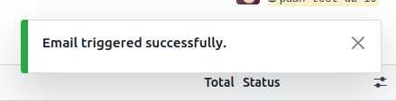

:show-content:

===============
Email Marketing
===============

In Point of Sale, we use the emails stored in PoS orders for email marketing purposes.

.. note::
    - Basic email marketing can be done without an Email Marketing App.
    - For more advanced email marketing, an email marketing app can be used to track marketing campaigns.

Flow of Email Marketing:
========================

-  After creating an order with contact details, the user needs to select orders from the PoS orders list view.
-  Then the user has to open the server action menu and click on the :guilabel:`Send Email` action.

.. image:: email/email-server-action.png
   :align: center
   :alt: How to open mail composer

-  This will open an mail composer.

.. image:: email/mail-composer.png
   :align: center
   :alt: mail composer view

-  The user can select an email template to use and can also update the email body from the mail composer.
-  After modifying the template, the user can click on the :guilabel:`Send` button.
-  A :guilabel:`Email triggered successfully.` notification will appear after the successful mail are sent.

-  For sending mass emails through email marketing, the user has to add a mass mailing name in the mail composer.

.. image:: email/mass-mailing-name.png
   :align: center
   :alt: Needed for mass mailing

.. note::
    - If a partner with the same email is not found, a new partner is created.

.. tip::
   Users can also send standalone marketing emails from the PoS order form.

.. image:: email/standalone-email-marketing.png
   :align: center
   :alt: How to do standalone email marketing
