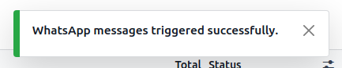
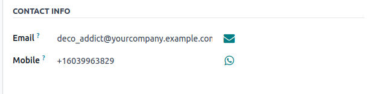

:show-content:

==================
Whatsapp Marketing
==================

In Point of Sale, we use the mobile stored in PoS orders for Whatsapp marketing purposes.

Configuration
=============

Configuring the "WhatsApp Message" server action
------------------------------------------------

 #.  Install the :guilabel:`whatsapp_pos` module.
 #.  Obtain approved marketing templates with the :guilabel:`Applies to` field value set to :guilabel:`Point of Sale Orders`, :guilabel:`Phone Field` field value
     set to :guilabel:`mobile` or :menuselection:`Partner --> Mobile`.
 #.  Click the :guilabel:`Allow Multi` button to create a server action in the PoS order's list view.

Flow for WhatsApp marketing:
============================

-   creating an order with contact details, select the orders from the PoS orders list view.
-   Open the server actions menu from the PoS order list view.
-   Click on the :guilabel:`WhatsApp Message` server action.

.. image:: whatsapp/whatsapp-message-server-action.png
   :align: center
   :alt: How to open whatsapp composer

-   This will open a WhatsApp composer.

.. image:: whatsapp/whatsapp-composer.png
   :align: center
   :alt: whatsapp composer view

-   Select the desired marketing template for the message.
-   Click on the :guilabel:`Send Message` button.
-   A :guilabel:`WhatsApp messages triggered successfully.` notification will appear after the successful messages are sent from WhatsApp.

.. note::
    - Users can now only send marketing templates from the PoS order's :guilabel:`Send WhatsApp` server action.
    - Approved marketing templates with the allow multi-option enabled from the :guilabel:`Point of Sale Orders` applies to field value
      are required for WhatsApp marketing based on Point of Sale.

.. image:: whatsapp/whatsapp-template.png
   :align: center
   :alt: whatsapp template view

.. tip::
    Users can also send standalone WhatsApp marketing messages from the PoS order form.

