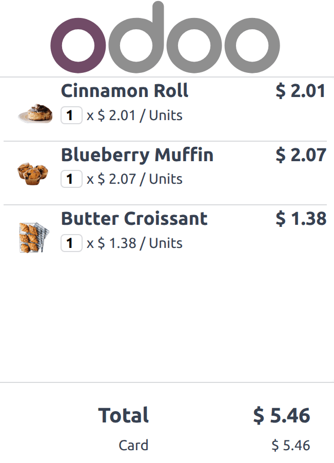
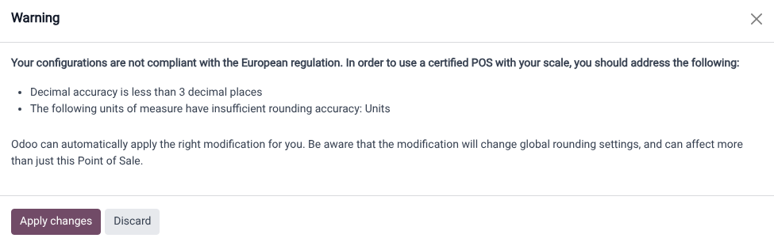
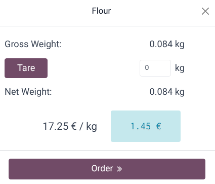

========
Hardware
========

Odoo Point of Sale supports integration with a variety of hardware, including :doc:`payment
terminals <payment_methods/terminals>` and cash drawers, as well as :ref:`customer displays
<pos/display>`, :ref:`scales <pos/scale>`, :doc:`barcode scanners <shop/barcode>`,
:doc:`ePOS printers <configuration/epos_printers>`, and in-store :doc:`electronic shelf labels
<pricing/electronic_labels>`.

.. _pos/display:

Customer display
================

The **customer display** feature provides real-time updates on a secondary screen for customers
during the checkout process. This screen shows the :ref:`items in the cart <pos/sell>`, the subtotal
as items are added, and details throughout the payment process. It also displays the total amount,
the selected :doc:`payment method <payment_methods>`, and any change to be returned.

.. note::
   Both the customer and POS displays must have a minimum diagonal size of 6 inches. For optimal
   readability, larger screens are recommended.

Configuration
-------------

Depending on the POS setup, the feature can be displayed directly on a secondary screen connected
via USB-C or HDMI, on another device remotely, or on a screen connected through an IoT system.

To activate the feature, follow these steps:

#. Navigate to the :ref:`POS settings <configuration/settings>` and scroll down to the
   :guilabel:`Connected Devices` section.
#. Open the dropdown menu under the :guilabel:`Customer Display` section and select one of the
   following options:

   - :guilabel:`None`: To disable the feature.
   - :ref:`The same device <pos/display-same-device>`: To use a secondary screen connected
     with an HDMI or USB-C cable.
   - :ref:`Another device <pos_hardware/display_another_device>`: To use a remote device connected
     to the database.
   - :ref:`An IOT-connected screen <pos_hardware/display_iot>`: To use a screen connected via an
     :doc:`IoT system <../../general/iot>`.

For displays connected using an :doc:`IoT system <../../general/iot>`:

#. Enable the :guilabel:`IoT Box` option to activate the IoT system in POS.
#. Click :guilabel:`Save`, which activates the IoT app in Odoo.
#. :doc:`Connect and configure an IoT system <../../general/iot/connect>` for a :doc:`display
   <../../general/iot/devices/screen>`.
#. Return to the :ref:`POS settings <configuration/settings>` and select an IoT-connected screen
   using the :guilabel:`Customer Display` field.

Opening the customer display
----------------------------

.. _pos/display-same-device:

Same device
~~~~~~~~~~~

To open the customer display on a second screen connected to a POS system using an HDMI or USB-C
cable, follow these steps:

#. :ref:`Open a POS session <pos/session-start>`.
#. Click the :icon:`fa-bars` (:guilabel:`hamburger menu`) icon.
#. Click the :icon:`fa-desktop` (:guilabel:`Customer Display`) icon, which opens a new window to
   drag onto the second screen.

For POS terminals running the
`Odoo <https://play.google.com/store/apps/details?id=com.odoo.mobile>`_ Android app with dual-screen
support, follow these steps:

#. :doc:`Activate the Point of Sale Mobile module <../../general/apps_modules>` to enable the
   customer display.
#. :ref:`Open a POS session <pos/session-start>`.
#. Click the :icon:`fa-bars` (:guilabel:`hamburger menu`) icon.
#. Click the :icon:`fa-desktop` (:guilabel:`Customer Display`) icon, which opens the customer
   display on the terminal's secondary screen.

.. _pos_hardware/display_another_device:

Another device
~~~~~~~~~~~~~~

To open the customer display on a remote device (any computer, tablet, or smartphone), follow these
steps:

#. Access your database from the other device and navigate to :menuselection:`Point of Sale -->
   Dashboard`.
#. Click the :icon:`fa-ellipsis-v` (:guilabel:`Dropdown menu`) icon on a POS card.
#. Click :guilabel:`Customer Display` to open the display remotely.

.. note::
   The two devices are not required to share the same network as long as they are connected to the
   same database.

.. _pos_hardware/display_iot:

IOT-connected screen
~~~~~~~~~~~~~~~~~~~~

To open the customer display onto an IoT-connected screens:

#. :ref:`Open a POS session <pos/session-start>`.
#. Click the :icon:`fa-bars` (:guilabel:`hamburger menu`) icon.
#. Click the :icon:`fa-desktop` (:guilabel:`Customer Display`) icon, which opens the customer
   display onto the IoT-connected screen.

.. note::
   Both devices need to be connected to the same local network.

.. seealso::
   - :doc:`configuration/pos_iot`
   - :doc:`../../general/iot`

.. _pos/scale:

Scale
=====

.. important::
   In EU member states, `certification is legally required
   <https://eur-lex.europa.eu/legal-content/EN/TXT/?uri=uriserv%3AOJ.L_.2014.096.01.0107.01.ENG>`_
   to use a scale as an integrated device.

Prerequisite
------------

Connecting a scale requires the use of an **IoT System**.

.. seealso::
   - :doc:`../../general/iot/connect`
   - :doc:`../../general/iot/devices/scale`

Configuration
-------------

Scale connection
~~~~~~~~~~~~~~~~

#. :ref:`Access the POS settings <configuration/settings>`.
#. Scroll down to the :guilabel:`Connected Devices` section and enable :guilabel:`IoT Box`.
#. Select the scale in the :guilabel:`Electronic Scale` field.
#. Click :guilabel:`Save`.

.. tip::
   Alternatively, click the :icon:`fa-ellipsis-v` (:guilabel:`Dropdown menu`) icon on a POS card and
   click :guilabel:`Edit` to access this setting.

Product configuration
~~~~~~~~~~~~~~~~~~~~~

In order to weigh products using an integrated scale, go to :menuselection:`Point of Sale -->
Products --> Products`, create a product or open an existing product form, and configure it as
follows:

#. Ensure the :guilabel:`Point of Sale` checkbox is activated for the product to be available in
   POS.
#. On the :guilabel:`General Information` tab, define a :guilabel:`Sales Price` per :guilabel:`kg`.

   .. note::
      This step requires to enable the :doc:`Units of Measure
      <../../inventory_and_mrp/inventory/product_management/configure/uom>` feature. To activate it:

      #. Go to :menuselection:`Inventory --> Configuration --> Settings`.
      #. Scroll down to the :guilabel:`Products` section and activate :guilabel:`Units of Measure`.
#. Go to the :guilabel:`Point of Sale` tab and activate :guilabel:`To Weigh With Scale`. This
   enables the product to be weighed directly on the connected scale at the POS.

.. important::
   The selected unit of measure for weighable products must be :guilabel:`kg` to ensure compliance
   with **European regulations**.

.. seealso::
   :doc:`../../inventory_and_mrp/inventory/product_management/configure/uom`

European regulations
--------------------

When using scales in commercial transactions, the database integrated with a scale must be
configured to meet specific European requirements. This includes supporting at least three decimal
places for accuracy and using proper rounding for units of measure, such as `kg` instead of generic
`units`.

If the database is not compliant, a red :icon:`fa-balance-scale` (:guilabel:`scale`) icon displays
as a warning. Click this icon to view the reasons for non-compliance and then select
:guilabel:`Apply changes` to automatically apply the necessary changes to the settings. Once the
database meets all regulatory requirements, the :icon:`fa-balance-scale` (:guilabel:`scale`) icon
turns green.

.. admonition:: Additional guidelines

   Both the :ref:`customer <pos/display>` and POS displays must have a minimum diagonal
   size of 6 inches. For optimal readability, larger screens are recommended.

Using a scale in PoS
--------------------

#. :ref:`Open a POS session <pos/session-start>`.
#. Select the product to weigh on the order screen or scan its barcode.
#. Place the product on the scale and wait for the weight to be displayed in the popup window.
#. Once the weight is determined, the price is automatically computed.
#. Click :guilabel:`Order` :icon:`fa-angle-double-right` to add the product to the cart.
#. Remove the previous product from the scale.

.. important::
   Make sure the scale returns to `zero` before weighing a new product. If it does not, the
   :guilabel:`Order` :icon:`fa-angle-double-right` button remains unclickable until it is reset.
