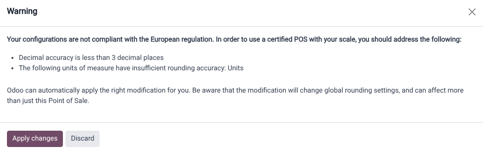
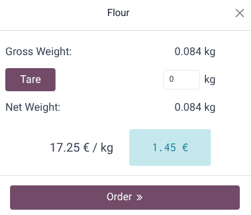

========
Hardware
========

Odoo Point of Sale supports integration with a variety of hardware, including :doc:`payment
terminals <payment_methods/terminals>` and cash drawers, as well as :doc:`customer displays
<shop/customer_display>`, :ref:`scales <pos/scale>`, :doc:`barcode scanners <shop/barcode>`,
:doc:`ePOS printers <configuration/epos_printers>`, and in-store :doc:`electronic shelf labels
<pricing/electronic_labels>`.

.. _pos/scale:

Scale
=====

.. important::
   In EU member states, `certification is legally required
   <https://eur-lex.europa.eu/legal-content/EN/TXT/?uri=uriserv%3AOJ.L_.2014.096.01.0107.01.ENG>`_
   to use a scale as an integrated device.

Prerequisite
------------

Connecting a scale requires the use of an **IoT System**.

.. seealso::
   - :doc:`../../general/iot/connect`
   - :doc:`../../general/iot/devices/scale`

Configuration
-------------

Scale connection
~~~~~~~~~~~~~~~~

#. :ref:`Access the POS settings <configuration/settings>` and select the POS, or click the
   :icon:`fa-ellipsis-v` (:guilabel:`vertical ellipsis`) icon on a POS card and click
   :guilabel:`Edit`.
#. Scroll down to the :guilabel:`Connected Devices` section and enable :guilabel:`IoT Box`.
#. Select the scale in the :guilabel:`Electronic Scale` field.
#. Click :guilabel:`Save`.

Product configuration
~~~~~~~~~~~~~~~~~~~~~

#. Go to :menuselection:`Inventory --> Configuration --> Settings`.
#. Scroll down to the :guilabel:`Products` section and activate :guilabel:`Units of Measure`.
#. Go to :menuselection:`Point of Sale --> Products --> Products`.
#. Select a product to weigh.
#. Ensure the :guilabel:`Point of Sale` checkbox is activated for the product to be available in
   POS.
#. Go to the :guilabel:`Point of Sale` tab and activate :guilabel:`To Weigh With Scale`. This
   enables the product to be weighed directly on the connected scale at the POS.
#. Return to the :guilabel:`General Information` tab and set a :guilabel:`Sales Price` per
   :guilabel:`kg`.

.. important::
   The selected unit of measure for weighable products must be :guilabel:`kg` to ensure compliance
   with **European regulations**.

.. seealso::
   :doc:`../../inventory_and_mrp/inventory/product_management/configure/uom`

European regulations
--------------------

As scales used in commercial transactions are certified, Odoo must adhere to specific European
requirements. If the database does not meet these European regulations, a distinct
:icon:`fa-balance-scale` (:guilabel:`red scale`) icon displays prominently in red.

Click this red icon opens to modal window that explains the reasons for non-compliance. To
automatically implement the necessary changes to the Odoo settings and achieve compliance, click
:guilabel:`Apply changes`. Once the database meets regulatory requirements, the
:icon:`fa-balance-scale` (:guilabel:`scale`) icon turns green, indicating full compliance.

.. note::
   .. raw:: html

      Once the database complies with the <b>European regulation</b>,
      <i class="fa fa-balance-scale" style="color:#d9555c;"></i> <i class="fa fa-arrow-right"></i>
      <i class="fa fa-balance-scale" style="color:#008818;"></i>

Additional guidelines
~~~~~~~~~~~~~~~~~~~~~

:doc:`The customer display <shop/customer_display>` and POS display must each be at least 6 inches.
However, we recommend using a larger screen for better end-user readability.

Usage guideline
---------------

#. :ref:`Open a POS session <pos/session-start>`.
#. Select the product to weigh on the POS interface or scan its barcode, which opens a modal window.
#. Place the product on the scale and wait for the weight to be displayed.
#. Once the weight is determined, the price is automatically computed.
#. Click :guilabel:`Order` :icon:`fa-angle-double-right` to add the product to the cart.
#. Remove the previous product to weigh a second item.

.. important::
   Make sure the scale returns to `zero` before weighing a new product. If it does not, the
   :guilabel:`Order` :icon:`fa-angle-double-right` button remains unclickable until it is reset.
