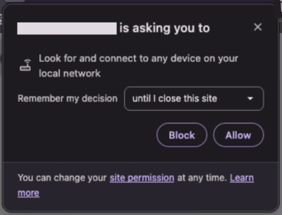

====================
Local Network Access
====================

Since the Chromium 142 update, a new feature called “Local Network Access” has been introduced.
It is now possible to grant local network access to a specific web page.

This allows us to contact printers directly from the browser without IoT.

Activate Local Network Access
=============================

Add a new **key** in the **System Parameters** to force your Point of Sale to use local network access
over a secure connection.

To do so, activate the :ref:`developer mode <developer-mode>`, go to :menuselection:`Settings -->
Technical --> Parameters --> System Parameters`, then create a new parameter, add the following
values and click on *Save*.

- **Key**: `point_of_sale.use_lna`
- **Value**: `True`

Supported Browsers
==================

Most browsers based on Chromium version 142 or higher are compatible.

- Google Chrome Browser
- Brave Browser
- Microsoft Edge Browser
- Vivaldi
- Opera

Sometimes you need to enable a flag in the browser to activate the feature.

- `brave://flags/#local-network-access-check`
- `chrome://flags/#local-network-access-check`

Browser Permission
==================

When you use your browser and after configuring a printer with local network access,
a pop-up window will appear asking for permission.

Once accepted, the browser will be able to contact devices on your local network.

.. seealso::
   - :doc:`epos_printers`
