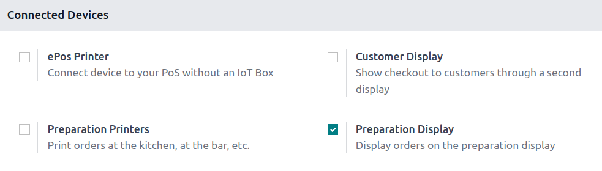
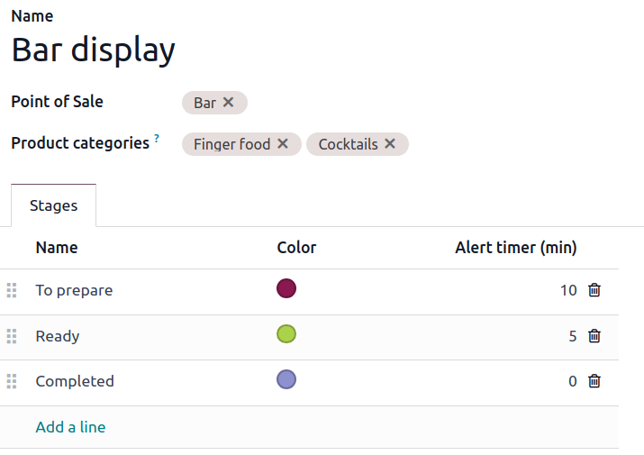

===================
Preparation display
===================

The preparation display feature allows you to handle POS orders that require preparation. For
example:

- In a furniture business,  the preparation team is notified after a payment is completed at the POS
  to gather the purchased items for customer pickup.
- In a restaurant, a POS order informs the kitchen of the meals to prepare.

Configuration
=============

To enable the preparation display feature, go to the :ref:`POS settings <configuration/settings>`,
scroll down to the :guilabel:`Connected Devices` section and tick :guilabel:`Preparation Display`.

Let's create and set up a preparation display by going to :menuselection:`Point of Sale -->
Orders --> Preparation Display` and click :guilabel:`New`.

Then, name it and configure it:

- Add the related POS in the :guilabel:`Point of Sale` field. The POS from where orders will be sent
  to the preparation display.
- Add POS product categories in the :guilabel:`Product categories` field. These are the categories
  of products that will be sent from the selected POS to the preparation display
- Set the stages. These are the steps the orders will have to take to be ready:

  - Click :guilabel:`Add a line` to add a stage.
  - Set specific colors to each stage for clarity (optional).
  - Define the :guilabel:`Alert timer (min)`, this tells you how much time you have to complete one
    each whether you are late or on time to do an order and which one to prioritize.

.. note::
   You can also edit a preexisting preparation display by clicking the vertical ellipsis button
   (:icon:`fa-ellipsis-v`) on the display's card and :guilabel:`Configure`.

Practical application
=====================

On the one hand, open the display on a connected screen by going to Point of Sale --> Orders --> Preparation Display --> Open Display

.. tip::
   Reach the displays page faster, click :guilabel:`Kitchen Display` from your Odoo Dashboard.

17.0: Open Preparation Display + --> Open customer display (customer display shows almost there/ready and order number)
-- customer display disappears in master

On the other hand, (ref) open a POS session and make a sale.
Click GUI Payment or Order to send the cart/order to the linked preparation displays. 

Key:

the stages and the number of orders in every stage
POS categories and the ordered products
The order card
The related table or, in retail stores, the order number
The duration an order has spent at the current stage
:note: the duration turns red when the time exceeds the time defined as alert time

Click the items on the order card to cross them off, once every item is crossed, the card moves to the next stage. Click the order card itself to cross all items at once.

in 17.0: customers have an order number on the ticket to find their order easily once they are prepared.

17.0: Order status screen