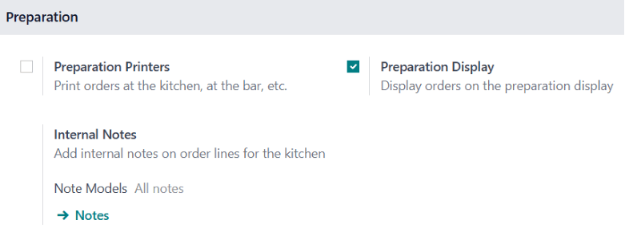

===================
Preparation display
===================

The preparation display feature allows you to handle POS orders requiring preparation.
Concretely,

- **For retail**:  The preparation team is notified after a payment is completed at the POS
  to gather the purchased items for customer pickup.
- **For restaurants**: POS orders inform the kitchen of the meals to be prepared.

Configuration
=============

To enable the preparation display feature,

#. Go to the :ref:`POS settings <configuration/settings>`.
#. Scroll down to the :guilabel:`Connected Devices` section.
#. Check the :guilabel:`Preparation Display` option.

To create and set up a preparation display,

#. Go to :menuselection:`Point of Sale --> Orders --> Preparation Display`
#. Click :guilabel:`New`.
#. Give the display a descriptive :guilabel:`Name` (e.g., `Main Kitchen`, `Bar`)
#. Set it up:

   #. :guilabel:`Point of Sale`: Select the POS that sends orders to this display.
   #. :guilabel:`Product categories`: Specify the POS :guilabel:`Product categories` sent to this
      display.
   #. :guilabel:`Stages`: Define the steps required for the orders to be ready.

      - Click :guilabel:`Add a line` to add a stage.
      - Assign specific colors to each stage for clarity (optional).
      - Define an :guilabel:`Alert timer (min)` for each stage to indicate the expected processing
        time.

.. image:: preparation/display-form.png
   :alt: preparation display set-up form
   :scale: 85 %

.. note::
   To edit a pre-existing preparation display, click the vertical ellipsis button
   (:icon:`fa-ellipsis-v`) on the display's card and select :guilabel:`Configure`.

Practical application
=====================

Go to :menuselection:`Point of Sale --> Orders --> Preparation Display` to get an overview of all
your displays.

The display card shows:

- The configured stages.
- The number of orders currently :guilabel:`In progress`.
- The :guilabel:`Average time` employees usually take to complete an order.

.. tip::
   Click the :guilabel:`Kitchen Display` app icon on your Odoo Dashboard for quicker access.

Using the preparation display
-----------------------------

To access the preparation display, click :guilabel:`Open Preparation Display`. This interface,
designed for employees, shows:

- **Stages and order count**: Displays the progress of orders across stages such as `To prepare`,
  `Ready`, and `Completed`, along with the number of orders in each stage.
- **Ordered products by category**: Lists all items in progress, grouped by POS categories (e.g.,
  `Drinks`, `Food`).
- **Order cards**: Summarizes individual orders, including:

  - Associated tables and order numbers.
  - Status, such as `Ready`, highlighted with the defined colors.
  - Waiting time, with visual indicators.

.. note::
   The duration indicator turns red if the elapsed time exceeds the predefined alert time.

.. image:: preparation/preparation-display.png
   :alt: the preparation display interface with orders to process.
   :scale: 80 %

To update order progress:

- Click items on the order card to cross them off individually.
- Click the order card itself to mark all items at once.
- The card automatically moves to the next stage once every item is crossed off.
- Click :icon:`fa-undo` :guilabel:`Recall` to move an order back to the previous stage if you
  mistakenly sent it to the next stage.

Customer display
----------------

In parallel, click :guilabel:`Open customer display` to open the customer interface. This
interface, designed for customers, provides an overview of orders that are:

- :guilabel:`Ready` for pickup.
- :guilabel:`Almost there`, indicating they are taken care of.

.. note::
   The order number can be found at the top of the customer's receipt.
