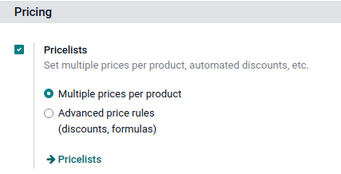
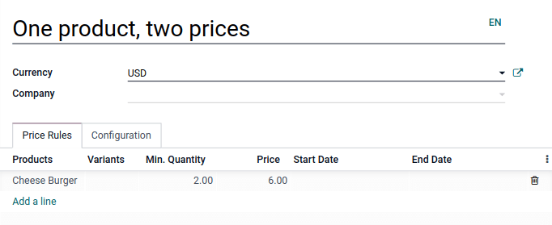
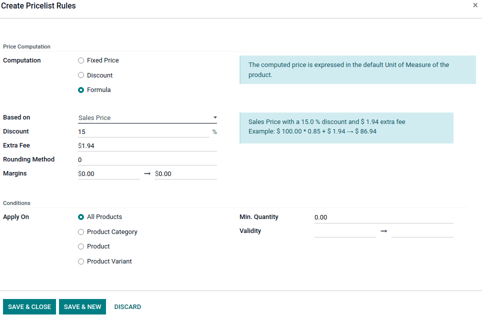
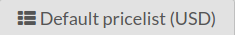

==========
Pricelists
==========

Pricelists allow you to adjust product prices depending on various criteria automatically. For
example, you can set POS-specific prices, create temporary discount periods, reward specific
customers, or offer discounts when set quantities are ordered.

.. _pricelists/configuration:

Configuration
=============

Navigate to the :ref:`general POS app settings <configuration/settings>` and ensure
:guilabel:`Flexible Pricelists` are enabled under the :guilabel:`Pricing` section.

:ref:`Multiple prices per product <pricelists/simple>` is the default pricelist option for setting
simple fixed price rules per product. Select :ref:`Advanced price rules (discounts, formulas)
<pricelists/advanced>` to apply price rules to multiple products at once and to compute prices
dynamically using percentage discounts or more complex formulas in addition to setting fixed prices.

.. note::
   The selected pricelist type applies to the entire database, including the :doc:`Sales
   <../../sales/products_prices/prices/pricing>` and :ref:`eCommerce <ecommerce/pricelists>`
   apps.

.. _pricelists/create:

Create pricelists
-----------------

Go to :menuselection:`Point of Sale --> Products --> Pricelists` and click :guilabel:`New` or
select an existing pricelist. The pricelist setup differs depending on the :ref:`selected pricelist
option <pricelists/configuration>`.

.. _pricelists/simple:

Multiple prices per product
~~~~~~~~~~~~~~~~~~~~~~~~~~~

When pricelists are configured to use the :guilabel:`Multiple prices per product` option, it is
possible to use multiple fixed prices for different products or their variants depending, if
necessary, on one or several conditions. To add a new price rule to a pricelist:

#. Click :guilabel:`Add a line`, and select a **product** and its **variant** if needed.
#. Add the condition(s):

   - a product quantity to be reached by using the :guilabel:`Min. Quantity` column;
   - a determined period during which the pricelist is applied by using the :guilabel:`Start Date`
     and :guilabel:`End Date` columns.

#. Add the :guilabel:`Price` to be applied when the conditions are met (if any).

.. _pricelists/advanced:

Advanced price rules
~~~~~~~~~~~~~~~~~~~~

When pricelists are configured to use the :guilabel:`Advanced price rules (discounts, formulas)`
option, it is possible to use percentage discounts/mark-ups and formulas in addition to using fixed
prices. To add a new price rule to a pricelist, click :guilabel:`Add a line`. In the pop-up windows:

#. Select a :guilabel:`Computation` method:

   - :guilabel:`Fixed Price` to set a new fixed price (similarly to the :guilabel:`Multiple prices
     per product` option).
   - :guilabel:`Discount` to compute a percentage discount (e.g., `10.00` %) or mark-up (e.g.,
     `-10.00` %).
   - :guilabel:`Formula` to compute the price according to a formula. It is required to define what
     the calculation is **based on** (:guilabel:`Sales Price`, :guilabel:`Cost`, or :guilabel:`Other
     Pricelist`). You can then:

     - Apply a percentage :guilabel:`Discount` or mark-up.
     - Add an :guilabel:`Extra Fee` (e.g., $ `5.00`) or subtract a fixed amount (e.g., $ `-5.00`).
     - Define a :doc:`Rounding Method <cash_rounding>` by forcing the price after
       :guilabel:`Discount` to be a multiple of the value set. The :guilabel:`Extra Fee` is applied
       afterward.

       .. example::
          To have the final price end with `.99`, set the :guilabel:`Rounding Method` to `1.00` and
          the :guilabel:`Extra Fee` to `-0.01`.

     - Specify the minimum (e.g., $ `20.00` ) and maximum (e.g., $ `50.00` ) profit
       :guilabel:`Margins` for computations based on :guilabel:`Cost`.

#. Select on which product(s) the price rule should be **applied**:

   - :guilabel:`All Products`
   - a :guilabel:`Product Category`
   - a :guilabel:`Product`
   - a :guilabel:`Product Variant`

#. Add conditions, such as a specific quantity to reach for the price to change by using the
   :guilabel:`Min. Quantity` field or a specific period during which the pricelist should be
   applied by using the :guilabel:`Validity` fields.

Select pricelists
-----------------

Go to the :ref:`specific POS settings <configuration/settings>` and add all the available
pricelists in the :guilabel:`Available` field. Then, set its **default pricelist** in the
:guilabel:`Default` field.

When you :ref:`open a POS session <pos/session-start>`, click the **pricelists** button, and select
the desired pricelist from the list.

.. note::
   - Multiple pricelists must be selected for the **pricelist button** to be displayed.
   - If a pricelist is selected on a POS order while its conditions are **not** met, the price will
     **not** be adjusted.

.. tip::
   You can also set a pricelist to be selected automatically once a specific :ref:`customer is set
   <pos/customers>`. To do so, go to the customer form and switch to the preferred pricelist in the
   :guilabel:`Pricelist` field of the :guilabel:`Sales & Purchase` tab.

.. seealso::
   - :doc:`../../sales/products_prices/prices/pricing`
   - :ref:`How to use pricelists in an ecommerce environment <ecommerce/pricelists>`
