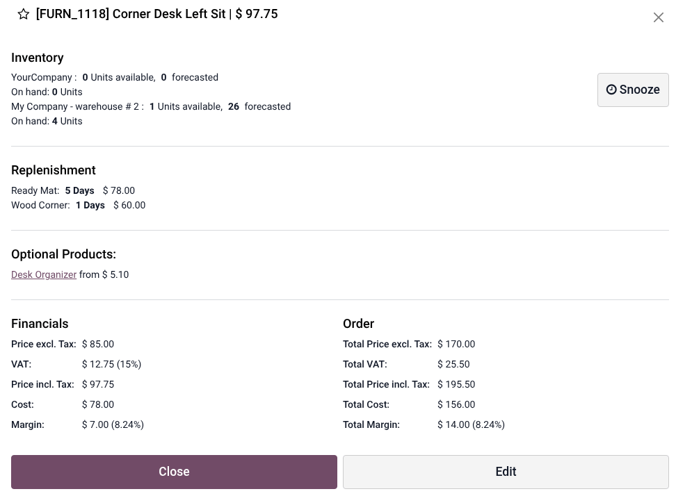
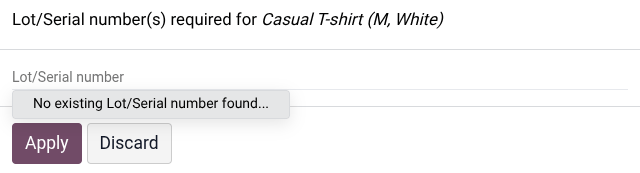

.. _pos/products/products:

========
Products
========

Odoo Point of Sale allows you to :ref:`create products <pos/products/creation>` and :ref:`manage
product information <pos/products/information-display>` from the backend or in the POS register.
Products can be :ref:`configured <pos/products/configuration>` in various ways, including creating
:ref:`variants <pos/products/variants>`, :ref:`product combinations <pos/products/combos>`, and
:ref:`POS-specific product categories <pos/products/categories>`, and adding :ref:`tags
<pos/products/tags>` and :ref:`images <pos/products/images>`. You can also group products by
:ref:`units <pos/products/units>` and :ref:`manage stock <pos/products/sn>`.

.. _pos/products/creation:

Product creation
================

To create products from the backend, go to :menuselection:`Point of Sale --> Products --> Products`,
and click :guilabel:`New` to create a product, or select an existing one to edit it.
Ensure the :guilabel:`Point of Sale` checkbox is enabled at the top of the form, then
:doc:`configure the product's general information
</applications/inventory_and_mrp/inventory/product_management/configure>`, such as defining the
:doc:`product type </applications/inventory_and_mrp/inventory/product_management/configure/type>`,
setting a :ref:`tracking strategy <pos/products/sn>`, or adding a product image, as needed.
Configure advanced, POS-specific :ref:`product details <pos/products/configuration>` as needed.

.. tip::
   It is also possible to create a product from the POS interface. To do so, open the :ref:`POS
   register <pos/use/open-register>`, click the :icon:`fa-bars` (:guilabel:`hamburger menu`) icon,
   then select :guilabel:`Create Product`. Enter the product details in the popover and click
   :guilabel:`Save`. The product is immediately available in the POS register. Existing products can
   also be updated directly from the POS register through the :ref:`product information popover
   <pos/products/information-display>`.

   .. note::
      When using :ref:`POS product categories <pos/products/categories>`, each product must be
      assigned to a :guilabel:`POS Category`; otherwise, the product will not be displayed or
      available for selection.

.. seealso::
   `Product creation (video tutorial) <https://youtu.be/b5eVusXHEvg?si=Xn3EBMmRfJ35mqyu>`_

.. _pos/products/information-display:

Product information display in the POS register
-----------------------------------------------

To view and edit product information from the POS register, click and hold the product to access the
following details:

- the :doc:`available
  </applications/inventory_and_mrp/inventory/warehouses_storage/inventory_management/count_products>`,
  :doc:`forecasted
  </applications/inventory_and_mrp/inventory/warehouses_storage/reporting/forecast>`, and
  :guilabel:`On hand` stock, including :doc:`warehouse
  </applications/inventory_and_mrp/inventory/warehouses_storage/inventory_management/warehouses>`
  information,
- :doc:`replenishment periods
  </applications/inventory_and_mrp/inventory/warehouses_storage/replenishment>`,
- :doc:`optional products <../sales/sales_quotations/optional_products>`,
- financial information, such as :doc:`prices <extra/pricing>`, :ref:`taxes <pos/pricing/taxes>`,
  costs, and :doc:`margins <../sales/sales_quotations/margin>`.

To temporarily make the product unavailable for sale in the POS register or :doc:`self-ordering
menu <extra/self_order>`, click :guilabel:`Snooze`, select the desired duration, and click
:guilabel:`Apply`. To reactivate the product before the set period ends, long-click the
product in the register, click the countdown timer, then, in the :guilabel:`Stop Snooze` popover,
click :guilabel:`Yes` to confirm.

You can also access and edit the product information of a product that has already been :ref:`added
to the cart <pos/use/sell>` by selecting the product, clicking the :icon:`fa-ellipsis-v`
:guilabel:`(vertical ellipsis)` icon, then the :icon:`fa-info` :guilabel:`Info` button.

.. tip::
   To display margins and costs in the product information window, go to the :ref:`POS settings
   <pos/use/settings>`, navigate to the :guilabel:`Product & PoS categories` section, and enable
   :guilabel:`Show margins & costs`.

.. _pos/products/configuration:

Product configuration
=====================

Once the product is :ref:`created <pos/products/creation>`, navigate to the :guilabel:`Point of
Sale` tab on the product form to configure the following POS-specific options:

- Enable the :guilabel:`To Weigh With Scale` option if the product must be weighed. Configure a
  connected :doc:`scale <hardware_network/scale>` for this purpose.
- Select POS-specific :ref:`categories <pos/products/categories>`.
- Define a :guilabel:`Color` to highlight the product in the :ref:`POS register
  <pos/use/open-register>`.
- Enable :guilabel:`Available in Self Order` if the product can be ordered in :doc:`self-ordering
  mode <extra/self_order>`. This option only appears once the self-ordering mode is :ref:`enabled
  <pos/self-order/activation>`.
- Write a :guilabel:`Description` to display in the :ref:`product information window in the POS
  register <pos/products/information-display>` and in :doc:`self-ordering mode <extra/self_order>`
  when clicking the :icon:`fa-info-circle` :ref:`info button <pos/products/tag-application>`.
- In the :guilabel:`Upsell & cross-sell` section, enable :guilabel:`POS Optional Products` to
  suggest :doc:`optional products <../sales/sales_quotations/optional_products>` when :ref:`adding
  items to the cart <pos/use/sell>` in the POS register.
- If applicable, configure :doc:`Urpan Piper <restaurant/urban_piper>` and/or decide if the
  product is :guilabel:`Available for Platform Orders`, such as GrabFood or GoFood.

Above that, you can configure additional options, such as :ref:`product variants
<pos/products/variants>`, :ref:`product tags <pos/products/tags>`, :ref:`product and category images
display <pos/products/images>`, and :ref:`units of measure <pos/products/units>`.

.. _pos/products/variants:

Product variants
----------------

To allow the use of different product variants, go to :menuselection:`Inventory --> Configuration
--> Settings`, scroll down to the :guilabel:`Products`, enable :guilabel:`Variants`, and
:guilabel:`Save`.

.. note::
   The **Inventory** app is automatically installed when using the **Point of Sale** app.

Then, navigate to :menuselection:`Point of Sale --> Products --> Products`, select a product, and
configure :ref:`attributes <products/variants/attributes>` and their :ref:`values
<products/variants/attributes-values>` to create :ref:`variants <products/variants/variants>` in
the :guilabel:`Attributes & Variants` tab. On the value's form, enable :guilabel:`Available on Food
Delivery` for values available through delivery platforms, if applicable.

.. tip::
   Navigate to :menuselection:`Point of Sale --> Configuration --> Attributes` to manage all
   configured attributes, or to :menuselection:`Point of Sale --> Products --> Product Variants` to
   view all variants.

.. admonition:: Practical application

   Users in the :ref:`POS register <pos/use/open-register>` and customers in :doc:`self-ordering
   mode <extra/self_order>` can select product variants when :ref:`adding items to the cart
   <pos/use/sell>`.

     .. image:: products/product_variants_kiosk.png
        :alt: Example of product variants in self-ordering mode.
        :scale: 60%

.. _pos/products/tags:

Product Tags
------------

Product tags help highlight specific features in :doc:`self-ordering mode <extra/self_order>`. To
create product tags, go to :menuselection:`Point of Sale --> Configuration --> Product Tags`. On the
:guilabel:`Product Tags` page, click :guilabel:`New` or select an existing tag.

On the product tag form:

- Enter a :guilabel:`Tag` label.
- Enable/disable :guilabel:`Visible to customers` to control whether the tag is visible to customers
  in :doc:`self-ordering mode <extra/self_order>`.
- Optionally, choose a :guilabel:`Color` or add an image. If both are configured, the image replaces
  the tag's color.
- In the :guilabel:`Point of sale` section, write a :guilabel:`Description` to be shown in
  self-ordering mode.

To add tags to a product, navigate to the product form, go to the :guilabel:`Sales` tab, and, in
the :guilabel:`Extra info` section, add as many :guilabel:`Tags` as needed.

.. note::
   If the **eCommerce** app is installed, :ref:`tags <ecommerce/catalog/filters>` are used in both
   apps, and need to be added in the :guilabel:`Shop` section of the :guilabel:`eCommerce` tab.

.. _pos/products/tag-application:

.. admonition:: Practical application

   Tags are displayed only in :doc:`self-ordering mode <extra/self_order>`, *not* in the :ref:`POS
   register <pos/use/open-register>`. Customers can view the tags and tag descriptions by clicking
   the :icon:`fa-info` :guilabel:`(info)` icon next to the product name.

   .. image:: products/tag_kiosk.png
      :alt: Example of product tags in self-ordering mode.
      :scale: 60%

.. _pos/products/units:

Product units
-------------

Products can be grouped by :doc:`unit of measure
</applications/inventory_and_mrp/inventory/product_management/configure/uom>` in the :ref:`POS
register <pos/use/open-register>` and on the :doc:`customer display
<hardware_network/customer_display>`.

To do so, follow these steps:

#. Enable :ref:`Units of Measure & Packagings <inventory/product_replenishment/configuration>` in
   the Inventory app settings.
#. Click the :icon:`fa-arrow-right` :guilabel:`Units & Packagings` link to view all configured
   units.
#. Select a unit.
#. Activate :ref:`developer mode <developer-mode>`.
#. Enable :guilabel:`Group Products in POS`.

.. admonition:: Practical application

   When a customer orders multiple units of the same product, the products are grouped into a
   single line rather than appearing individually. The unit price is displayed below the product,
   and the total amount appears next to it.

   .. image:: products/group-by-unit.png
      :alt: Customer display with merged row per unit.

.. _pos/products/images:

Product and category images
---------------------------

Images can be added for :ref:`products <pos/products/creation>`, :ref:`product tags
<pos/products/tags>`, :ref:`variants <pos/products/variants>`, and :ref:`categories
<pos/products/categories>`. They can be displayed in the :ref:`POS register
<pos/use/open-register>`, on the :doc:`customer display <hardware_network/customer_display>`, and/or
in :doc:`self-ordering mode <extra/self_order>`, as follows:

.. list-table::
   :header-rows: 1
   :stub-columns: 1
   :widths: 5 5 5 5

   * -
     - POS register
     - Customer display
     - Self-ordering mode
   * - Product image
     - :icon:`fa-check`
     - :icon:`fa-check`
     - :icon:`fa-check` on the :guilabel:`Your Order` page
   * - Product tag image
     - :icon:`oi-close`
     - :icon:`oi-close`
     - :icon:`fa-check` when clicking the :icon:`fa-info-circle` :ref:`Info button
       <pos/products/tag-application>`
   * - Product variant image
     - :icon:`oi-close`
     - :icon:`fa-check`
     - :icon:`fa-check` on the :guilabel:`Your Order` page
   * - Category image
     - :icon:`fa-check`
     - :icon:`oi-close`
     - :icon:`oi-close`

Once you have added images to products or categories, configure their visibility *in the POS
register*. To do so, navigate to the :ref:`POS settings <pos/use/settings>`, scroll down to the
:guilabel:`POS interface` section, and under :guilabel:`Hide pictures in POS`, enable/disable
:guilabel:`Show product images` and/or :guilabel:`Show category images`.

.. _pos/products/categories:

POS product categories
======================

POS product categories are used to group products in the POS register to aid navigation.

To manage POS categories, follow these steps:

#. Navigate to :menuselection:`Point of Sale --> Configuration --> PoS Product Categories`.
#. Click :guilabel:`New` to create a category or select an existing one to update it.
#. On the category form:

   - Enter or edit the label for the category.
   - Select a :guilabel:`Parent Category` to build a hierarchy of categories. A parent category
     groups one or more child categories (e.g., use `Drinks` to group `Hot beverages` and `Soft
     drinks`).
   - Configure the availability for :doc:`self-ordering <extra/self_order>`.
   - Define a :guilabel:`Color` for display in the POS register.
   - Select a :ref:`course <pos/restaurant/orders/courses>` if applicable.
   - Add an image if needed.
   - If :doc:`online food delivery platforms <restaurant/urban_piper>` are configured in your
     database, indicate their :guilabel:`Service Hours`.

After creating POS product categories, assign them to specific products on the :ref:`product form
<pos/products/creation>`.

To only display specific categories in the POS register, go to the :ref:`POS settings
<pos/use/settings>`, navigate to the :guilabel:`Product & PoS categories` section, then, in the
:guilabel:`Restrict Categories` field, select the categories that should be available.

.. admonition:: Practical application

   Product categories are displayed in the :ref:`POS register <pos/use/open-register>` and in
   :doc:`self-ordering mode <extra/self_order>`. Subcategories appear after selecting a parent
   category.

   .. image:: products/categories-in-kiosk.png
      :alt: Categories and subcategories in kiosk mode.

.. tip::
   If no category is selected in the POS register, all products are displayed. To organize products
   by category in this view, navigate to the :ref:`POS settings <pos/use/settings>`, scroll down to
   the :guilabel:`PoS Interface` section, and enable :guilabel:`Group products by categories`.

   .. example::
      In this POS register, two categories are configured, :guilabel:`Food` and :guilabel:`Drinks`,
      but neither of them is currently selected. The overview shows all products in both categories,
      grouped by category on separate rows.

      .. image:: products/group-by-category.png
         :alt: Group products by categories.

.. _pos/products/combos:

Product combos
==============

A product combo is a bundle of multiple products sold together as a single unit. Each product combo
consists of multiple categories, known as :ref:`combo choices <pos/products/combo-choices>`, and
each combo choice contains several items. When purchasing a product combo, customers can select one
or more items from each combo choice.

.. example::
    A burger menu is offered as a product combo including three combo choices: one burger, one
    drink, and one portion of fries. For each combo choice, customers select one item from the
    available options (e.g., cheese burger or bacon burger; water or soda; large or regular fries).

    .. image:: products/combo-selection-in-pos.png
       :alt: Combo selection in the POS register.
       :scale: 70%

    .. tip::
       - To change the selection after :ref:`adding a product combo to the cart <pos/use/sell>`,
         click and hold the combo item in the cart to reopen the selection popover.
       - When all products that belong to a predefined combo are added to the cart individually,
         Odoo automatically detects the combo and displays a suggestion for it above the keypad. To
         apply the combo pricing, click :guilabel:`Apply`.
         If multiple combos are detected, click :guilabel:`Choose`, then :guilabel:`Apply` the
         appropriate combo.

         .. image:: products/auto-detect-combo.png
            :alt: Combo automatically detected in the POS register.
            :scale: 70%

       - To split a combo into its individual products, select the combo, click the
         :icon:`fa-ellipsis-v` (:guilabel:`vertical ellipsis`) button, and select :icon:`fa-outdent`
         :guilabel:`Break Combo`. The price of each product is adjusted according to its standard
         :guilabel:`Sales Price`.

.. seealso::
   `Product combos (video tutorial) <https://youtu.be/H8e2CakLhaQ?si=yjPbvYkj00K7OP3q>`_

.. _pos/products/combo-choices:

Combo choice creation
---------------------

To create the combo choices that will be added to the :ref:`product combo
<pos/products/combo-creation>`, follow the next steps:

#. Go to :menuselection:`Point of Sale --> Products --> Combo Choices` and click :guilabel:`New`.
#. Enter a name for the :guilabel:`Combo Choice`.
#. Set the maximum selectable items for the combo choice using the :guilabel:`Maximum items` field.
#. Choose between the following options:

   - Set the number of items included in the combo choice using the :guilabel:`Includes items`
     field.
   - Enable the :guilabel:`Is Upsell` option if the combo choice is optional and offered as an
     additional paid upgrade.

#. If you are in a :doc:`multi-company </applications/general/companies/multi_company>`
   environment, choose the relevant :guilabel:`Company`. Leave the field empty to make it available
   for *all* companies.
#. Click :guilabel:`Add a line` under the :guilabel:`Options` section to add the products that
   constitute the :guilabel:`Combo Choices`.
#. If needed, click a product to add an :guilabel:`Extra Price`.

.. admonition:: Combo Price vs. Extra Price

  - The :guilabel:`Combo Price` field defines the price charged for any additional product selected
    by the customer. It is applied when the :guilabel:`Maximum items` field is set to `2` or more,
    or when a combo choice is configured as an optional upsell. The price is automatically
    calculated based on the least expensive product in the combo choice.
  - The :guilabel:`Extra Price` field is used to set an additional charge for a specific product in
    the combo choice, e.g., to cover higher costs or encourage upselling. This extra price is
    applied each time a customer selects that product within the combo choice.

.. _pos/products/combo-creation:

Product combo creation
----------------------

To create a specific product that contains :ref:`combo choices <pos/products/combo-choices>`,
follow the next steps:

#. Go to :menuselection:`Point of Sale --> Products --> Products` and click :guilabel:`New`.
#. Enter a product name.
#. Set the :guilabel:`Product Type` to :guilabel:`Combo` and select the relevant :ref:`Combo
   Choices <pos/products/combo-choices>`.
#. Add a :guilabel:`Sales Price`.
#. Optionally, click the :guilabel:`Point of Sale` tab to select the preferred :guilabel:`Category`.

.. note::
   The total price of the product combo, as displayed in the :ref:`POS register
   <pos/use/open-register>`, is based on the :guilabel:`Sales Price` defined on the :ref:`product
   combo's form <pos/products/combo-creation>`. Selecting several products in the combo choices,
   a product with an :guilabel:`Extra Price`, and/or products in a combo choice configured as an
   upsell all affect the total price.

   .. example::
      The :guilabel:`Office Combo` has a :guilabel:`Sales Price` of **300** € and offers a
      selection of chairs and desks. The combo choice for chairs includes a conference chair, an
      office chair, and an armchair, with a maximum selectable amount set to 2. For each
      additional chair a customer selects, a :guilabel:`Combo Price` of **35** € is added. The
      armchair has an :guilabel:`Extra Price` of **100** € because it is made of leather. Selecting
      both the conference chair and the armchair increases the price of the :guilabel:`Office
      Combo` to **435** €, i.e., :guilabel:`Sales Price` + **35** € (:guilabel:`Combo Price`) for
      adding a second chair + **100** € (:guilabel:`Extra Price`) for the leather armchair.

      .. image:: products/office-combo.png
         :scale: 60%

.. _pos/products/stock-management:

Stock management
================

To track stock for POS products, the :ref:`product type <inventory/type/good-or-services>` must be
set to :guilabel:`Goods` or :guilabel:`Combo`, and the :ref:`track inventory option
<inventory/product_management/tracking-inventory>` must be enabled. Products can be tracked by
quantity, :ref:`by lot, or by serial number <pos/products/sn>`.

.. tip::
   When adding tracked items to the :ref:`cart <pos/use/sell>`, the number of :guilabel:`Free To
   Use` units is displayed in the POS configuration popover.

   .. image:: products/pos-available-stock.png
      :alt: Free-to-use stock displayed in POS register.
      :scale: 70%

.. _pos/products/sn:

Serial numbers and lots
-----------------------

Using **lots** and **serial numbers** allows product movements to be tracked throughout a product's
lifecycle. When traceability is enabled, Odoo identifies a product's location based on its last
recorded movement.

To track products by lots or serial numbers:

#. :ref:`Enable the Lots & Serial Numbers setting
   <inventory/product_management/traceability-setting>`.
#. :ref:`Configure products <pos/products/creation>`.
#. :ref:`Assign tracking numbers <inventory/product_management/assign-sn>`.

.. tip::
   :doc:`Expiration dates
   </applications/inventory_and_mrp/inventory/product_management/product_tracking/expiration_dates>`
   can also be configured for products tracked by lot or serial number. When an expired product is
   added to the cart, a warning is displayed in the upper-right corner of the POS register.

   .. image:: products/lot-expired.png
      :alt: Warning about expired product.

.. _pos/products/tracking:

Selling tracked products
~~~~~~~~~~~~~~~~~~~~~~~~

Adding a tracked product to the cart from the POS register automatically imports its serial number
or lot number. If no tracking number exists, a popover appears to create and assign one.

.. note::
   When you :ref:`load a quotation or sales order <pos/shop/so>` containing tracked products, a
   popover asks whether the numbers linked to the quotation or sales order should be imported.
   Click :guilabel:`Ok` to proceed.

Once tracking numbers are assigned or imported, they appear in the cart below the corresponding
products, next to the :icon:`fa-list` (:guilabel:`Valid product lot`) icon. The icon's color
highlights if the tracking has been assigned:

- **Green** :icon:`fa-list` (:guilabel:`Valid product lot`) **icon**: The tracking number was
  successfully imported or assigned.
- **Red** :icon:`fa-list` (:guilabel:`Invalid product lot`) **icon**: The tracking number is
  missing or incorrect.

To change a tracking number, click the :icon:`fa-list` (:guilabel:`Valid product lot`) icon, select
a different lot or serial number from the popover, and click :guilabel:`Apply`.

.. example::
   The icon appears in green for the :guilabel:`Casual T-shirt` as the serial number `123456` has
   been assigned. On the other hand, the icon is red for the :guilabel:`Cozy sweater` because no
   serial number has been assigned.

   .. image:: products/serial-number-assignment.png
      :alt: Serial number assignment in POS register.

.. note::
   Missing or invalid tracking numbers do not block the sale, but a warning popover must be
   acknowledged before proceeding to payment.

.. seealso::
   - :doc:`/applications/inventory_and_mrp/inventory/product_management/product_tracking/serial_numbers`
   - :doc:`/applications/inventory_and_mrp/inventory/product_management/product_tracking/lots`
