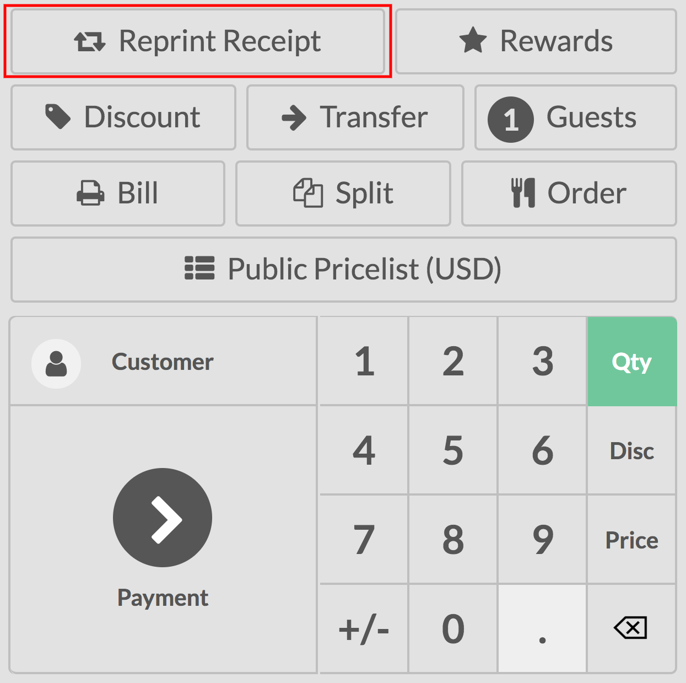

=====================
Receipts and invoices
=====================

Reprint receipts
================

Use the *Reprint receipt* feature if you have the need to reprint a ticket.

Configuration
-------------

To activate *Reprint Receipt*, go to :menuselection:`Point of Sale
--> Configuration --> Point of sale`. and select your PoS interface.

Under the Bills & Receipts category, you will find *Reprint Receipt*
option.

.. note::
    In order to allow the option reprint receipt, you need to activate the receipt printer.

.. image:: receipts_invoices/reprint01.png

Reprint a receipt
-----------------

On your PoS interface, you now have a *Reprint receipt* button.

When you use it, you can then reprint your last receipt.

.. image:: receipts_invoices/reprint03.png

Invoice from the PoS interface
==============================

Some of your customers might request an invoice when buying from your
Point of Sale, you can easily manage it directly from the PoS interface.

Activate invoicing
------------------

Go to :menuselection:`Point of Sale --> Configuration --> Point of Sale`
and select your Point of Sale:

.. image:: receipts_invoices/invoice01.png

Under the *Bills & Receipts* you will see the invoicing option, tick
it. Don't forget to choose in which journal the invoices should be
created.

.. image:: receipts_invoices/invoice02.png

Select a customer
-----------------

From your session interface, use the customer button

.. image:: receipts_invoices/invoice03.png

You can then either select an existing customer and set it as your
customer or create a new one by using this button.

.. image:: receipts_invoices/invoice04.png

You will be invited to fill out the customer form with its information.

Invoice your customer
---------------------

From the payment screen, you now have an invoice option, use the button
to select it and validate.

.. image:: receipts_invoices/invoice05.png

You can then print the invoice and move on to your next order.

Retrieve invoices
-----------------

Once out of the PoS interface (:menuselection:`Close --> Confirm` on the top right corner)
you will find all your orders in :menuselection:`Point of Sale -->
Orders --> Orders` and under the status tab you will see which ones have
been invoiced. When clicking on a order you can then access the invoice.

.. image:: receipts_invoices/invoice06.png
