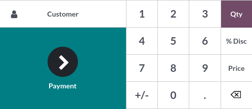

=====================
Receipts and invoices
=====================

Receipts
========

Set up receipts by going to :menuselection:`Point of Sale --> Configuration --> Point of Sale`,
selecting a POS, and scrolling down to the :guilabel:`Bills & Receipts` section.

To **customize** the **header** and **footer**, activate :guilabel:`Header & Footer` and fill in
both fields with the information to be printed on the receipts.

To **print receipts** automatically once the payment is registered, enable the :guilabel:`Automatic
Receipt Printing` setting.

.. image:: receipts_invoices/receipt.png
   :alt: POS receipt

.. seealso::
   - :doc:`restaurant/bill_printing`

Reprint a receipt
-----------------

From the POS interface, click :guilabel:`Orders`, open the dropdown selection menu next to the
search bar, and change the default :guilabel:`All active orders` filter to :guilabel:`Paid`. Then,
select the corresponding order and click :guilabel:`Print Receipt`.

.. image:: receipts_invoices/print-receipt.png
   :alt: Print receipt button from the backend

.. note::
   You can filter the list of orders using the search bar. Type in your reference and click
   :guilabel:`Receipt Number`, :guilabel:`Date`, or :guilabel:`Customer`.

.. _receipts-invoices/invoices:

Invoices
========

In Point of Sale, you can issue and print invoices upon payment at the cash register or retrieve all
the past invoiced orders.

Set a customer
--------------

First, you need to open a session and set your customer. Open the **POS interface** by going to
:menuselection:`Point of Sale --> New session --> Open session`. Then, click :guilabel:`Customer` to
access the list of **customers**.

From there, you can either set an existing customer by clicking their name or create a new one by
clicking :guilabel:`Create`. Doing so opens a customer creation form to fill in with their
information. Click :guilabel:`Save` to validate and set this new customer.

.. note::
   - You can also **edit** a customer's information by clicking :guilabel:`Details`.
   - If you did not set your customer during the order, you can do so at the payment screen by
     clicking :guilabel:`Customer`.

Invoice a customer
------------------

Once an order is done, click :guilabel:`Payment` to move to the **payment screen**. Click
:guilabel:`Invoice` underneath the customer's name to enable issuing and printing invoices upon
payment.

.. image:: receipts_invoices/invoice-button.png
   :alt: button to generate an invoice in POS

Select the payment method and click :guilabel:`Validate`. The **invoice** is automatically issued
and ready to be downloaded and/or printed.

Retrieve invoices
-----------------

To retrieve invoices from the **POS dashboard**,

#. access all orders made through your POS by going to :menuselection:`Point of Sale --> Orders -->
   Orders`;
#. to access an order's invoice, open the **order form** by selecting the order, then click
   :guilabel:`Invoice`.

.. image:: receipts_invoices/invoice-smart-button.png
   :alt: invoice smart button from an order form

.. note::
   - **Invoiced orders** can be identified by the :guilabel:`Invoiced` status in the
     :guilabel:`Status` column.
   - You can filter the list of orders to invoiced orders by clicking :guilabel:`Filters` and
     :guilabel:`Invoiced`.

QR codes to generate invoices
-----------------------------

Customers can also request an invoice by scanning the **QR code** printed on their receipt. Upon
scanning, they must fill in a form with their billing information and click :guilabel:`Get my
invoice`. On the one hand, doing so generates an invoice available for download. On the other hand,
the order status goes from :guilabel:`Paid` or :guilabel:`Posted` to :guilabel:`Invoiced` in the
Odoo backend.

.. image:: receipts_invoices/order-status.png
   :alt: order status change

To use this feature, you have to enable QR codes on receipts by going to :menuselection:`Point of
Sale --> Configuration --> Settings`. Then, select the POS in the :guilabel:`Point of Sale` field,
scroll down to the :guilabel:`Bills & Receipts` section and enable :guilabel:`Use QR code on
ticket`.
