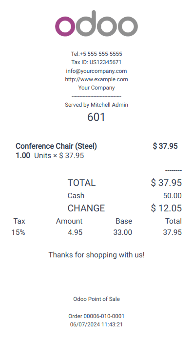
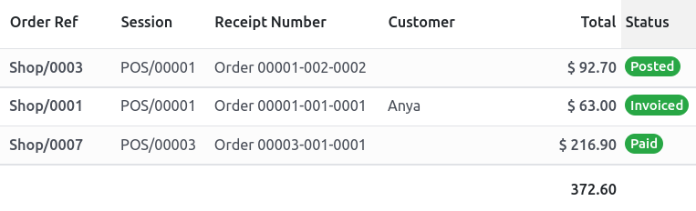

=====================
Receipts and invoices
=====================

Receipts
========

Set up receipts by going to :menuselection:`Point of Sale --> Configuration --> Point of Sale`,
selecting a POS, and scrolling down to the :guilabel:`Bills & Receipts` section.

To **customize** the **header** and **footer**, activate :guilabel:`Header & Footer` and fill in
both fields with the information to be printed on the receipts.

To **print receipts** automatically once the payment is registered, enable the :guilabel:`Automatic
Receipt Printing` setting.

.. seealso::
   - :doc:`restaurant/bill_printing`

Reprint a receipt
-----------------

From the POS interface, click :guilabel:`Orders`, open the dropdown selection menu next to the
search bar, and change the default :guilabel:`All active orders` filter to :guilabel:`Paid`. Then,
select the corresponding order and click :guilabel:`Print Receipt`.

.. image:: receipts_invoices/print-receipt.png
   :alt: Print receipt button from the backend

.. note::
   You can filter the list of orders using the search bar. Type in your reference and click
   :guilabel:`Receipt Number`, :guilabel:`Date`, or :guilabel:`Customer`.

.. _receipts-invoices/invoices:

Invoices
========

Point of Sale allows you to issue and print invoices for :ref:`registered customers <pos/customers>`
upon payment and retrieve all past invoiced orders.

.. note::
   An invoice created in a POS creates an entry into the corresponding :ref:`accounting journal
   <cheat_sheet/journals>`, previously :ref:`set up <receipts_invoices/invoice_configuration>`.

.. _receipts_invoices/invoice_configuration:

Configuration
-------------

To define what journals will be used for a specific POS, go to the :ref:`POS' settings
<configuration/settings>` and scroll down to the accounting section. Then, you can determine the
accounting journals used by default for orders and invoices in the :guilabel:`Default Journals`
section.

.. image:: receipts_invoices/invoice-config.png
   :alt: accounting section in the POS settings

Invoice a customer
------------------

Upon processing a payment, click :guilabel:`Invoice` underneath the customer's name to issue an
invoice for that order.

Select the payment method and click :guilabel:`Validate`. The **invoice** is automatically issued
and ready to be downloaded and/or printed.

.. note::
   To be able to issue an invoice, a :ref:`customer <pos/customers>` must be selected.

Retrieve invoices
-----------------

To retrieve invoices from the **POS dashboard**,

#. access all orders made through your POS by going to :menuselection:`Point of Sale --> Orders -->
   Orders`;
#. to access an order's invoice, open the **order form** by selecting the order, then click
   :guilabel:`Invoice`.

.. image:: receipts_invoices/invoice-smart-button.png
   :alt: invoice smart button from an order form

.. note::
   - **Invoiced orders** can be identified by the :guilabel:`Invoiced` status in the
     :guilabel:`Status` column.
   - You can filter the list of orders to invoiced orders by clicking :guilabel:`Filters` and
     :guilabel:`Invoiced`.

QR codes to generate invoices
-----------------------------

Customers can also request an invoice by scanning the **QR code** printed on their receipt. Upon
scanning, they must fill in a form with their billing information and click :guilabel:`Get my
invoice`. On the one hand, doing so generates an invoice available for download. On the other hand,
the order status goes from :guilabel:`Paid` or :guilabel:`Posted` to :guilabel:`Invoiced` in the
Odoo backend.

To use this feature, you have to enable QR codes on receipts by going to :menuselection:`Point of
Sale --> Configuration --> Settings`. Then, select the POS in the :guilabel:`Point of Sale` field,
scroll down to the :guilabel:`Bills & Receipts` section and enable :guilabel:`Use QR code on
ticket`.
