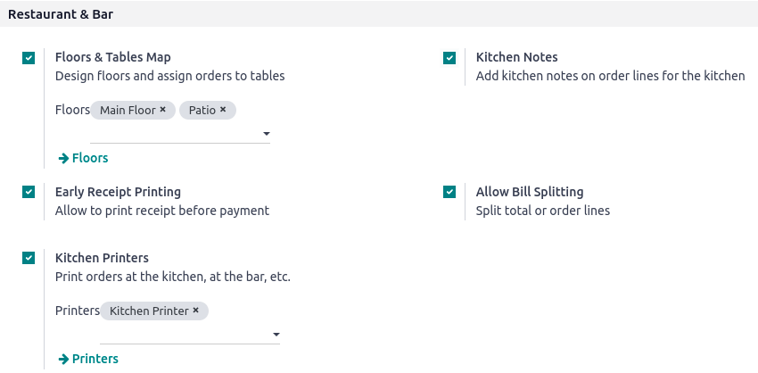

:show-content:

===================
Restaurant features
===================

Managing a restaurant or a bar comes with specific needs. The Point of Sale application provides
various features that allow performing all the required tasks in such businesses.

Once the POS is set to be used in a restaurant or a bar, you can:

- :doc:`organize your floors and tables to reflect your interior <restaurant/floors_tables>`;
- :ref:`take orders <floors_tables/orders>`;
- :doc:`communicate with the kitchen or the bar through the POS <restaurant/kitchen_printing>`;
- :doc:`print bills in advance and split them <restaurant/bill_printing>`;
- :doc:`collect tips <restaurant/tips>`; and
- :doc:`set different taxes for takeaway food <pricing/fiscal_position>`.

Configuration
=============

To enable the restaurant and bar-specific features, go to :menuselection:`Point of Sale -->
Configuration --> Settings`, select the POS, and activate :guilabel:`Is a Bar/Restaurant`.

These features are displayed in the :guilabel:`Restaurant & Bar` section.

.. toctree::
   :titlesonly:

   restaurant/bill_printing
   restaurant/floors_tables
   restaurant/kitchen_printing
   restaurant/tips
