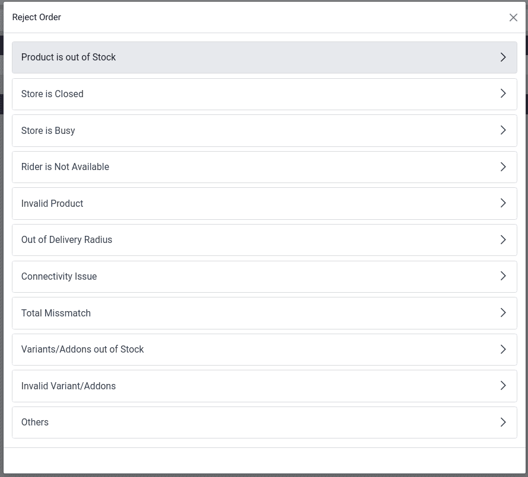

==================
APAC food delivery
==================

Point of Sale provides integrations with popular APAC food delivery platforms, allowing for
synchronizing orders, updating menus and managing store details directly from the :guilabel:`POS`.

Supported providers:

- :ref:`GoFood <pos/apac/gofood>`
- GrabFood

.. important::
   A valid account with each delivery provider is required before proceeding.

.. _pos/apac/general configuration:

General configuration
=====================

Before setting up a specific delivery provider, configure your general store hours and prepare your products for synchronization.

.. _pos/apac/general_configuration/service_hours:

Service hours
-------------

Configure the store timings to define when delivery services are available. These hours synchronize directly with the respective delivery platforms.

#. Navigate to :menuselection:`Point of Sale --> Configuration --> Service Hours`.
#. Click :guilabel:`New` to add a record.
#. Define the :guilabel:`Name`, :guilabel:`Day of Week`, :guilabel:`Opening from`, and :guilabel:`Opening to` associated with this working time.

.. _pos/apac/general_configuration/products:

Products
--------

To ensure products are synchronized and available for delivery:

#. Navigate to :menuselection:`Point of Sale --> Products --> Products`.
#. Select a product to open its form.
#. Navigate to the :guilabel:`Point of Sale` tab.
#. Enable the :guilabel:`Available for Platform Orders` checkbox, and ensure the product category
   used falls under the publishable category to be set for the :guilabel:`Entity`.

.. _pos/apac/gofood:

GoFood
======

The GoFood integration allows businesses in Indonesia to manage food delivery orders directly from
the Odoo POS.

As a prerequisite, :ref:`activate <general/install>` the :guilabel:`Platform Order Provider:
GoFood` module *(technical name: pos_platform_order_gofood)* to integrate with GoFood and receive
and manage orders.

.. _pos/apac/gofood/configuration:

Configuration
-------------

.. _pos/apac/gofood/configuration/portal:

GoBiz Developer Portal
~~~~~~~~~~~~~~~~~~~~~~

Start by creating a GoFood account on the `GoFood website <https://gofoodmerchant.co.id/>`_. Next,
navigate to the `GoBiz Developer Portal <https://developer.gobiz.com/home/auth>`_ to retrieve the
necessary API credentials used to authenticate and synchronize data between Odoo and GoFood:

- App ID
- Secret
- Partner ID
- Relay Secret
- Outlet ID

.. note::
   There is no separate sign-up required for the developer portal. Log in using the same merchant
   credentials associated with the GoFood/GoBiz account.

.. _pos/apac/gofood/configuration/setup:

Odoo setup
~~~~~~~~~~

#. Navigate to :menuselection:`Point of Sale --> Configuration --> Providers`.
#. Select :guilabel:`GoFood` and change the state to :guilabel:`Enabled`.
#. Under the :guilabel:`Credentials` tab, enter the :guilabel:`App ID`,
   :guilabel:`Secret Key`, :guilabel:`Partner ID`, and :guilabel:`Relay Secret Key` retrieved from
   the Gobiz Developer Portal.

.. note::
   To test the integration before formal setup, change the state to :guilabel:`Test`.

.. _pos/apac/gofood/configuration/entity:

Configure the entities
~~~~~~~~~~~~~~~~~~~~~~

:guilabel:`Entity` represents a specific physical store or outlet registered on the delivery
platform, linking it directly to an Odoo Point of Sale.

#. Navigate to :menuselection:`Point of Sale --> Configuration --> Stores`, then click
   :guilabel:`New` to create a GoFood entity.
#. Fill in the :guilabel:`Name` field and verify the :guilabel:`Provider` field is set to
   :guilabel:`GoFood`.
#. Fill in the :guilabel:`External ID` field with the Outlet ID retrieved from GoFood.

   .. image:: APAC_food_delivery/gofood_outletid.png
      :alt: Outlet ID

#. Select the related :guilabel:`Point of Sale` and the :guilabel:`Service Hours`.
#. Under the :guilabel:`Accounting` tab, choose the :guilabel:`Payment Method` and select the
   appropriate :guilabel:`Pricelist`.
#. Under the :guilabel:`General` tab, select the :guilabel:`Available Product Categories`
   applicable to the GoFood platform.

.. important::
   Ensure the currency of the selected pricelist matches the company’s country and fiscal
   localization settings.

.. seealso::
   - :doc:`../../sales/products_prices/prices/pricing`
   - :doc:`../extra/presets`
   - :ref:`pos/products/categories`

.. _pos/apac/gofood/configuration/menusync:

Synchronize the menu
~~~~~~~~~~~~~~~~~~~~

The menu represents the curated catalog of available products, categories, and pricing defined in
Odoo that is published to the GoFood app for customers to browse.

#. Navigate to :menuselection:`Point of Sale --> Configuration --> Stores` and select the
   configured GoFood entity.
#. Click :guilabel:`Sync Menu`, then verify the status displays as :guilabel:`Done`, indicating a
   successful synchronization.

.. note::
   - The menu synchronization process can take up to few minutes.
   - To verify the integration, place sample orders through GoFood and ensure they appear in the
     :guilabel:`Odoo POS orders` list.

.. important::
   Any changes made to product configurations require manually clicking :guilabel:`Sync Menu` to
   push the updated products and prices to GoFood.

.. _pos/apac/gofood/configuration/go_live:

Go live
~~~~~~~

Once the configuration and testing are complete, contact the GoFood account manager to switch the
account to production and officially go live.

.. _pos/apac/gofood/orderflow:

Order flow
----------

An order placed via the configured delivery platform triggers a notification. To manage these
orders, open the orders' list view by:

#. Clicking :guilabel:`Review Orders` on the notification popup.
#. Clicking the bag-shaped icon for online orders and :guilabel:`New`.

   .. image:: APAC_food_delivery/gofood_order_receipt.png
      :alt: Cart button

   .. note::
      - Clicking this icon displays the number of orders at each stage: :guilabel:`New`,
        :guilabel:`Ongoing`, and :guilabel:`Done`.
      - The :guilabel:`New` button indicates newly placed orders, :guilabel:`Ongoing` is for
        accepted orders, and :guilabel:`Done` is for orders ready to be delivered.

.. _pos/apac/gofood/rejection:

Order rejection
~~~~~~~~~~~~~~~

Sometimes, the shop or restaurant may want to **reject** an order. In this case, open the orders'
list view,

#. Select the desired order.
#. Click the :guilabel:`Reject` button.
#. Select one of the reasons from the popup window.

